#  HarryPotter: Aragog - Writeup 

Argog is the first of three HarryPotter VM series from Vulnhub by Mansoor R.<br />
This series challenge us to find the horcruxes which hidden inside these machines.<br />
Link to the machine: [https://www.vulnhub.com/entry/harrypotter-aragog-102,688/](https://www.vulnhub.com/entry/harrypotter-aragog-102,688/)

<br />

## Target discovery

First, we need to identify the target's IP address.

```
sudo netdiscover -i vboxnet0 -r 10.10.10.0/24

Currently scanning: Finished!   |   Screen View: Unique Hosts

2 Captured ARP Req/Rep packets, from 2 hosts.   Total size: 102
_____________________________________________________________________________
   IP            At MAC Address     Count     Len  MAC Vendor / Hostname
-----------------------------------------------------------------------------
10.10.10.1      08:00:27:ad:97:e7      1      42  PCS Systemtechnik GmbH
10.10.10.5      08:00:27:b5:9e:f7      1      60  PCS Systemtechnik GmbH
```
<br />

## Port scanning

Next, we need to find which ports and services is running.

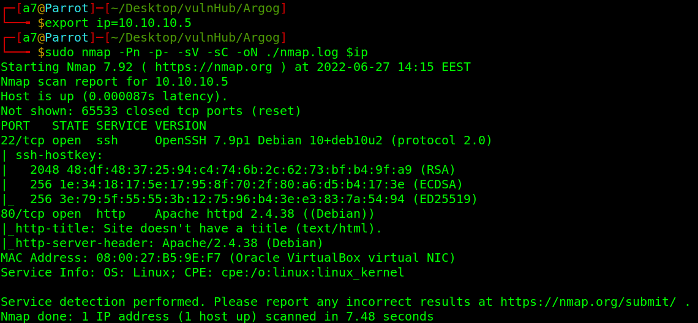

We have `SSH` and `HTTP`.

<br />

## Web Server Enumeration

When we visit the web page, we got a nice image. Examin the source code and nothing usefull. 

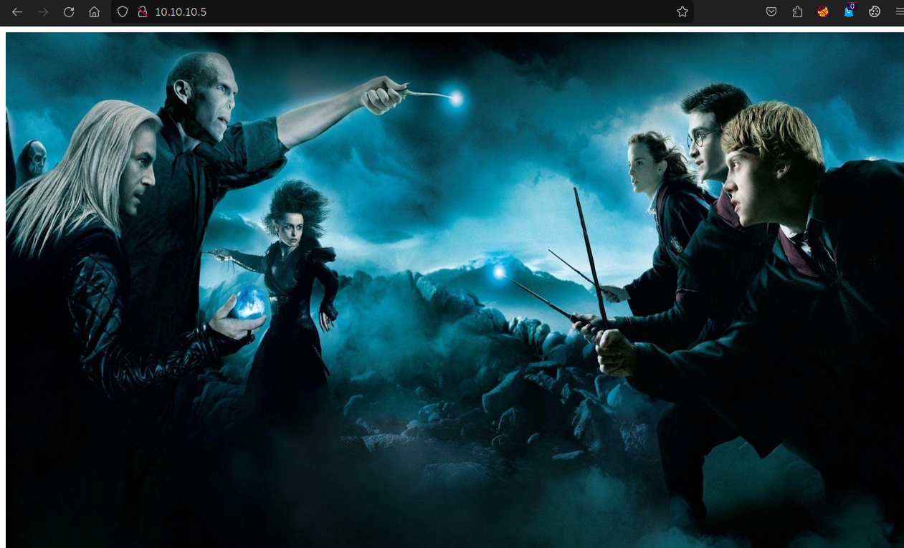
<br />

Fire `dirb` to bruteforce the directories.

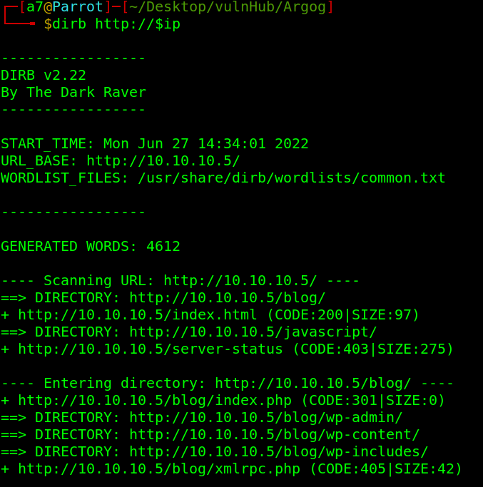 
<br />

We have `/blog`, navigate to it.
<br />

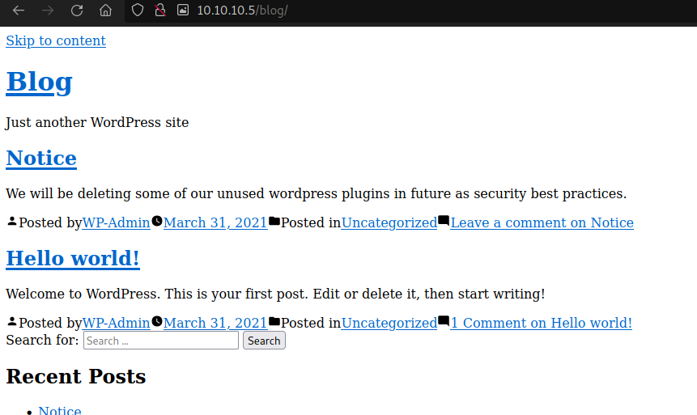

<br />
It's a wordpress site.
<br/>
Lets scan it with wpscan: `wpscan --url http://10.10.10.5/blog/ --api-token=$wpApi -e vp --plugins-detection aggressive`.
<br />

> PS: Vulnerable plugins scan requires an API token. To obtaine one, register in [https://wpscan.com/](https://wpscan.com/).


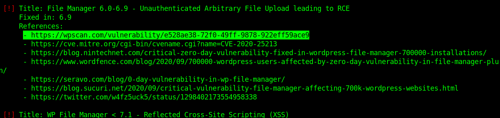

We can see, We have a vulnerable plugin `File Manager` that could gives us RCE. Let’s visit the highlighted link.
<br />

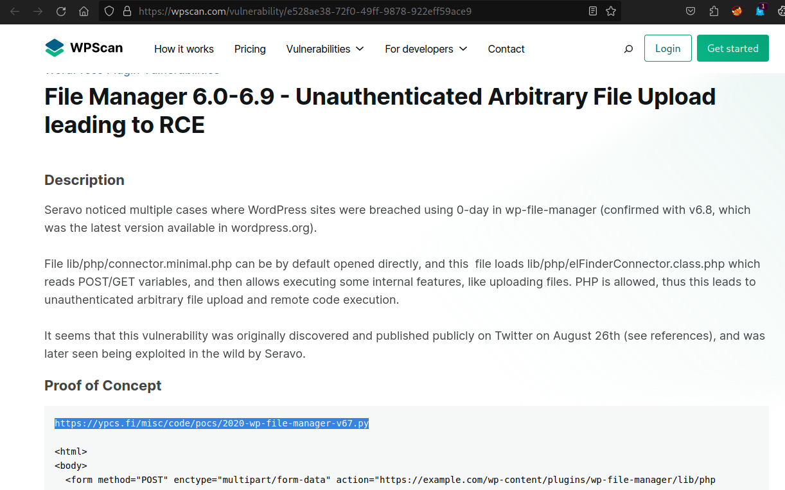
<br />

We have a Proof of Concept, copy the highlighted link, download the file and run it.

Got an error, create a `payload.php` and the script will work.

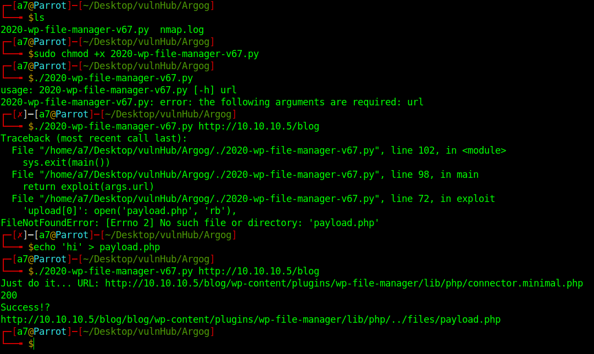

As you see above, there is two `/blog` in the url, remove one and visit the link. 

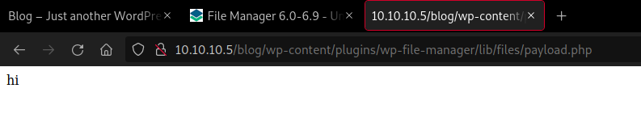
<br />

Now, modify `payload.php`  with reverse shell.<br />
`cp /usr/share/webshells/php/php-reverse-shell.php  payload.php`.

<br />
<strong>Remember to change the IP and Port to yours.</strong>

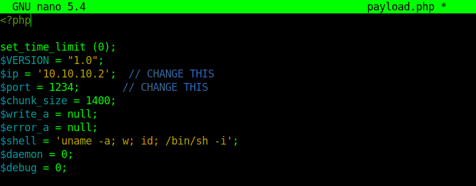
<br />

Listen to the port, run the script and visit the link again.

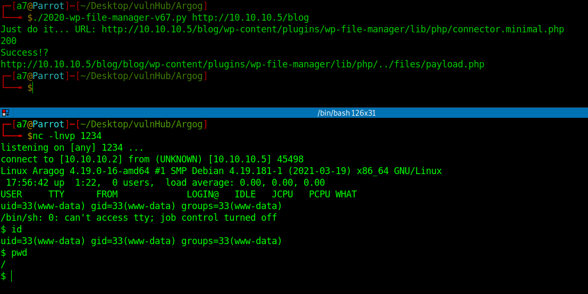
<br />

Now, upgrade the shell. [https://infosecwriteups.com/pimp-my-shell-5-ways-to-upgrade-a-netcat-shell-ecd551a180d2](https://infosecwriteups.com/pimp-my-shell-5-ways-to-upgrade-a-netcat-shell-ecd551a180d2).

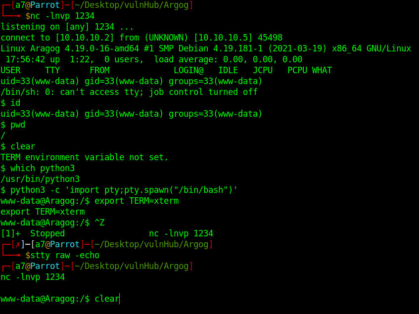
<br />

In home directory, there are two users and the first horcrux<strong>(flag)</strong> encoded in base64.

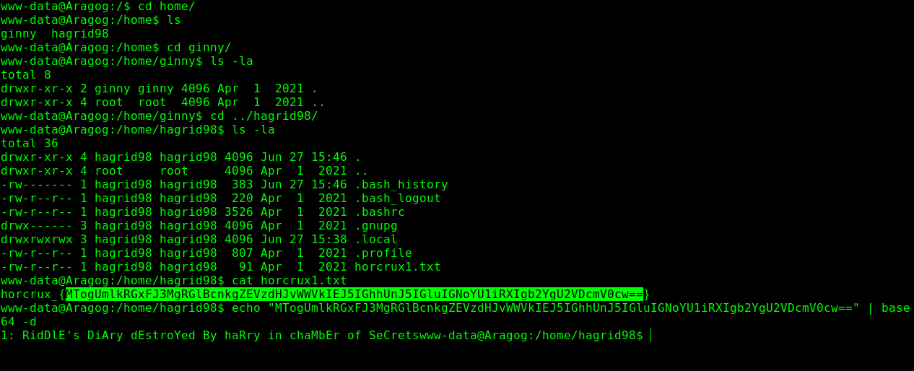
<br />

## Privilege Escalation

Now, lets try to get more privileges, `linpeas` is a great tool for that. Lets upload it and run it on the target machine. 

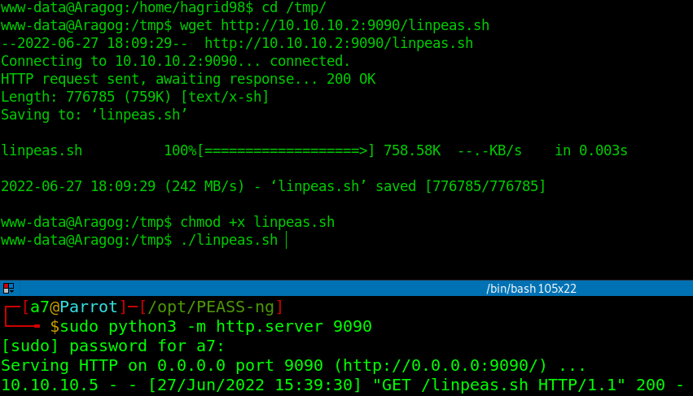
<br />

We have a hidden file. 

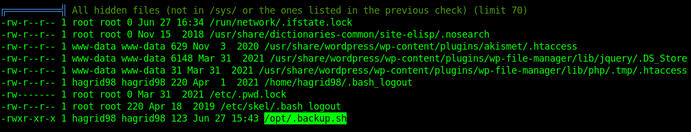

And a database credentials.

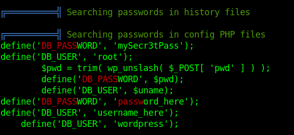
<br />

Log into mysql with `mysql -u<username> -p<password>`.

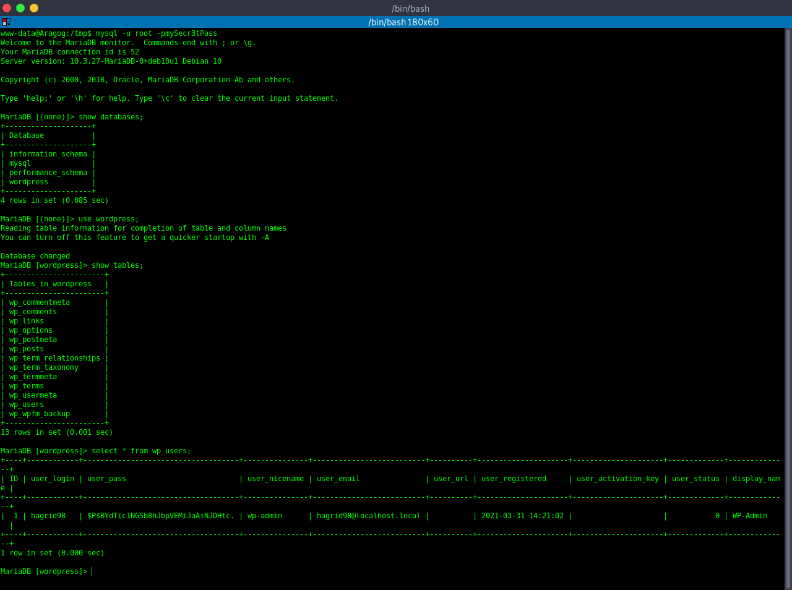
<br />

We got hagrid98's hashed password, crack it with `john`.

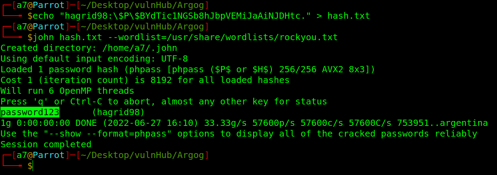
<br />

Switch to `hagrid98`, and cat `/.backup.sh`

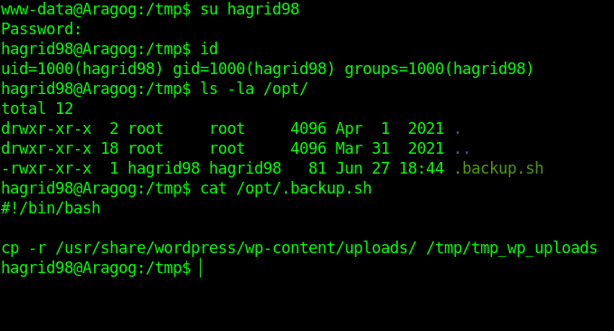
<br />

Looks like `/opt/.backup.sh` is a background script that copies what's in `uploads` to other location. There is a tool called pspy which listens and monitors any events that occur in the system. Lets upload it on the target and run it.

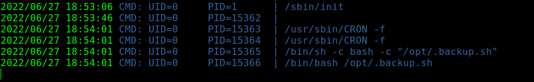
<br />

A background job runs by `root`, what if we add a reverse shell in `/.backup.sh`.

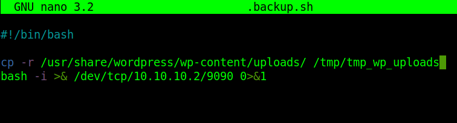
<br />

Start the listener, and waite.<br />
We're root.

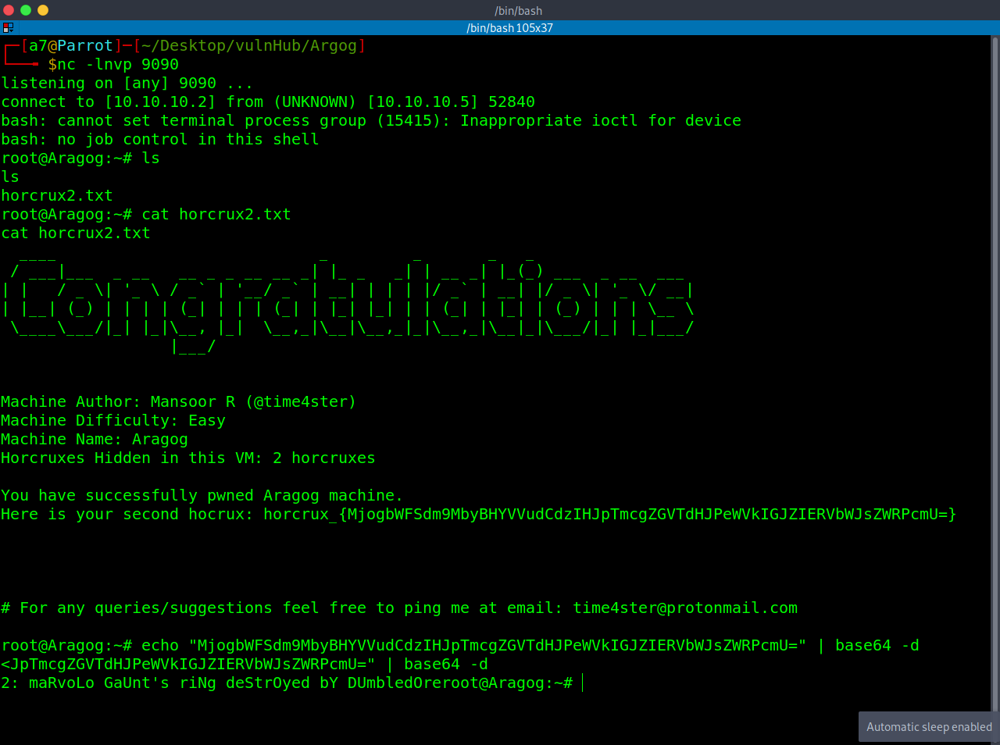
