# Brainpan1 - Writeup

Brainpan1 is an intermediate-level machine from Vulnhub by superkojiman.<br />
This is a Buffer Overflow machine, so you need to have basic knowledge of scripting and buffer overflow.<br />
Link to the machine: [https://www.vulnhub.com/entry/brainpan-1,51/](https://www.vulnhub.com/entry/brainpan-1,51/).
<br />

## Target discovery

Starting with identifying our target IP address.

```
sudo netdiscover -i vboxnet0 -r 10.10.10.0/24

Currently scanning: Finished!   |   Screen View: Unique Hosts

2 Captured ARP Req/Rep packets, from 2 hosts.   Total size: 84
_____________________________________________________________________________
   IP            At MAC Address     Count     Len  MAC Vendor / Hostname
-----------------------------------------------------------------------------
10.10.10.1      08:00:27:a7:fd:12      1      42  PCS Systemtechnik GmbH
10.10.10.10     08:00:27:86:50:f8      1      42  PCS Systemtechnik GmbH
```
<br />

## Scanning The Target

Scanning the target for open ports and running services.

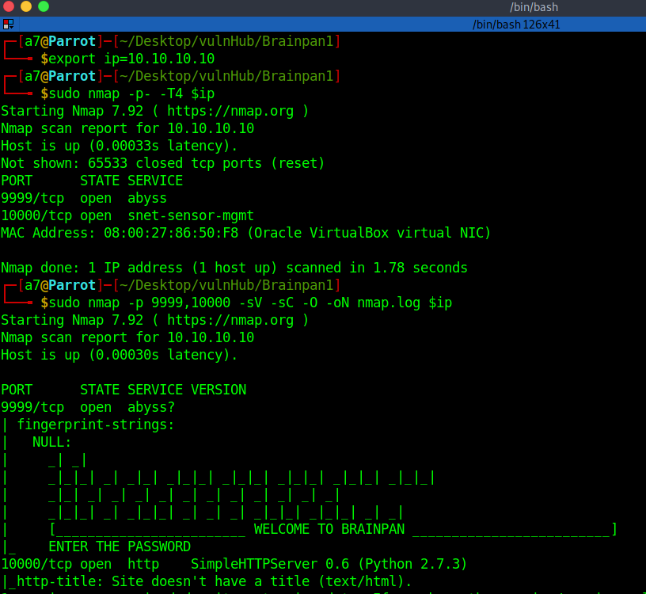
<br />
<br />

We have two open ports, let's start our enumeration.
<br />

## Enumeration

Fire `nikto` and `gobuster` in the background while we manually examine these two ports.

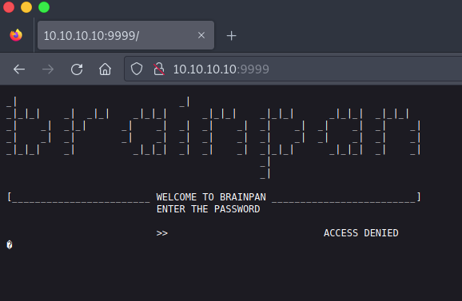
<br />
<br />

It's an application that expects inputs, let's connect to it via netcat.

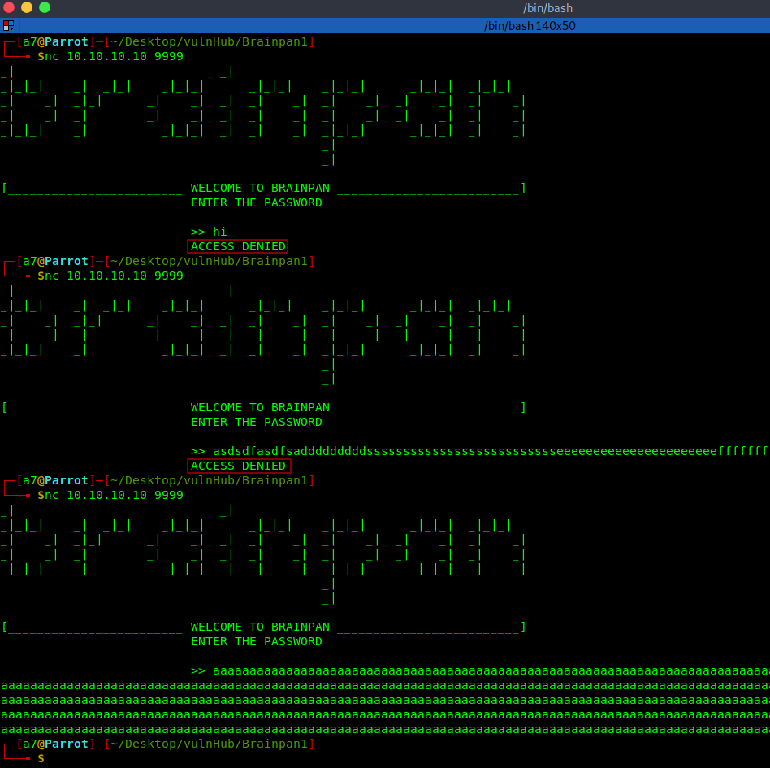
<br />
<br />

We crash it, I guess!<br />
Anyway, let's examine port `10000`.

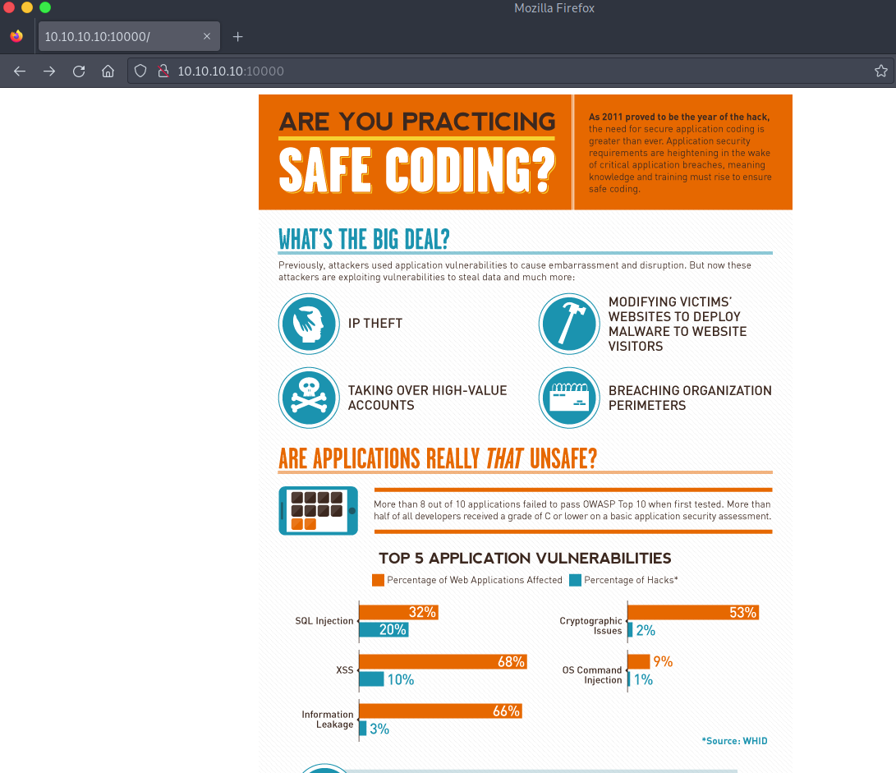
<br />
<br />

Just an image about safe coding. Back at our results.

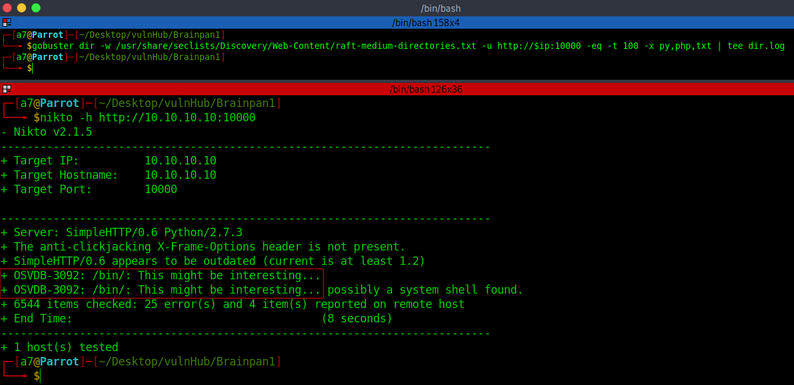
<br />
<br />

We have a `/bin` directory. Let's browse it.

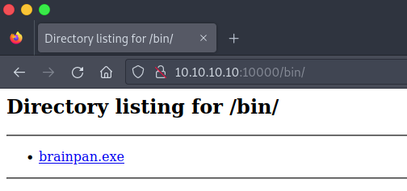
<br />
<br />

Well, it's a windows executables `.exe` file, am going to download it on a windows VM and execute it.
<br />
<br />

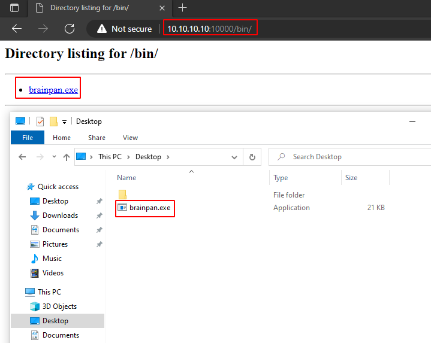
<br />
<br />

This machine is about `Buffer Overflow`, we need a debugger, I'll use Immunity debugger.<br />
[https://www.immunityinc.com/products/debugger/](https://www.immunityinc.com/products/debugger/)
<br />
<br />
Now, Buffer Overflow occurs when a program or process attempts to write more data than the buffer’s capacity, resulting in adjacent memory being overwritten, which gives the attacker full control over the program execution.

To Perform Buffer Overflow, follow these steps:
- Fuzzing: Is it vulnerable? and how many bytes would crash the application?
- Finding the Offset: Which bytes locate in EIP?
- Overwriting The EIP: Control the execution.
- Generating shellcode.
- Getting shell.

## Fuzzing

On Windows, start the application `Brainpan.exe`.

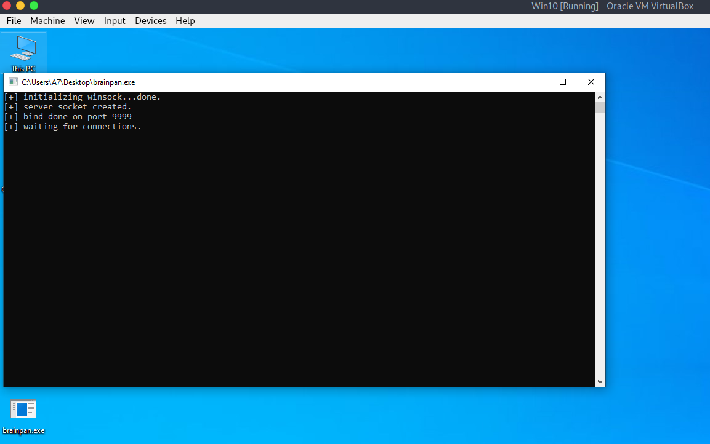
<br />
<br />

Open Immunity and click on `ctrl+F1` to attach the service (brainpan.exe) to Immunity.

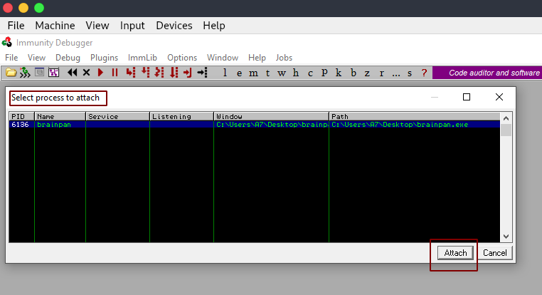
<br />
<br />

Notice that the application is in `Pause`, Click on `F9` to run it.

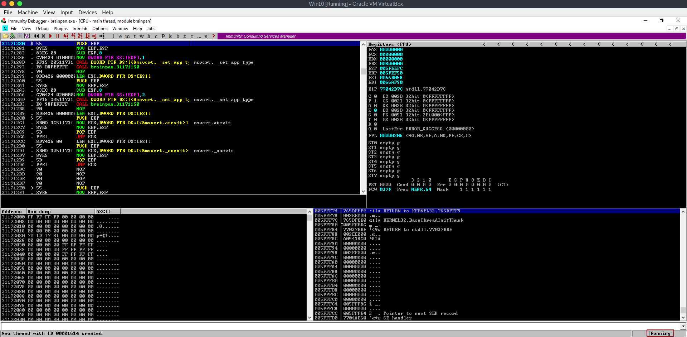
<br />
<br />

Let's write a python script that connects to the application, sends 100 `A` to the application, keeps increasing by 100 on each attempt until it crashes, then prints the length of bytes that crash the application.<br />
My windows machine is at `10.10.10.9`.

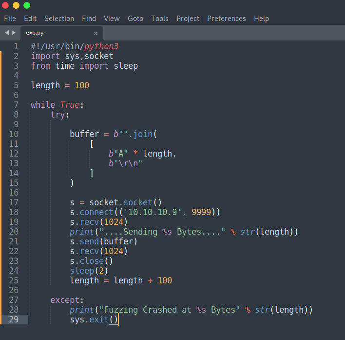
<br />
<br />

Make it executable and run it.

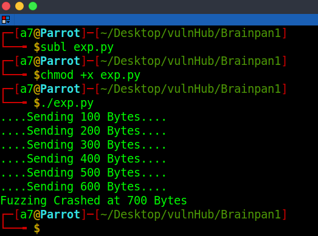
<br />
<br />

The application crashed at 700 bytes.<br />
On Immunity, we got an error message saying that the EIP address had changed to `41414141` which is the hex of `AAAA`.

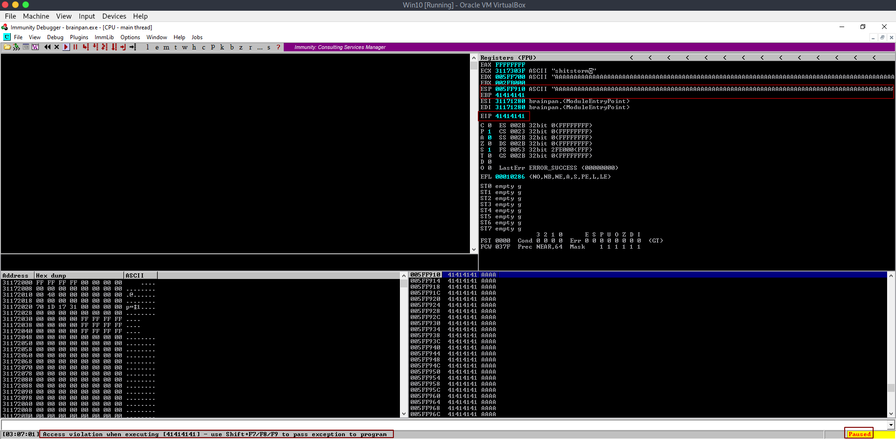
<br />
<br />

## Finding The Offset

Now, find the exact 4 bytes locate in EIP, we'll use a tool called `msf-pattern_create` with argument `-l` for the length of the pattern.

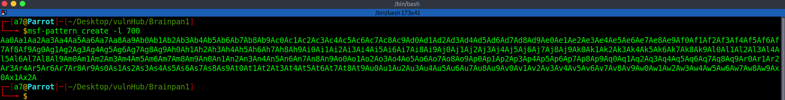
<br />
<br />

Paste the pattern into the script.

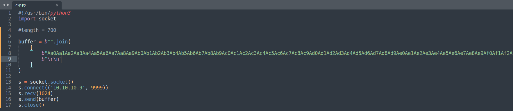
<br />
<br />

PS: Remember to restart the program every time it crashes by clicking on `ctrl+F2`, then `F9` to run it.<br />
Run the script and navigate to Immunity.

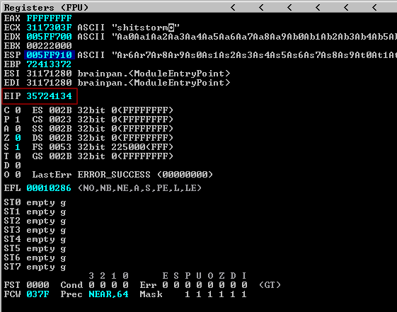
<br />
<br />

Copy EIP's address `35724134`, and use `msf-pattern_offset -q 35724134 -l 700` to locate the exact bytes.

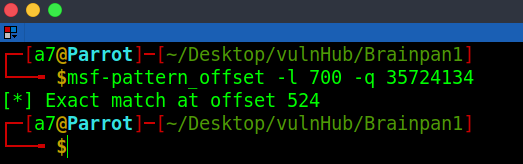
<br />
<br />

## Overwrite The EIP

Now, modify our script.

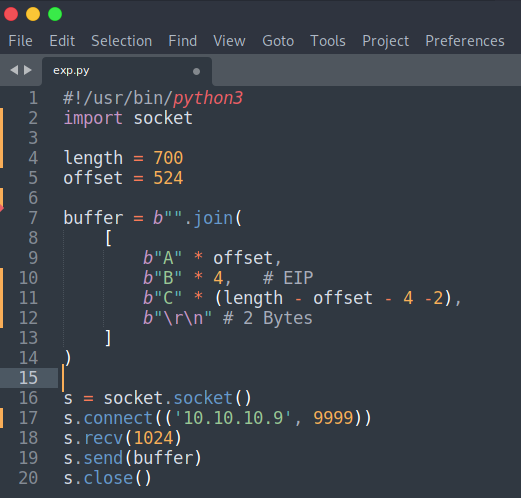
<br />
<br />

Our script will connect to the server, Overflow the buffer with `524 A`, and Overwrite the EIP with `4 B`.<br />
Restart the server, run the script, and back to Immunity.

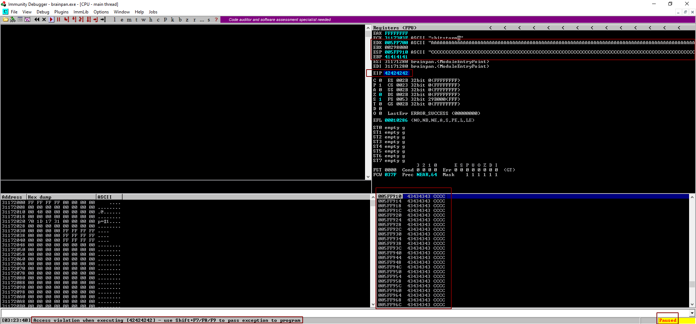
<br />
<br />

The EIP address has changed to `42424242` which means BBBB.<br />
We control EIP! I mean, if we inject EIP with an address that store a shellcode, it will be executed.
<br />

Let's find bad Characters.<br />
Bad Characters is a reserved character for the application, we can't use them.

```
"\x01\x02\x03\x04\x05\x06\x07\x08\x09\x0a\x0b\x0c\x0d\x0e\x0f\x10\x11\x12\x13\x14\x15\x16\x17\x18\x19\x1a\x1b\x1c\x1d\x1e\x1f\x20"
"\x21\x22\x23\x24\x25\x26\x27\x28\x29\x2a\x2b\x2c\x2d\x2e\x2f\x30\x31\x32\x33\x34\x35\x36\x37\x38\x39\x3a\x3b\x3c\x3d\x3e\x3f\x40"
"\x41\x42\x43\x44\x45\x46\x47\x48\x49\x4a\x4b\x4c\x4d\x4e\x4f\x50\x51\x52\x53\x54\x55\x56\x57\x58\x59\x5a\x5b\x5c\x5d\x5e\x5f\x60"
"\x61\x62\x63\x64\x65\x66\x67\x68\x69\x6a\x6b\x6c\x6d\x6e\x6f\x70\x71\x72\x73\x74\x75\x76\x77\x78\x79\x7a\x7b\x7c\x7d\x7e\x7f\x80"
"\x81\x82\x83\x84\x85\x86\x87\x88\x89\x8a\x8b\x8c\x8d\x8e\x8f\x90\x91\x92\x93\x94\x95\x96\x97\x98\x99\x9a\x9b\x9c\x9d\x9e\x9f\xa0"
"\xa1\xa2\xa3\xa4\xa5\xa6\xa7\xa8\xa9\xaa\xab\xac\xad\xae\xaf\xb0\xb1\xb2\xb3\xb4\xb5\xb6\xb7\xb8\xb9\xba\xbb\xbc\xbd\xbe\xbf\xc0"
"\xc1\xc2\xc3\xc4\xc5\xc6\xc7\xc8\xc9\xca\xcb\xcc\xcd\xce\xcf\xd0\xd1\xd2\xd3\xd4\xd5\xd6\xd7\xd8\xd9\xda\xdb\xdc\xdd\xde\xdf\xe0"
"\xe1\xe2\xe3\xe4\xe5\xe6\xe7\xe8\xe9\xea\xeb\xec\xed\xee\xef\xf0\xf1\xf2\xf3\xf4\xf5\xf6\xf7\xf8\xf9\xfa\xfb\xfc\xfd\xfe\xff"
```
<br />

Modify our script.

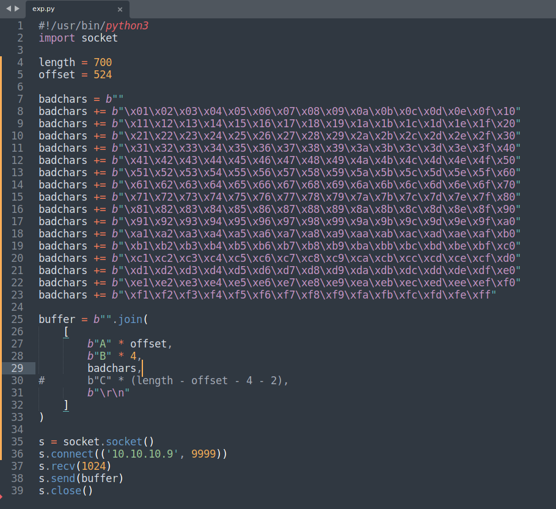
<br />
<br />

Run the script, head back to Immunity and click on `ESP` then right-click and `Follow in Dump`.

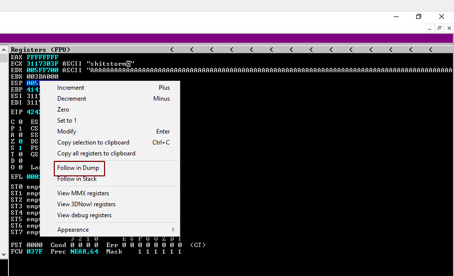
<br />
<br />

Searching for any missing characters.<br />
Except the null byte "\x00", we have no bad characters.

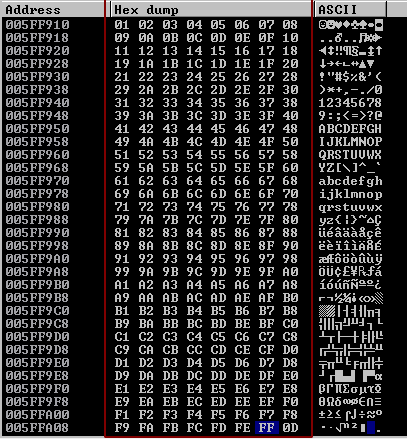
<br />
<br />

Finally, looking for a jump statement with no memory protection.<br />
We will use mona.py module (not installed by default). Run `!mona modules` down at the bottom.

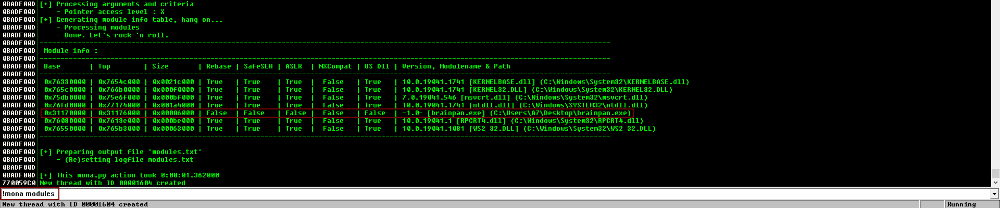
<br />
<br />

Great! We'll use brainpan.exe, enter `!mona find -s '\xff\xe4' -m brainpan.exe`.

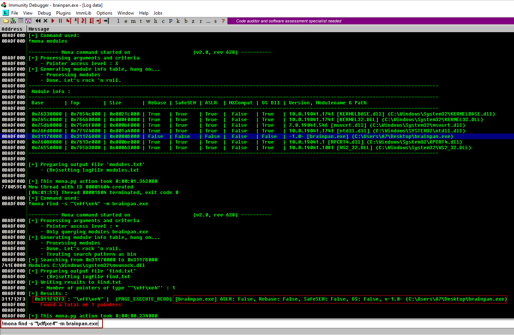
<br />
<br />

Note this address `0x311712f3`, We'll inject EIP with this address which will jump to our shellcode.<br />
<br />

## Getting access

Now, generate windows reverse shell.

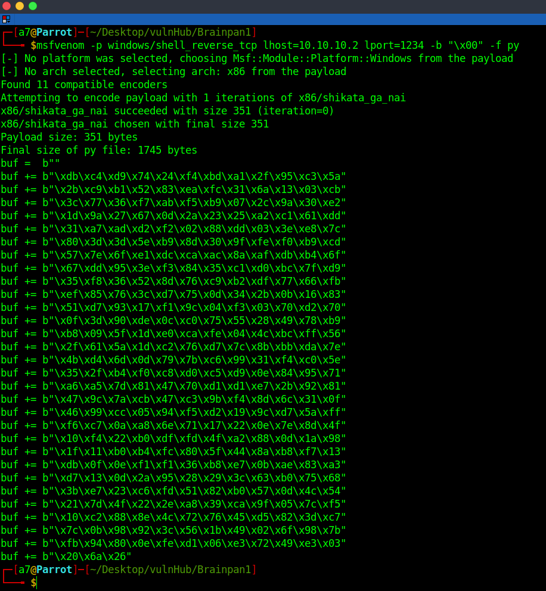
<br />
<br />

Copy it to our script.

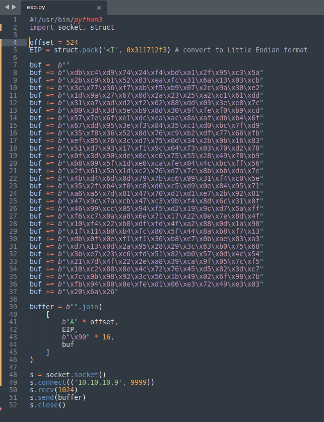
<br />
<br />

Test time. Close `Immunity` and relaunch Brainpan.exe.

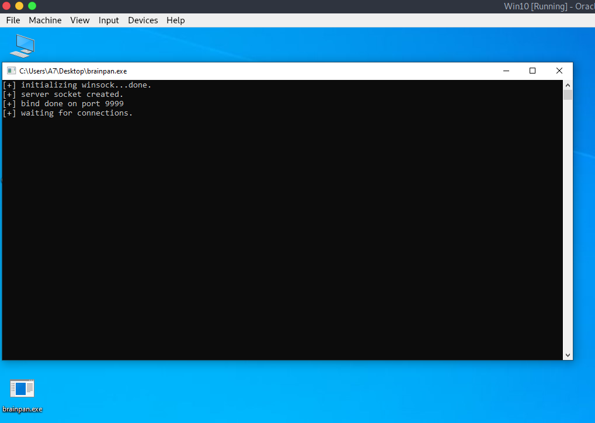
<br />
<br />

Launch a listener, and run our script.

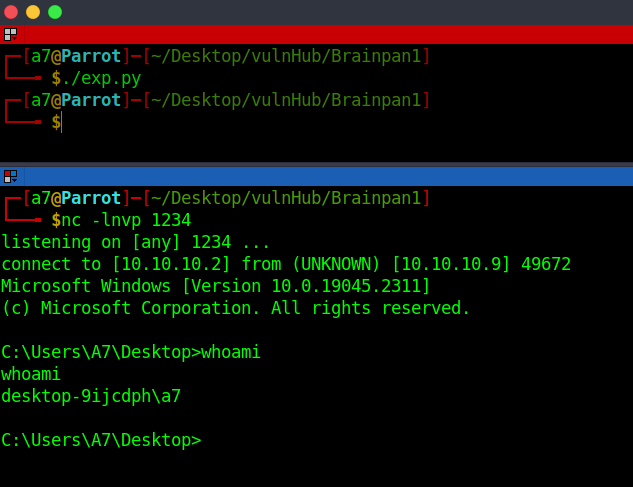
<br />
<br />

Great! We successfully perform buffer overflow on the Windows machine.<br />
Now, generate a Linux payload to exploit the actual application.

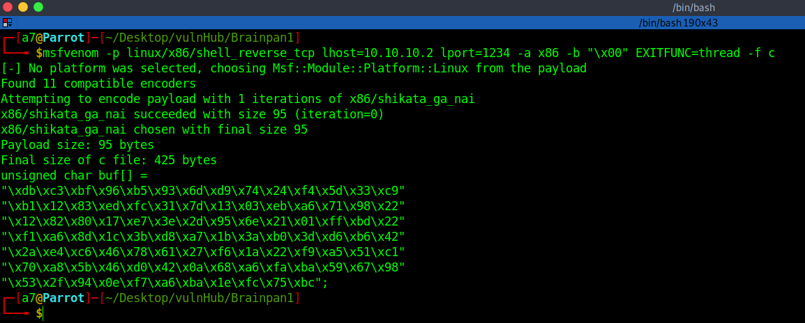
<br />
<br />

Modify our script with the new payload.<br />
Remember to add `NOPs` which means `No Operation (\x90)`.

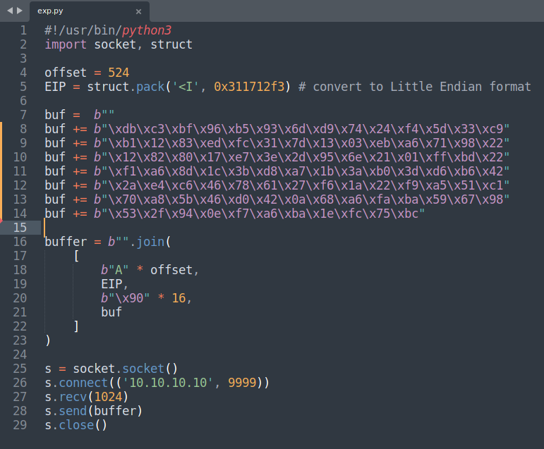
<br />
<br />

Launch a listener and run the script.

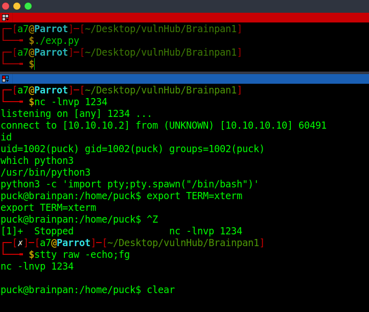
<br />
<br />

## Privilege Escalation

When we check sudo permission, there is one binary we can run as sudo.

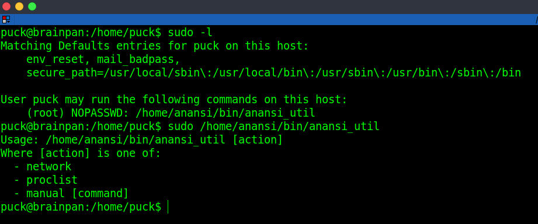
<br />
<br />

We can use sudo with `anansi_util`.<br />
Run `anansi_util`, and we have three options, "manual" looks interesting, searching at GTFObins, we can use `manual` to get root. [https://gtfobins.github.io/gtfobins/man/](https://gtfobins.github.io/gtfobins/man/).

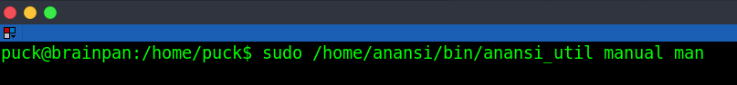
<br />
<br />

Enter `!/bin/bash`.

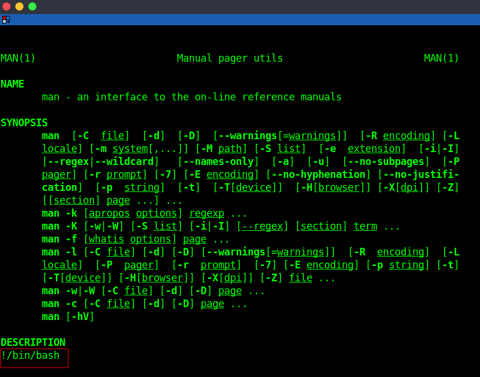
<br />

Cat our flag.

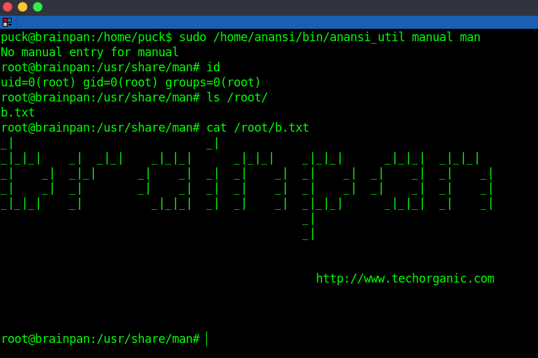
<br />