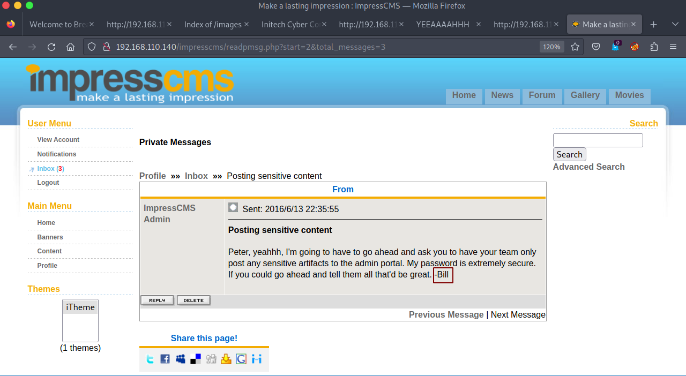

# Breach:1 - Writeup 

Breach1 is Beginner to Intermediate-level machine from Vulnhub by mrb3n. 
Breach1 is the first in a multi-part series. 
The description says: "Solving will take a combination of solid information gathering and persistence. Leave no stone unturned". 
Link to the machine: [https://www.vulnhub.com/entry/breach-1,152/](https://www.vulnhub.com/entry/breach-1,152/)
 

## Identify The Target

Let's begin with the target's IP address.

 
 

## Ports Scanning

Let's scan our target.

 
 

We got all 65535 ports opened. Let's concentrate on port "80".

 
 

## WebServer Enumeration

Let's visit the webpage.

 
 

We got two usernames, write them down, and inspect the source code.

 
 

We found a base64 encoded hash, the `/images` directory, and another webpage, let's first decode the hash.

 
 

Looks like it's **Peter Gibbons**'s username and password, we noticed that name on the webpage! Anyway, run `gobuster` and we got `/images` directory, so let's visit it.

 
 

Let's visit `/initech.html`.

 
 

Inspecting the source code.

 
 

We got another comment, and two links, let's browse them.

 
 

Inspect the source code.

 
 

Nothing to see here! Let's download the picture in the link for more examination if that what he meant.

 
 

We got a comment!! Anyway, moving on, we saw an `Employee portal`, let's visit it.

 
 

Let's try Peter's creds we found earlier.

 
 

There are 3 emails in Peter's inbox, let's read them.

 
 

We saw the name `bill` in the picture we downloaded, moving to the next email.

 
 

This one is interesting, we have a new username, some SSL cert, and a file to download, let's download it.

 
 

Use the `file` command on it.

 
 

It's my first time dealing with something like this, so let's google it.

 
 

Ok, there are keys stored in this file. Moving on and digging around I found something. 
Click on Peter Gibsons Profile, then click on Content.

 
 

Click on `SSL implementation test capture`.

 
 

Let's download that pcap file.

 
 

Open it with **WireShark**.

 
 

Notice that it's all encrypted, we can't read anything, so basically it's useless until we decrypt it.

 
 

If we go back to the webpage, Peter was talking about (alias, storepassword and keypassword), all set to 'tomcat', we have `index.keystore`, searched on google about how to use it, and found a way. 
> Reference: [https://dzone.com/articles/extracting-a-private-key-from-java-keystore-jks](https://dzone.com/articles/extracting-a-private-key-from-java-keystore-jks) 

I will use `keytool`.

 
 

Now, let's decrypt the captured file. Close the captured file, Press `Ctrl + Shift + P`, click on `Protocols` select `TLS` and click `Edit`.

 
 

Now open the captured file, right click on any HTTP req/res and click follow TLS or HTTP stream.

 
 

As we see above, there was a request to `/_M@nag3Me/html` and the server responded with 401 code 'Unauthorized'.

 
 

In the second request, when adding the 'Authorization' parameter, the server responds with **200** code. 
So, let us decrypt that hash.

 
 
Looks like a username and password, let's browse `/_M@nag3Me/html`.

 
 

Ok, open Burp, and refresh `/_M@nag3Me/html`.

 
 

That solved it, when we click on "Accept The Risk", a sign-in prompt popped up.

 
 

Supply the creds we obtained by decrypting the hash and sign in.

 
 

With the upload feature, we could get a reverse shell. 
Let's make a java reverse shell.

 
 

Upload it.

 
 

Click on `/exp` to trigger it.

 
 

## Privelege Escalation

Start to enumerate for higher priv, under the `/home` directory there are two users, when we cat `/etc/passwd` we see user `blumbergh` , and his full name is **Bill Lumbergh**.

 
 

Earlier, we found a comment `coffeestains` hidden in `bill.png`, maybe it's his password, let's try it.

 
 

Searching in our directory and nothing useful, checking our SUDO perm.

 
 

We could run `tee` and `tidyup.sh` as root with no password. 
The tool `tee` can read from standard input and write to standard output or a file. The script run every 3 minutes, it scans for any content under `swingline` and deletes it. 

The fun part is we could use '**tee**' to read from standard input and write it to standard output or let's say (tidyup.sh). 
Let's create our reverse shell.

 
 

Now, abuse `tee` to read our payload and write it to `tidyup.sh`.

 
 

All we have to do now is wait for 3 minutes or less to get a shell.

 
