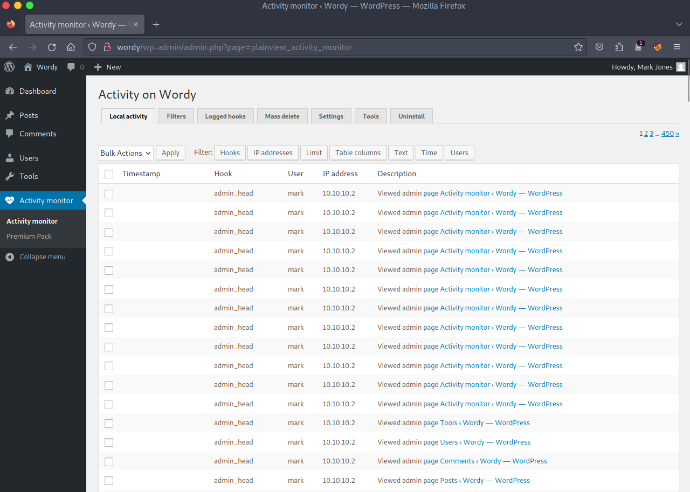
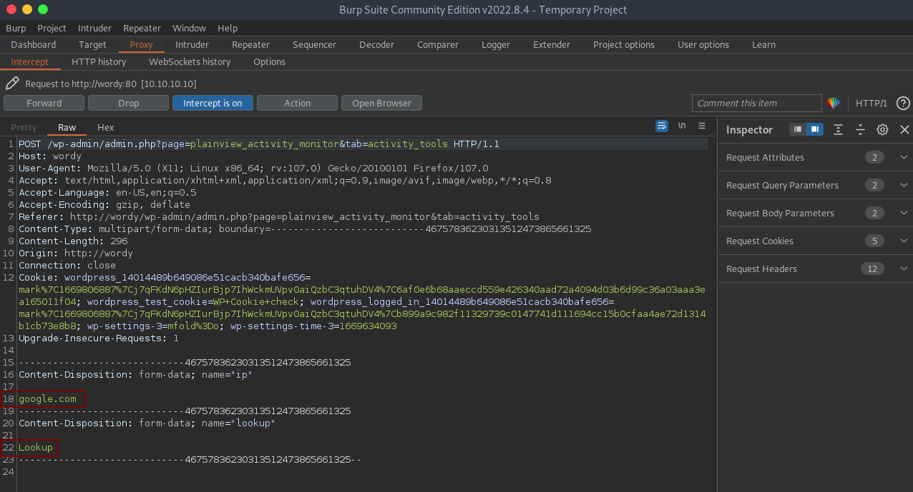

# DC: 6 - Writeup 

DC: 6 is purposely built vulnerable lab from Vulnhub by DCAU.<br />
Our goal is to get root and read the flag.<br />

The author gives us a Clue: "OK, this isn't really a clue as such, but more of some (we don't want to spend five years waiting for a certain process to finish) kind of advice for those who just want to get on with the job. `cat /usr/share/wordlists/rockyou.txt | grep k01 > passwords.txt` That should save you a few years. ;-)".

Link to the machine: [https://www.vulnhub.com/entry/dc-6,315/](https://www.vulnhub.com/entry/dc-6,315/)
<br />

## Identify the target

Let's begin with identifying our target IP address.

```
fping -agq 10.10.10.0/24

10.10.10.1
10.10.10.2
10.10.10.10
```
<br />

## Port scan

Scan our target for open ports, running services, and version detection.


<br />
<br />

## Enumeration

Add `wordy` in `/etc/hosts` file.


<br />
<br />

Browse `wordy`.


<br />
<br />

Great, we have WordPress.<br />
Let's fire `gobuster` to bruteforce directories.


<br />
<br />

After checking, we have a login page, tried common credentials but didn't work.<br />
let's scan WordPress plugins, themes, and users with `wpscan`.


<br />
<br />

We got some users.


<br />
<br />


I create a list of found users, and from our clue, we have a passwords list, let's bruteforce.


<br />
<br />

Well, we got the password.


<br />
<br />

Log in with `mark`.


<br />
<br />

## Getting Access

We can see there's a tab `Activity monitor`.


<br />
<br />

Search for known exploits, and we have an easy one.


<br />
<br />

Let's read it.


<br />
<br />

Let's do it. Click on `Tools`, and type `google.com`.


<br />
<br />

Now, intercept the request with `Burp`, and send it to repeater.


<br />
<br />

Launch a listener and modify the request to connect back to our machine by `netcat`.


<br />
<br />

## Privilege Escalation

Under `/home/mark/stuff` directory, there's a file called `things-to-do.txt`, cat it.


<br />
<br />

That looks interesting, let's give it a try.


<br />
<br />

Checking `graham` sudo permissions.


<br />
<br />

Great, we could abuse group permission to write and execute a command as user `jens`.


<br />
<br />

## Root Access

Now, check `jens` sudo permissions.


<br />
<br />

Heading to GTFObins [https://gtfobins.github.io/gtfobins/nmap/](https://gtfobins.github.io/gtfobins/nmap/)


<br />
<br />

We could get a root shell by creating a Nmap script file ".nse".<br />
Let's get root.


<br />
