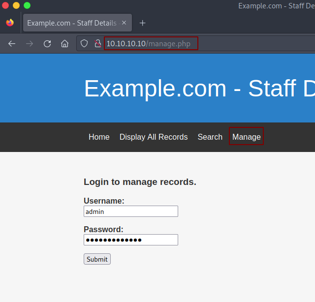
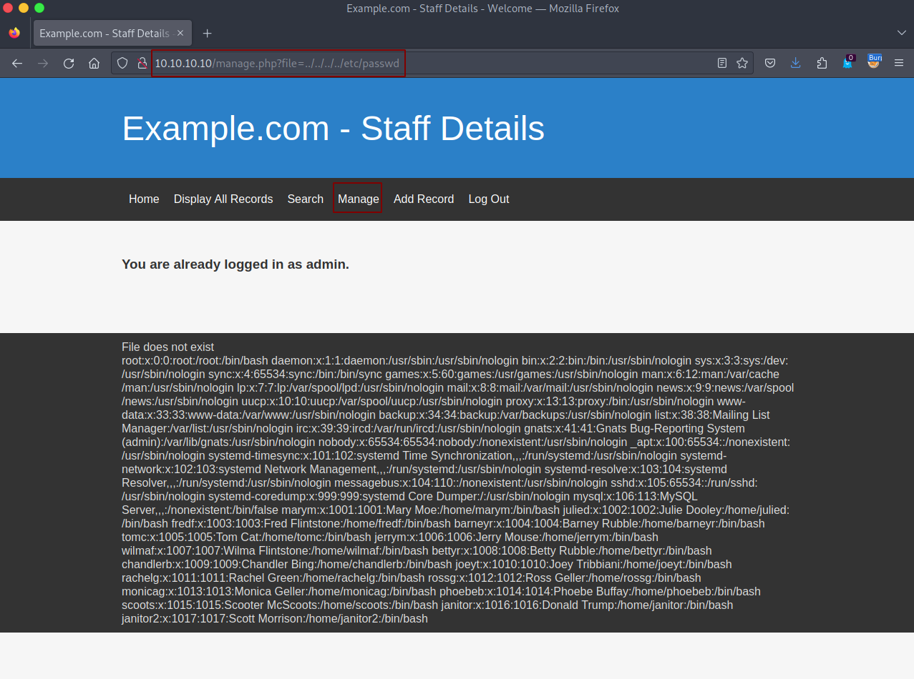

# DC:9 - Writeup 

DC:9 is another purposely built vulnerable lab from Vulnhub by DCAU.<br />
The ultimate goal of this challenge is to get root and read the one and only flag.<br />

Link to the machine: [https://www.vulnhub.com/entry/dc-9,412/](https://www.vulnhub.com/entry/dc-9,412/)
<br />

## Identify our target

Let's begin with identifying our target IP address.

```
netdiscover -i vboxnet0 -r 10.10.10.0/24

Currently scanning: Finished!   |   Screen View: Unique Hosts

2 Captured ARP Req/Rep packets, from 2 hosts.   Total size: 102
_____________________________________________________________________________
   IP            At MAC Address     Count     Len  MAC Vendor / Hostname
-----------------------------------------------------------------------------
10.10.10.1      08:00:27:fd:29:dc      1      42  PCS Systemtechnik GmbH
10.10.10.10     08:00:27:94:94:ad      1      60  PCS Systemtechnik GmbH
```
<br />

## Port scan

Start by Scanning our target for open ports, running services, and version detection.


<br />
<br />

As we see, we have `HTTP`, and filtered `SSH`, maybe there's port knocking, I guess.
<br />

## Web Server Enumeration

When we browse the webpage, it's a php application.


<br />
<br />

Launch `gobuster` for directories brute-force.


<br />
<br />

After we click on all links, there's a `Display All Records` parameter, it retrieves all user information from a database which may indicate to SQLi.


<br />
<br />

There's a `Search` parameter, we could search by the first or last name.


<br />
<br />

Tried a few names and then copied the first user from `Display All Records`, and paste it on `Search`.


<br />
<br />

Let's test it for sqli, try: `a' or 1=1 -- -`.


<br />
<br />

Great, It's vulnerable to SQLi, and returns all the records from the table.<br />
Launch `Burp`, and send `Search` request to Repeater.


<br />
<br />

Try the query again.


<br />
<br />

Now, we'll use `UNION` attack.<br />
> When an application is vulnerable to SQLi and the results of the query are returned within the application's responses, the UNION keyword can be used to retrieve data from other tables within the database.<br />

For a `UNION` query to work, the query must return the same number of columns from the original query.<br />
`search=a' union select null -- -`.


<br />
<br />

If the number of `null` does not match the number of columns, the database returns an error.<br />
We'll keep increasing the `null` to match the number of columns.<br />
`search=a' union select null,null,null -- -`.


<br />
<br />

As we see, we have six columns.<br />
Now, let's get the database type and version.<br />
`search=a' union select @@version,2,3,4,5,6 -- -`.


<br />
<br />

Great, we could retrieve data from the database, let's find how many databases exist.<br />
`search=a' union select schema_name,2,3,4,5,6 from information_schema.schemata -- -`.


<br />
<br />

We have two databases, `Staff` and `users`.<br />
Let's find the tables in `Staff`.<br />
`search=a' union select table_name,2,3,4,5,6 from information_schema.tables where table_schema='Staff' -- -`.


<br />
<br />

Let's get the columns for the table `Users`.<br />
`search=a' union select column_name,2,3,4,5,6 from information_schema.columns where table_name='Users' -- -`.


<br />
<br />

Now, we have a database called `Staff`, with a table called `Users` which contains "UsersId", "Usernames", and "Passwords". Let's dump the users and passwords.


<br />
<br />

There's one user, `admin` and his hashed password, let's crack it.


<br />
<br />

Great, Let's do the same for the database `users`.


<br />
<br />

There's one table, let's get the columns.


<br />
<br />

Lastly, let's dump the "usernames" and their "passwords".


<br />
<br />

Create a list of the obtained users and passwords for later if needed.
<br />

## Getting Access

Tried to log in as `admin`.


<br />
<br />

At `manage.php`, there's a message "File does not exist" down at the bottom, the page is trying to include a file and display it.


<br />
<br />

Maybe there's LFI (Local File Inclusion) vulnerability, let's test it.


<br />
<br />

It's vulnerable to LFI.<br />
After reviewing our earlier reports, notice that we have filtered ssh which might indicate to Port Knocking, let's try to include the `/etc/knockd.conf`.


<br />
<br />

This is a great box.<br />
There's a port knocking and we've found the knock sequence.<br />
knock, knock!


<br />
<br />

We opened SSH, and we have users and passwords, let's brute-force ssh.


<br />
<br />

Login.


<br />
<br />
	
## Privilege Escalation

Start looking to escalate our privilege, but nothing in `chandlerb` home directory, no sudo permission, no suid files, decide to switch to `janitor`, and find a file containing passwords in her directory.


<br />
<br />

Add the new passwords to our password list and brute-force again.


<br />
<br />

Login with `fredf`.


<br />
<br />

The user `fredf` can run sudo as root with `/opt/devstuff/dist/test/test`, this binary reads from one file and appends to another.

Let's test it.


<br />
<br />

## Root Access

With write as root ability, let's add a new user to the `/etc/passwd` using the test script.<br />

Generate a password hash with OpenSSL `openssl passwd -1 -salt salt asd123`.<br /> 
Then add this line `<username>:<hash>:0:0:root:/root:/bin/bash` in the text file we created earlier `a.txt`.


<br />
<br />

Now, run the script to read from `a.txt` and then append it to `/etc/passwd`.


<br />
<br />

Finally, switch to `user`, and read the flag.


<br />
