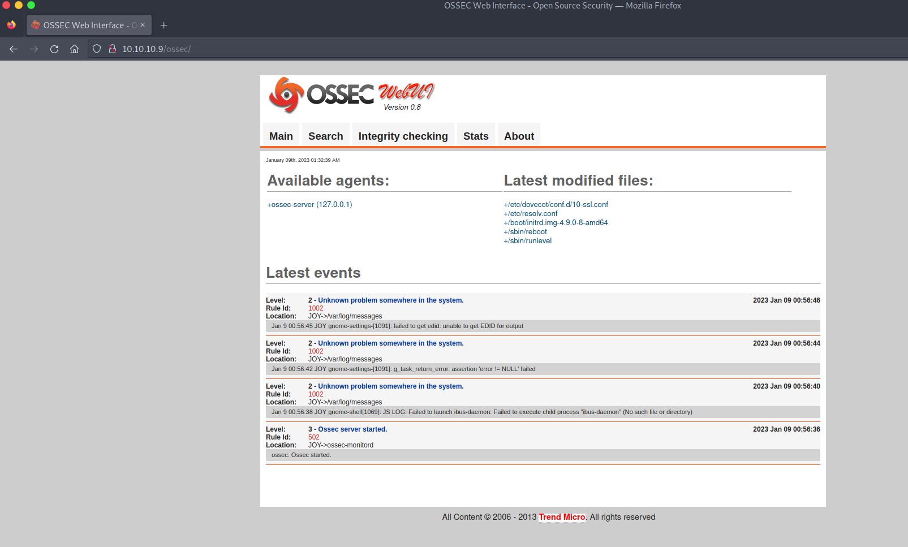
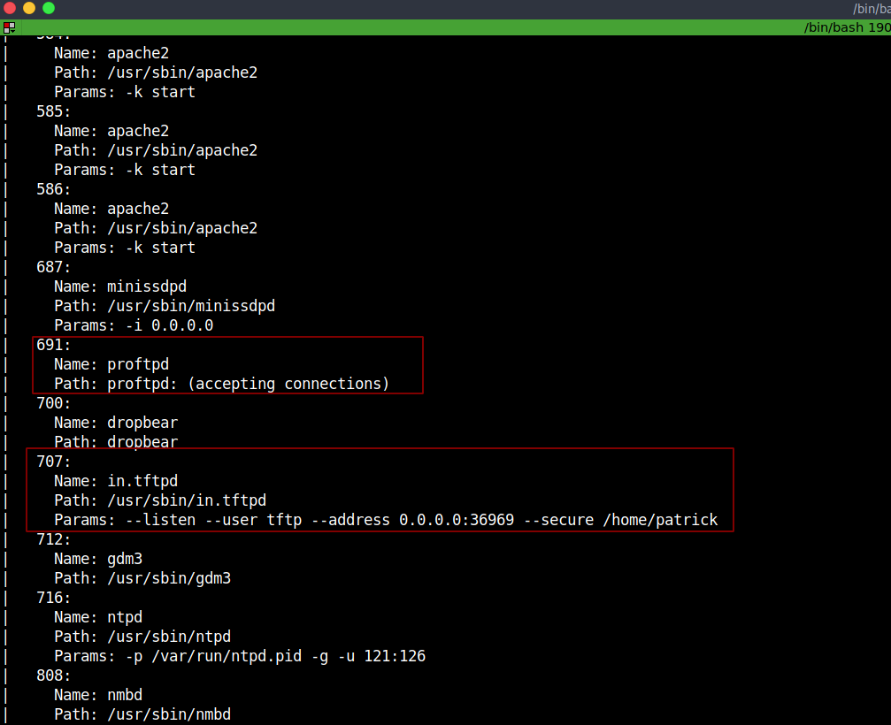

# Digitalworld.local: JOY - Writeup 

JOY is somewhat OSCP-like for learning value, it's from Vulnhub by Donavan.<br />
The description says: "This machine is full of services, full of fun, but how many ways are there to align the stars? Perhaps, just like the child in all of us, we may find joy in a playground such as this.<br />
Note: There are at least two reliable ways of obtaining user privileges and rooting this machine. Have fun. :-)"<br />

Link to the machine: [https://www.vulnhub.com/entry/digitalworldlocal-joy,298/](https://www.vulnhub.com/entry/digitalworldlocal-joy,298/)

<br />

## Identify the target

Let's start by identifying our target IP address.
```bash
┌─[a7@Parrot]─[10.10.10.2]─[~/Desktop/vulnHub/Digitalworld.local - JOY]
└──╼ $fping -agq 10.10.10.0/24
10.10.10.1
10.10.10.2
10.10.10.9
```
<br />

## Ports and Services

Next, scan the target for open ports and running services.
```bash
┌─[a7@Parrot]─[10.10.10.2]─[~/Desktop/vulnHub/Digitalworld.local - JOY]
└──╼ $export ip=10.10.10.9
┌─[a7@Parrot]─[10.10.10.2]─[~/Desktop/vulnHub/Digitalworld.local - JOY]
└──╼ $sudo nmap -A -oN nmap.log $ip
Starting Nmap 7.92 ( https://nmap.org )
Nmap scan report for 10.10.10.9
Host is up (0.00015s latency).
Not shown: 988 closed tcp ports (reset)
PORT    STATE SERVICE     VERSION
21/tcp  open  ftp         ProFTPD 1.2.10
| ftp-anon: Anonymous FTP login allowed (FTP code 230)
| drwxrwxr-x   2 ftp      ftp          4096 Jan  6  2019 download
|_drwxrwxr-x   2 ftp      ftp          4096 Jan 10  2019 upload
22/tcp  open  ssh         Dropbear sshd 0.34 (protocol 2.0)
25/tcp  open  smtp        Postfix smtpd
|_ssl-date: TLS randomness does not represent time
|_smtp-commands: JOY.localdomain, PIPELINING, SIZE 10240000, VRFY, ETRN, STARTTLS, ENHANCEDSTATUSCODES, 8BITMIME, DSN, SMTPUTF8
| ssl-cert: Subject: commonName=JOY
| Subject Alternative Name: DNS:JOY
| Not valid before: 2018-12-23T14:29:24
|_Not valid after:  2028-12-20T14:29:24
80/tcp  open  http        Apache httpd 2.4.25
| http-ls: Volume /
| SIZE  TIME              FILENAME
| -     2016-07-19 20:03  ossec/
|_
|_http-server-header: Apache/2.4.25 (Debian)
|_http-title: Index of /
110/tcp open  pop3        Dovecot pop3d
|_pop3-capabilities: STLS RESP-CODES UIDL TOP SASL AUTH-RESP-CODE PIPELINING CAPA
|_ssl-date: TLS randomness does not represent time
139/tcp open  netbios-ssn Samba smbd 3.X - 4.X (workgroup: WORKGROUP)
143/tcp open  imap        Dovecot imapd
|_ssl-date: TLS randomness does not represent time
|_imap-capabilities: more have post-login ENABLE IDLE listed capabilities SASL-IR ID LITERAL+ OK Pre-login LOGIN-REFERRALS IMAP4rev1 LOGINDISABLEDA0001 STARTTLS
445/tcp open  netbios-ssn Samba smbd 4.5.12-Debian (workgroup: WORKGROUP)
465/tcp open  smtp        Postfix smtpd
|_ssl-date: TLS randomness does not represent time
| ssl-cert: Subject: commonName=JOY
| Subject Alternative Name: DNS:JOY
| Not valid before: 2018-12-23T14:29:24
|_Not valid after:  2028-12-20T14:29:24
|_smtp-commands: JOY.localdomain, PIPELINING, SIZE 10240000, VRFY, ETRN, STARTTLS, ENHANCEDSTATUSCODES, 8BITMIME, DSN, SMTPUTF8
587/tcp open  smtp        Postfix smtpd
|_smtp-commands: JOY.localdomain, PIPELINING, SIZE 10240000, VRFY, ETRN, STARTTLS, ENHANCEDSTATUSCODES, 8BITMIME, DSN, SMTPUTF8
|_ssl-date: TLS randomness does not represent time
| ssl-cert: Subject: commonName=JOY
| Subject Alternative Name: DNS:JOY
| Not valid before: 2018-12-23T14:29:24
|_Not valid after:  2028-12-20T14:29:24
993/tcp open  ssl/imaps?
|_ssl-date: TLS randomness does not represent time
| ssl-cert: Subject: commonName=JOY/organizationName=Good Tech Pte. Ltd/stateOrProvinceName=Singapore/countryName=SG
| Not valid before: 2019-01-27T17:23:23
|_Not valid after:  2032-10-05T17:23:23
995/tcp open  ssl/pop3s?
|_ssl-date: TLS randomness does not represent time
| ssl-cert: Subject: commonName=JOY/organizationName=Good Tech Pte. Ltd/stateOrProvinceName=Singapore/countryName=SG
| Not valid before: 2019-01-27T17:23:23
|_Not valid after:  2032-10-05T17:23:23
MAC Address: 08:00:27:62:48:C3 (Oracle VirtualBox virtual NIC)
Device type: general purpose
Running: Linux 3.X|4.X
OS CPE: cpe:/o:linux:linux_kernel:3 cpe:/o:linux:linux_kernel:4
OS details: Linux 3.2 - 4.9
Network Distance: 1 hop
Service Info: Hosts: The,  JOY.localdomain, 127.0.1.1, JOY; OS: Linux; CPE: cpe:/o:linux:linux_kernel

Host script results:
|_clock-skew: mean: 19m58s, deviation: 4h37m07s, median: 2h59m57s
| smb2-security-mode: 
|   3.1.1: 
|_    Message signing enabled but not required
| smb-os-discovery: 
|   OS: Windows 6.1 (Samba 4.5.12-Debian)
|   Computer name: joy
|   NetBIOS computer name: JOY\x00
|   Domain name: \x00
|   FQDN: joy
|_  System time: 2023-01-09T00:58:34+08:00
| smb-security-mode: 
|   account_used: guest
|   authentication_level: user
|   challenge_response: supported
|_  message_signing: disabled (dangerous, but default)
|_nbstat: NetBIOS name: JOY, NetBIOS user: <unknown>, NetBIOS MAC: <unknown> (unknown)
| smb2-time: 
|   date: 2023-01-08T16:58:34
|_  start_date: N/A

TRACEROUTE
HOP RTT     ADDRESS
1   0.15 ms 10.10.10.9

OS and Service detection performed. Please report any incorrect results at https://nmap.org/submit/ .
Nmap done: 1 IP address (1 host up) scanned in 44.91 seconds
```
WoW! 
<br />

## FTP Enumeration

Let's take them one by one, start with the FTP server, and log in as anonymous.


<br />
<br />

We got `/download` which is empty, and `/upload` contains a lot of files, download them with `mget`.


<br />
<br />

Let's check them out.


<br />
<br />

Nice, let's check `directory`.


<br />
<br />

We got `Patrick` directory containing a lot of text files with weird names, but we got two interesting files `version_control` and `script` , and some comments about knowing the directory location.

<br />

## Web Server Enumeration

Let's visit the web page.


<br />
<br />

We got `/ossec`, let's browse it.


<br />
<br />

It's a HIDS (Host-based intrusion detection system).<br />

<br />

## SMB Enumeration

Let's enumerate the SMB service.


<br />
<br />

## SMTP Enumeration

Let's check what users exist.


<br />
<br />

Feel like stuck! Don't know what to do? TryHarder and enumerate.


<br />
<br />

We got `SNMP` running, but the interesting thing is `snmp-processes`.


<br />
<br />

We have `TFTP` running, let's connect to it.


<br />
<br />

Searching for any known exploit for "ProFTPd 1.3.5".


<br />
<br />

There's a Metasploit exploit, let's use it.


<br />
<br />

After we got a shell, when we list the current directory, we found `ossec`, listing its contents and we found a file `patricksecretsofjoy` with creds.


<br />
<br />

## Root Access

Checking the user permission, user `patrick` can run `/home/patrick/script/test` as root with no password.


<br />

We could replace `test` file with a fake one containing a script to get privileges.<br />
Let's upload our script.


<br />
<br />

Now, run it.


<br />