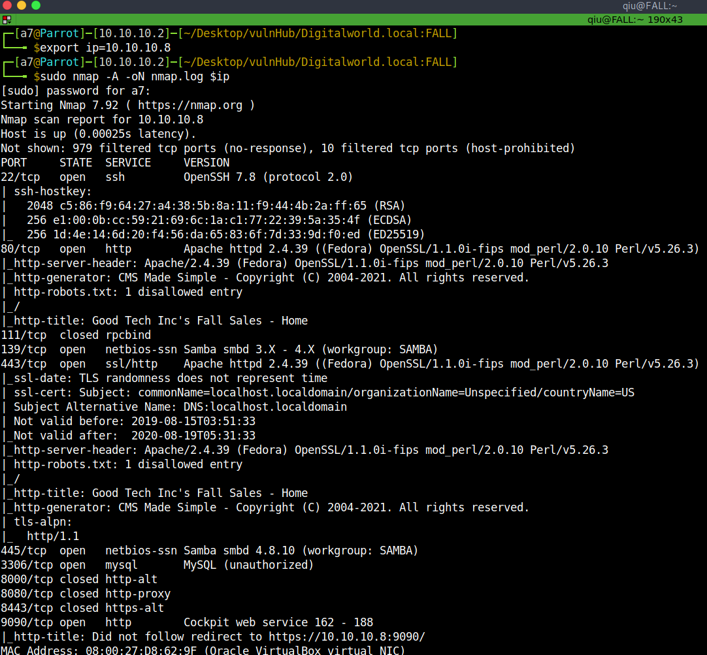

# Digitalworld.local:FALL - Writeup

FALL is an OSCP-like machine from Vulnhub by Donavan.<br />
FALL is another machine from Digitalworld.local series.<br />
The description says: "To celebrate the fifth year that the author has survived his infosec career, a new box has been born! This machine resembles a few different machines in the PEN-200 environment (making it yet another OSCP-like box). More enumeration practice indeed!".<br />
Link to the machine: [https://www.vulnhub.com/entry/digitalworldlocal-fall,726/](https://www.vulnhub.com/entry/digitalworldlocal-fall,726/)
<br />

## Information Gathering

Let's grab our target's IP address.

```bash
┌─[a7@Parrot]─[10.10.10.2]─[~/Desktop/vulnHub/Digitalworld.local:FALL]
└──╼ $fping -agq 10.10.10.0/24
10.10.10.1
10.10.10.2
10.10.10.8
```
<br />

## Ports and Services

One of the most important steps is to scan and identify open ports and running services with their versions on the target.


<br />
<br />

## Enumeration

Let's enumerate port 80 by visiting the webpage.


<br />
<br />

It's CMS **Content Management System**, let's run `gobuster`.


<br />
<br />

A few interesting directories. After visiting them we got `/admin` which is a login page.


<br />
<br />

And `/test.php` which gives us an error alert.


<br />
<br />

There is some kind of missing parameter, so let's fuzz it.


<br />
<br />

We found the missing parameter `file` which made me think of **LFI**, let's test it and try to include `/etc/passwd`.


<br />
<br />

We have **LFI**, spent some time enumerating the other services but it's useless, we have port 22 open, we may be able to include `QIU`'s ssh key, let's try it.


<br />
<br />

Perfecto, copy and paste it into a file, and change the permission to rw, and ssh.


<br />
<br />

## Privilege Escalation

Now, start to examine the user's files till I notice that `.bash_history` is not empty or redirected to `/dev/null`.


<br />
<br />

Let's try this password by trying to see our **SUDO** permissions.


<br />
<br />

Great! We could run anything as root with our password, let's get root.


<br />