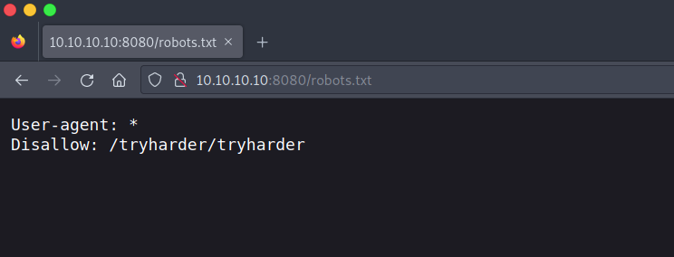
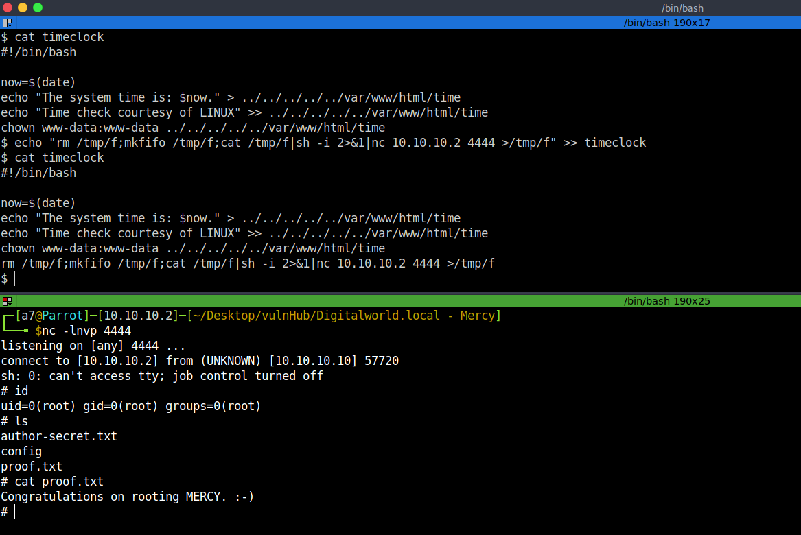

# Digitalworld.local: Mercy - Writeup

MERCY is a machine dedicated to Offensive Security for the PWK course, this machine is from Vulnhub by Donavan.<br />

The description says: "MERCY is a name-play on some aspects of the PWK course. It is NOT a hint for the box".<br />

Link to the machine: [https://www.vulnhub.com/entry/digitalworldlocal-mercy-v2,263/](https://www.vulnhub.com/entry/digitalworldlocal-mercy-v2,263/).
<br />

## Information Gathering

Let's identify our target IP address.

```bash
┌─[a7@Parrot]─[10.10.10.2]─[~/Desktop/vulnHub/Digitalworld.local - Mercy]
└──╼ $fping -agq 10.10.10.0/24
10.10.10.1
10.10.10.2
10.10.10.10
```
<br />

## Port scan

Let's scan our target for open ports, running services, and default scripts.


<br />
<br />

We got various services, but `ssh` and `http` are filtered.

<br />

## Web Server Enumeration

Let's start with port 8080.


<br />
<br />

In our nmap output, we got `robots.txt` with one entry, let's browse it.


<br />
<br />

Let's visit `/tryharder/tryharder`.


<br />
<br />

Some base64 encoded text, let's decode it.


<br />
<br />

I run `gobuster` and `nikto` but nothing useful, so let's move on.
<br />

## SMB Enumeration

Let's enumerate SMB service with `enum4linux`.


<br />
<br />

We got a shared, but we couldn't list it without a user and a password.


<br />
<br />

We got a few users.


<br />
<br />

Tried to access the shared with the users we found and the password `password`.


<br />
<br />

Going through the directories, and downloading what looks interesting.


<br />
<br />

Let's read the downloaded files.


<br />
<br />

The `configprint` is a script that copies some configuration files and appends them in `config` file, let's read it.


<br />
<br />

Great! We got the sequence, let's knock on port 80.


<br />
<br />

Now port 80 is open, let's visit it.


<br />
<br />

Ok, let's run `gobuster`.


<br />
<br />

Let's browse `robots.txt`.


<br />
<br />

We got two disallowed directories, let's browse them.


<br />
<br />

Open `index`.


<br />
<br />

Ok, let's navigate to `/nomercy`.


<br />
<br />

Looks like a vulnerability scanner, search for known exploit for `RIPS 0.53`.


<br />
<br />

We got LFI, let's try it by including `/etc/passwd`.


<br />
<br />

Previously, we got a note at **Apache Tomcat** port 8080 page, the note says that users are defined in `/etc/tomcat7/tomcat-user.xml`, let's try to read it to get the username and password to access the manager webapp.


<br />
<br />

We got two users, one of them with an admin-gui role, so let's log in to the `Manager Webapp`.


<br />
<br />

There's an upload feature, we could upload a reverse shell [https://book.hacktricks.xyz/network-services-pentesting/pentesting-web/tomcat#msfvenom-reverse-shell](https://book.hacktricks.xyz/network-services-pentesting/pentesting-web/tomcat#msfvenom-reverse-shell).


<br />
<br />

Let's create it.


<br />
<br />

Let's upload the shell.


<br />
<br />

Launch a listener, and click on `exp`.


<br />
<br />

Tried to switch to user `fluffy` with the obtained creds.


<br />
<br />

## Root Access

Under `~/.private/secrets`, there's a script `timeclock` which is owned by root.


<br />
<br />

This script stores the date in a file under `/www/html` which may be running as a scheduled task.<br />
We could change its contents and wait to get a reverse shell.


<br />