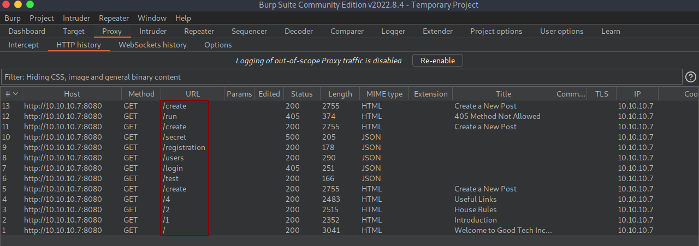
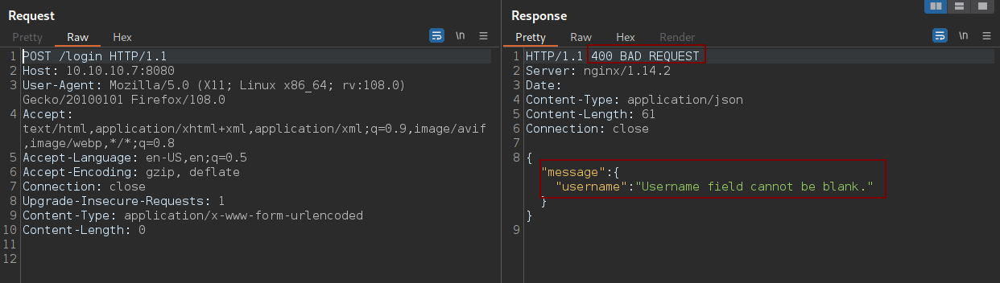

# Digitalworld.local:SNAKEOIL - Writeup

SNAKEOIL is another machine from `Digitalworld.local` series from Vulnhub by Donavan.<br />

The description says: "Recently, Good Tech Inc. has decided to change their application development process. However, their applications look broken and too basic. Is this an application full of snakeoil, or are they insecure too?<br />This goes beyond PEN-200, and some web application development expertise could be helpful".<br />

Link to the machine: [https://www.vulnhub.com/entry/digitalworldlocal-snakeoil,738/](https://www.vulnhub.com/entry/digitalworldlocal-snakeoil,738/)
<br />

## Information Gathering

Let's find the target's IP address.

```bash
┌─[a7@Parrot]─[10.10.10.2]─[~/Desktop/vulnHub/Digitalworld.local:SNAKEOIL]
└──╼ $fping -agq 10.10.10.0/24
10.10.10.1
10.10.10.2
10.10.10.7
```
<br />

## Port Scan

Scan the target for open ports and running services.


<br />
<br />

## Web Server Enumeration

First, let's visit port 80.


<br />
<br />

Just a page telling us `SNAKEOIL` is set up properly, examining the source code, and nothing useful.<br />
Let's visit port 8080.


<br />
<br />

When we click on `Introduction`, we got a post, but look at the URL.


<br />
<br />

Back to the main page, click on `House Rules`.


<br />
<br />

We got username `Patrick`, and again notice the URL.<br />
Now, head back and click on `Useful Links`.


<br />
<br />

We got some information, first, it's **flask**, second, there is some kind of authentication mechanism like JWT (JSON Web Tokens), anyway, there's a link, let's visit it.


<br />
<br />

It's about configuring **JWT**.<br />
Our next step is to launch `gobuster`.


<br />
<br />

Firstly, let's try to change the directory from `4` to `3`.


<br />
<br />

This is the "404 Not Found" message in JSON format which means there is no page with that name.<br />
Moving on, let's browse `test`.


<br />
<br />

Now, open `Burp`, and visit all links on the website including those found by `gobuster` for more analysis.


<br />
<br />

Notice `create`, let's browse it.


<br />
<br />

Let's create a post.


<br />
<br />

Submit.


<br />
<br />

Click on `Edit`.


<br />
<br />

Back to `Burp`, send the interesting requests to `Repeater` for more analysis.<br />
Starting with `login`.


<br />
<br />

The `METHOD NOT ALLOWED`, change the request method.


<br />
<br />

We got `BAD REQUEST` which means the request sent to the server is invalid or corrupted, add `username=patrick&password=patrick`.


<br />
<br />

Let's jump to `registration`, when we send the request it responds with `Wrong Method` so change the method.


<br />
<br />

Bad request, obviously the method is POST and the page is `registration`, so let's add a new user.


<br />
<br />

Check our user on `users`.


<br />
<br />

Back to `login`, log in with the user `admin`.


<br />
<br />

We got Access_Token! Anyway, we analyzed `users, login, registration`, we have two left, let's analyze `secret`.


<br />
<br />

Let's send a request to `run`.


<br />
<br />

Change the method.


<br />
<br />

This one took me some time till I notice my mistake.


<br />
<br />

Let's do it.


<br />
<br />

Where the :) is my secret key.<br />
Let's visit `secret`.


<br />
<br />

After a few tries, thinking maybe expect a cookie or token, so let's add one.


<br />
<br />

Tried it but didn't work so I visit the link we found earlier.


<br />
<br />

Try it again.


<br />
<br />

We got the secret key, now let's add it in `run`.


<br />
<br />

We got some kind of command output, we may be able to inject commands.<br />
After playing around, turns out it's `curl`.


<br />
<br />

The `url` parameter is vulnerable to command injection, so let's send some commands.


<br />
<br />

Tried to list files and directories.


<br />
<br />

After browsing these files, found an interesting one.


<br />
<br />

## Getting Access

Tried to log in with ssh with the obtained creds.


<br />
<br />

When we check for SUDO permissions, we could run anything as root, let's get root.


<br />
<br />