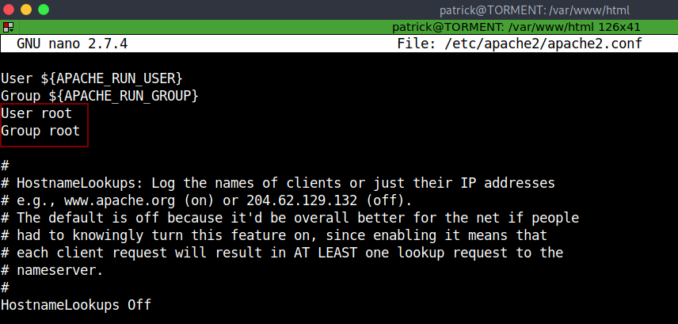

# Digitalworld.local:TORMENT - Writeup 

TORMENT is an Intermediate-level machine from Vulnhub by Donavan.<br />
The description says: "This is the evil twin of JOY. Unlike JOY, this machine is designed to drive you crazy. This machine guarantees to teach you some new ways of looking at enumeration and exploitation. Unlike all the other OSCP-like machines written by me, this machine will be mind-twisting and maybe mind-blowing."<br />
Link to the machine: [https://www.vulnhub.com/entry/digitalworldlocal-torment,299/](https://www.vulnhub.com/entry/digitalworldlocal-torment,299/)
<br />

## Identify the target

First, identify the target's IP address.


<br />
<br />

## Port scan

Now, find all open ports and running services.

```bash
┌─[a7@Parrot]─[10.10.10.2]─[~/Desktop/vulnHub/Digitalworld.local:TORMENT]
└──╼ $export ip=10.10.10.7
┌─[a7@Parrot]─[10.10.10.2]─[~/Desktop/vulnHub/Digitalworld.local:TORMENT]
└──╼ $sudo nmap -sV -sC -O -oN nmap.log $ip
Starting Nmap 7.92 ( https://nmap.org )
Nmap scan report for 10.10.10.7
Host is up (0.00028s latency).
Not shown: 987 closed tcp ports (reset)
PORT     STATE SERVICE     VERSION
21/tcp   open  ftp         vsftpd 2.0.8 or later
| ftp-anon: Anonymous FTP login allowed (FTP code 230)
| -rw-r--r--    1 ftp      ftp        112640 Dec 28  2018 alternatives.tar.0
| -rw-r--r--    1 ftp      ftp          4984 Dec 23  2018 alternatives.tar.1.gz
| -rw-r--r--    1 ftp      ftp         95760 Dec 28  2018 apt.extended_states.0
| -rw-r--r--    1 ftp      ftp         10513 Dec 27  2018 apt.extended_states.1.gz
| -rw-r--r--    1 ftp      ftp         10437 Dec 26  2018 apt.extended_states.2.gz
| -rw-r--r--    1 ftp      ftp           559 Dec 23  2018 dpkg.diversions.0
| -rw-r--r--    1 ftp      ftp           229 Dec 23  2018 dpkg.diversions.1.gz
| -rw-r--r--    1 ftp      ftp           229 Dec 23  2018 dpkg.diversions.2.gz
| -rw-r--r--    1 ftp      ftp           229 Dec 23  2018 dpkg.diversions.3.gz
| -rw-r--r--    1 ftp      ftp           229 Dec 23  2018 dpkg.diversions.4.gz
| -rw-r--r--    1 ftp      ftp           229 Dec 23  2018 dpkg.diversions.5.gz
| -rw-r--r--    1 ftp      ftp           229 Dec 23  2018 dpkg.diversions.6.gz
| -rw-r--r--    1 ftp      ftp           505 Dec 28  2018 dpkg.statoverride.0
| -rw-r--r--    1 ftp      ftp           295 Dec 28  2018 dpkg.statoverride.1.gz
| -rw-r--r--    1 ftp      ftp           295 Dec 28  2018 dpkg.statoverride.2.gz
| -rw-r--r--    1 ftp      ftp           295 Dec 28  2018 dpkg.statoverride.3.gz
| -rw-r--r--    1 ftp      ftp           281 Dec 27  2018 dpkg.statoverride.4.gz
| -rw-r--r--    1 ftp      ftp           208 Dec 23  2018 dpkg.statoverride.5.gz
| -rw-r--r--    1 ftp      ftp           208 Dec 23  2018 dpkg.statoverride.6.gz
| -rw-r--r--    1 ftp      ftp       1719127 Jan 01  2019 dpkg.status.0
|_Only 20 shown. Use --script-args ftp-anon.maxlist=-1 to see all.
| ftp-syst: 
|   STAT: 
| FTP server status:
|      Connected to ::ffff:10.10.10.2
|      Logged in as ftp
|      TYPE: ASCII
|      No session bandwidth limit
|      Session timeout in seconds is 300
|      Control connection is plain text
|      Data connections will be plain text
|      At session startup, client count was 1
|      vsFTPd 3.0.3 - secure, fast, stable
|_End of status
22/tcp   open  ssh         OpenSSH 7.4p1 Debian 10+deb9u4 (protocol 2.0)
| ssh-hostkey: 
|   2048 84:c7:31:7a:21:7d:10:d3:a9:9c:73:c2:c2:2d:d6:77 (RSA)
|   256 a5:12:e7:7f:f0:17:ce:f1:6a:a5:bc:1f:69:ac:14:04 (ECDSA)
|_  256 66:c7:d0:be:8d:9d:9f:bf:78:67:d2:bc:cc:7d:33:b9 (ED25519)
25/tcp   open  smtp        Postfix smtpd
|_ssl-date: TLS randomness does not represent time
|_smtp-commands: TORMENT.localdomain, PIPELINING, SIZE 10240000, VRFY, ETRN, STARTTLS, ENHANCEDSTATUSCODES, 8BITMIME, DSN, SMTPUTF8
| ssl-cert: Subject: commonName=TORMENT
| Subject Alternative Name: DNS:TORMENT
| Not valid before: 2018-12-23T14:28:47
|_Not valid after:  2028-12-20T14:28:47
80/tcp   open  http        Apache httpd 2.4.25
|_http-server-header: Apache/2.4.25
|_http-title: Apache2 Debian Default Page: It works
111/tcp  open  rpcbind     2-4 (RPC #100000)
| rpcinfo: 
|   program version    port/proto  service
|   100000  2,3,4        111/tcp   rpcbind
|   100000  2,3,4        111/udp   rpcbind
|   100000  3,4          111/tcp6  rpcbind
|   100000  3,4          111/udp6  rpcbind
|   100003  3,4         2049/tcp   nfs
|   100003  3,4         2049/tcp6  nfs
|   100003  3,4         2049/udp   nfs
|   100003  3,4         2049/udp6  nfs
|   100005  1,2,3      38266/udp   mountd
|   100005  1,2,3      48367/tcp6  mountd
|   100005  1,2,3      55912/udp6  mountd
|   100005  1,2,3      56559/tcp   mountd
|   100021  1,3,4      42251/tcp   nlockmgr
|   100021  1,3,4      42769/tcp6  nlockmgr
|   100021  1,3,4      45079/udp6  nlockmgr
|   100021  1,3,4      52489/udp   nlockmgr
|   100227  3           2049/tcp   nfs_acl
|   100227  3           2049/tcp6  nfs_acl
|   100227  3           2049/udp   nfs_acl
|_  100227  3           2049/udp6  nfs_acl
139/tcp  open  netbios-ssn Samba smbd 3.X - 4.X (workgroup: WORKGROUP)
143/tcp  open  imap        Dovecot imapd
|_imap-capabilities: more IDLE LOGIN-REFERRALS IMAP4rev1 post-login ENABLE SASL-IR capabilities AUTH=PLAIN ID Pre-login LITERAL+ OK listed have AUTH=LOGINA0001
445/tcp  open  netbios-ssn Samba smbd 4.5.12-Debian (workgroup: WORKGROUP)
631/tcp  open  ipp         CUPS 2.2
|_http-title: Home - CUPS 2.2.1
| http-methods: 
|_  Potentially risky methods: PUT
| http-robots.txt: 1 disallowed entry 
|_/
|_http-server-header: CUPS/2.2 IPP/2.1
2049/tcp open  nfs_acl     3 (RPC #100227)
6667/tcp open  irc         ngircd
6668/tcp open  irc         ngircd
6669/tcp open  irc         ngircd
MAC Address: 08:00:27:87:1B:CE (Oracle VirtualBox virtual NIC)
Device type: general purpose
Running: Linux 3.X|4.X
OS CPE: cpe:/o:linux:linux_kernel:3 cpe:/o:linux:linux_kernel:4
OS details: Linux 3.2 - 4.9
Network Distance: 1 hop
Service Info: Hosts:  TORMENT.localdomain, TORMENT, irc.example.net; OS: Linux; CPE: cpe:/o:linux:linux_kernel

Host script results:
| smb-os-discovery: 
|   OS: Windows 6.1 (Samba 4.5.12-Debian)
|   Computer name: torment
|   NetBIOS computer name: TORMENT\x00
|   Domain name: \x00
|   FQDN: torment
|_  System time:
| smb2-time: 
|   date:
|_  start_date: N/A
| smb-security-mode: 
|   account_used: guest
|   authentication_level: user
|   challenge_response: supported
|_  message_signing: disabled (dangerous, but default)
| smb2-security-mode: 
|   3.1.1: 
|_    Message signing enabled but not required
|_nbstat: NetBIOS name: TORMENT, NetBIOS user: <unknown>, NetBIOS MAC: <unknown> (unknown)
|_clock-skew: mean: 19m58s, deviation: 4h37m07s, median: 2h59m58s

OS and Service detection performed. Please report any incorrect results at https://nmap.org/submit/ .
Nmap done: 1 IP address (1 host up) scanned in 14.49 seconds
```
<br />
Let's enumerate them one by one.

<br />
<br />

## FTP Enumeration

Starting with FTP, log in as anonymous.


<br />
<br />

## SMTP Enumeration

Next, let's enumerate the SMTP users.


<br />
<br />

We got `patrick` and `qiu`.
<br />
<br />

## SMB Enumeration

Let's see if there are any shared.


<br />
<br />

## WEB Server "80" Enumeration

Let's visit the web page.


<br />
<br />

Launch `gobuster` for directory brute-force.


<br />
<br />

We got `/secret`, let's browse it.


<br />
<br />

## WEB '631' Enumeration

Ok, let's browse port `631`.


<br />
<br />

When we click on `Printers`, we got users.


<br />
<br />

After manually enumerating and visiting all links, running `gobuster` and `nikto`, I feel stuck.<br />
Enumerate from the beginning, and fire `nmap` for UDP ports.

```bash
┌─[a7@Parrot]─[10.10.10.2]─[~/Desktop/vulnHub/Digitalworld.local:TORMENT]
└──╼ $sudo nmap -sU --top-ports 50 -sV -sC $ip
Starting Nmap 7.92 ( https://nmap.org )
Stats: 0:01:45 elapsed; 0 hosts completed (1 up), 1 undergoing Service Scan
Service scan Timing: About 62.50% done; ETC: 19:34 (0:00:54 remaining)
Nmap scan report for 10.10.10.7
Host is up (0.00040s latency).
Not shown: 28 open|filtered udp ports (no-response)
PORT      STATE  SERVICE       VERSION
7/udp     closed echo
69/udp    closed tftp
80/udp    closed http
111/udp   open   rpcbind       2-4 (RPC #100000)
| rpcinfo: 
|   program version    port/proto  service
|   100000  2,3,4        111/tcp   rpcbind
|   100000  2,3,4        111/udp   rpcbind
|   100000  3,4          111/tcp6  rpcbind
|   100000  3,4          111/udp6  rpcbind
|   100003  3,4         2049/tcp   nfs
|   100003  3,4         2049/tcp6  nfs
|   100003  3,4         2049/udp   nfs
|   100003  3,4         2049/udp6  nfs
|   100005  1,2,3      34321/tcp   mountd
|   100005  1,2,3      55707/udp   mountd
|   100005  1,2,3      55936/udp6  mountd
|   100005  1,2,3      55975/tcp6  mountd
|   100021  1,3,4      33725/tcp   nlockmgr
|   100021  1,3,4      35912/udp   nlockmgr
|   100021  1,3,4      36479/tcp6  nlockmgr
|   100021  1,3,4      44676/udp6  nlockmgr
|   100227  3           2049/tcp   nfs_acl
|   100227  3           2049/tcp6  nfs_acl
|   100227  3           2049/udp   nfs_acl
|_  100227  3           2049/udp6  nfs_acl
123/udp   closed ntp
136/udp   closed profile
137/udp   open   netbios-ns    Samba nmbd netbios-ns (workgroup: WORKGROUP)
| nbns-interfaces: 
|   hostname: TORMENT
|   interfaces: 
|_    10.10.10.7
161/udp   closed snmp
162/udp   closed snmptrap
445/udp   closed microsoft-ds
514/udp   closed syslog
520/udp   closed route
626/udp   closed serialnumberd
996/udp   closed vsinet
999/udp   closed applix
1025/udp  closed blackjack
1026/udp  closed win-rpc
1701/udp  closed L2TP
2049/udp  open   nfs_acl       3 (RPC #100227)
4500/udp  closed nat-t-ike
5353/udp  open   mdns          DNS-based service discovery
| dns-service-discovery: 
|   0/tcp printer
|     Address=10.10.10.7 fe80::a00:27ff:fe87:1bce
|   80/tcp http
|     Address=10.10.10.7 fe80::a00:27ff:fe87:1bce
|   631/tcp ipps
|     Address=10.10.10.7 fe80::a00:27ff:fe87:1bce
|   631/tcp ipp
|_    Address=10.10.10.7 fe80::a00:27ff:fe87:1bce
49153/udp closed unknown
MAC Address: 08:00:27:87:1B:CE (Oracle VirtualBox virtual NIC)
Service Info: Host: TORMENT

Host script results:
|_nbstat: NetBIOS name: TORMENT, NetBIOS user: <unknown>, NetBIOS MAC: <unknown> (unknown)

Service detection performed. Please report any incorrect results at https://nmap.org/submit/ .
Nmap done: 1 IP address (1 host up) scanned in 260.84 seconds
```
<br />
Ok, now I'm stuck.<br />
I moved to other machines, and a friend told me that it's all about the FTP server, so let's do it again.


<br />
<br />

Yes, nothing looks different, let's do it again.


<br />
<br />

Yes, that's the mind-twisting, we got `.ngircd` and `.ssh`, let's list their contents and download them.


<br />
<br />

Cat them.


<br />
<br />

> **ngircd** is a free, portable, and lightweight Internet Relay Chat server for small or private networks.<br />
> Reference: [https://ngircd.barton.de/](https://ngircd.barton.de/)<br />

I downloaded `pidgin` which is a chat program. [https://www.pidgin.im/install/](https://www.pidgin.im/install/)


<br />
<br />

Run it, and add an account.


<br />
<br />

Now, chose IRC protocol, the username is root, and the server is ngircd's IP add.


<br />
<br />

We need a password, search for ngircd default password.


<br />
<br />

add the password then click add.<br />
Another window popped up, click on `Buddies`, `Join a Chat`, enter the channel name we obtained earlier, and press join.


<br />
<br />

Another window popped up, this time it's a chat room with creds.


<br />
<br />

## Getting Access

Let's log in as `patrick` with the id_rsa and the passphrase from the chat room.


<br />
<br />

Now we're in, let's find a way to escalate our privileges.


<br />
<br />

Upload `linpeas`.


<br />
<br />

Linpeas found apache2 running with root permission.


<br />
<br />

When we checked for sudo permissions, we found that we could run sudo as root with no password for `/bin/systemctl reboot`, and the apache2 service is running with root permissions.<br />
Thinking about it, we could add user root in apache2.conf file, restart the service and upload a reverse shell on the HTTP server, then we should have a root shell.<br />
Let's try it.<br />
First, upload a reverse shell.


<br />
<br />

Now, modify apache2.conf file by adding `User root`, and `Group root`.


<br />
<br />

Restart the service.


<br />
<br />

Launch a listener and open `10.10.10.8/rev.php`


<br />
<br />

Let's try again with another user, change apache2.conf user from root to qiu.


<br />
<br />

Restart the service, launch a listener, and visit the same page.


<br />
<br />

## Root Access

Great! Now, check for SUDO permissions.


<br />
<br />

We could run python as root with no password, search for abuse in [GTFOBins](https://gtfobins.github.io/gtfobins/python/).


<br />
<br />

Let's get root.


<br />