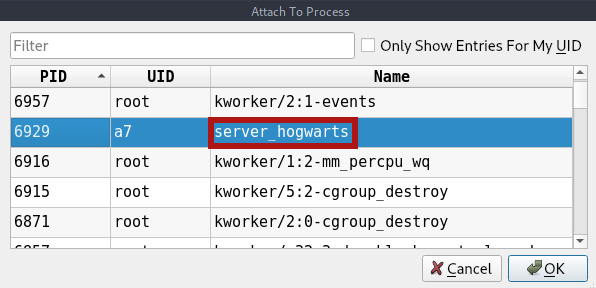
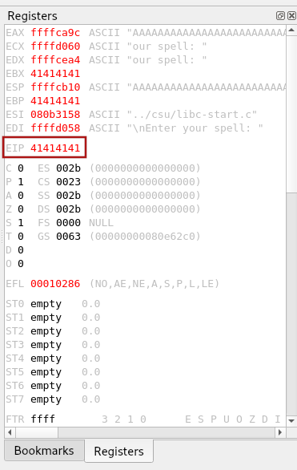

# HarryPotter: Fawkes - Writeup 

Fawkes is the Third of three HarryPotter VM series from Vulnhub by Mansoor R.<br />
We need to find the last 3 Horcruxes hidden inside this machine.<br />
Link to the machine: [https://www.vulnhub.com/entry/harrypotter-fawkes,686/](https://www.vulnhub.com/entry/harrypotter-fawkes,686/) 
<br />

## Target discovery

First, identifying the IP address of our target.

```
sudo netdiscover -i vboxnet0 -r 10.10.10.0/24

Currently scanning: Finished!   |   Screen View:Unique Hosts

2 Captured ARP Req/Rep packets, from 2 hosts.   Total size: 102
_____________________________________________________________________________
   IP            At MAC Address     Count     Len  MAC Vendor / Hostname
-----------------------------------------------------------------------------
10.10.10.1      08:00:27:86:ec:da      1      42  PCS Systemtechnik GmbH
10.10.10.10     08:00:27:85:7d:b1      1      60  PCS Systemtechnik GmbH
```
<br />

## Ports and Services scan

Scan the target for open ports, running services, and version detection.

```
export ip=10.10.10.10

sudo nmap -Pn -p- -sV -sC -oN nmap.log $ip

Nmap scan report for 10.10.10.10
Host is up (0.00018s latency).
Not shown: 65530 closed tcp ports (reset)
PORT     STATE SERVICE    VERSION
21/tcp   open  ftp        vsftpd 3.0.3
| ftp-syst: 
|   STAT: 
| FTP server status:
|      Connected to ::ffff:10.10.10.2
|      Logged in as ftp
|      TYPE: ASCII
|      No session bandwidth limit
|      Session timeout in seconds is 300
|      Control connection is plain text
|      Data connections will be plain text
|      At session startup, client count was 3
|      vsFTPd 3.0.3 - secure, fast, stable
|_End of status
| ftp-anon: Anonymous FTP login allowed (FTP code 230)
|_-rwxr-xr-x    1 0        0          705996 Apr 12  2021 server_hogwarts
22/tcp   open  ssh        OpenSSH 7.9p1 Debian 10+deb10u2 (protocol 2.0)
| ssh-hostkey: 
|   2048 48:df:48:37:25:94:c4:74:6b:2c:62:73:bf:b4:9f:a9 (RSA)
|   256 1e:34:18:17:5e:17:95:8f:70:2f:80:a6:d5:b4:17:3e (ECDSA)
|_  256 3e:79:5f:55:55:3b:12:75:96:b4:3e:e3:83:7a:54:94 (ED25519)
80/tcp   open  http       Apache httpd 2.4.38 ((Debian))
|_http-title: Site doesn't have a title (text/html).
|_http-server-header: Apache/2.4.38 (Debian)
2222/tcp open  ssh        OpenSSH 8.4 (protocol 2.0)
| ssh-hostkey: 
|   3072 c4:1d:d5:66:85:24:57:4a:86:4e:d9:b6:00:69:78:8d (RSA)
|   256 0b:31:e7:67:26:c6:4d:12:bf:2a:85:31:bf:21:31:1d (ECDSA)
|_  256 9b:f4:bd:71:fa:16:de:d5:89:ac:69:8d:1e:93:e5:8a (ED25519)
9898/tcp open  monkeycom?
| fingerprint-strings: 
|   GenericLines, GetRequest, HTTPOptions, RTSPRequest: 
|     Welcome to Hogwart's magic portal
|     Tell your spell and ELDER WAND will perform the magic
|     Here is list of some common spells:
|     Wingardium Leviosa
|     Lumos
|     Expelliarmus
|     Alohomora
|     Avada Kedavra 
|     Enter your spell: Magic Output: Oops!! you have given the wrong spell
|     Enter your spell:
|   NULL: 
|     Welcome to Hogwart's magic portal
|     Tell your spell and ELDER WAND will perform the magic
|     Here is list of some common spells:
|     Wingardium Leviosa
|     Lumos
|     Expelliarmus
|     Alohomora
|     Avada Kedavra 
|_    Enter your spell:
1 service unrecognized despite returning data. If you know the service/version, please submit the following fingerprint at https://nmap.org/cgi-bin/submit.cgi?new-service :
SF-Port9898-TCP:V=7.92%I=7%D=7/6%Time=62C532DF%P=x86_64-pc-linux-gnu%r(NUL
SF:L,DE,"Welcome\x20to\x20Hogwart's\x20magic\x20portal\nTell\x20your\x20sp
SF:ell\x20and\x20ELDER\x20WAND\x20will\x20perform\x20the\x20magic\n\nHere\
SF:x20is\x20list\x20of\x20some\x20common\x20spells:\n1\.\x20Wingardium\x20
SF:Leviosa\n2\.\x20Lumos\n3\.\x20Expelliarmus\n4\.\x20Alohomora\n5\.\x20Av
SF:ada\x20Kedavra\x20\n\nEnter\x20your\x20spell:\x20")%r(GenericLines,125,
SF:"Welcome\x20to\x20Hogwart's\x20magic\x20portal\nTell\x20your\x20spell\x
SF:20and\x20ELDER\x20WAND\x20will\x20perform\x20the\x20magic\n\nHere\x20is
SF:\x20list\x20of\x20some\x20common\x20spells:\n1\.\x20Wingardium\x20Levio
SF:sa\n2\.\x20Lumos\n3\.\x20Expelliarmus\n4\.\x20Alohomora\n5\.\x20Avada\x
SF:20Kedavra\x20\n\nEnter\x20your\x20spell:\x20Magic\x20Output:\x20Oops!!\
SF:x20you\x20have\x20given\x20the\x20wrong\x20spell\n\nEnter\x20your\x20sp
SF:ell:\x20")%r(GetRequest,125,"Welcome\x20to\x20Hogwart's\x20magic\x20por
SF:tal\nTell\x20your\x20spell\x20and\x20ELDER\x20WAND\x20will\x20perform\x
SF:20the\x20magic\n\nHere\x20is\x20list\x20of\x20some\x20common\x20spells:
SF:\n1\.\x20Wingardium\x20Leviosa\n2\.\x20Lumos\n3\.\x20Expelliarmus\n4\.\
SF:x20Alohomora\n5\.\x20Avada\x20Kedavra\x20\n\nEnter\x20your\x20spell:\x2
SF:0Magic\x20Output:\x20Oops!!\x20you\x20have\x20given\x20the\x20wrong\x20
SF:spell\n\nEnter\x20your\x20spell:\x20")%r(HTTPOptions,125,"Welcome\x20to
SF:\x20Hogwart's\x20magic\x20portal\nTell\x20your\x20spell\x20and\x20ELDER
SF:\x20WAND\x20will\x20perform\x20the\x20magic\n\nHere\x20is\x20list\x20of
SF:\x20some\x20common\x20spells:\n1\.\x20Wingardium\x20Leviosa\n2\.\x20Lum
SF:os\n3\.\x20Expelliarmus\n4\.\x20Alohomora\n5\.\x20Avada\x20Kedavra\x20\
SF:n\nEnter\x20your\x20spell:\x20Magic\x20Output:\x20Oops!!\x20you\x20have
SF:\x20given\x20the\x20wrong\x20spell\n\nEnter\x20your\x20spell:\x20")%r(R
SF:TSPRequest,125,"Welcome\x20to\x20Hogwart's\x20magic\x20portal\nTell\x20
SF:your\x20spell\x20and\x20ELDER\x20WAND\x20will\x20perform\x20the\x20magi
SF:c\n\nHere\x20is\x20list\x20of\x20some\x20common\x20spells:\n1\.\x20Wing
SF:ardium\x20Leviosa\n2\.\x20Lumos\n3\.\x20Expelliarmus\n4\.\x20Alohomora\
SF:n5\.\x20Avada\x20Kedavra\x20\n\nEnter\x20your\x20spell:\x20Magic\x20Out
SF:put:\x20Oops!!\x20you\x20have\x20given\x20the\x20wrong\x20spell\n\nEnte
SF:r\x20your\x20spell:\x20");
MAC Address: 08:00:27:85:7D:B1 (Oracle VirtualBox virtual NIC)
Service Info: OSs: Unix, Linux; CPE: cpe:/o:linux:linux_kernel

Service detection performed. Please report any incorrect results at https://nmap.org/submit/ .
Nmap done: 1 IP address (1 host up) scanned in 101.63 seconds
```
<br />

## Enumeration

Let's start with `FTP`.<br />
When we log in `FTP`, we found a file, download it to examine it.


<br />

It's a Linux executable file, change the permission and run it.


<br />

Nothing happened, looks like it's listening on some port.


<br />

It's the same port we found in our Nmap result. Let's connect to that port.


<br />

Well, this machine is vulnerable to Buffer Overflow!!!
<br />
Buffer Overflow occurs when a program or process attempts to write more data than the buffer’s capacity, resulting in adjacent memory being overwritten, which gives the attacker full control over the program execution.

To Perform Buffer Overflow, follow these steps:

- Fuzzing.
- Finding the Offset.
- Overwriting The EIP.
- Generating shellcode.
- Getting shell.

We gonna need to use the `edb` debugger.

Start the server program.


<br />

On `edb`, attach the process `server_hogwarts` by clicking `File/Attach` or `Shift+F3`.


<br />

Click on `Run` or `F9`.


<br />

Now, let's write a small python script that connects to the server program and send 2000 `A`.

```
#!/usr/bin/env python3

import socket

length = 2000

payload = b"".join(
   [
      b"A" * length
   ]
)

s = socket.socket()
s.connect(('127.0.0.1', 9898))
print(s.recv(3000))
s.send(payload)
s.close()
```

Run it.


<br />

We got an error message saying that the EIP address had changed to `41414141` which is the hex of `AAAA`.


<br />

Now, we need to know which 4 bytes are stored in EIP, for that, we gonna use a tool called `msf-pattern_create` with argument `-l` for the length of the pattern.


<br />

Copy and paste it into the script.


<br />

Run the script and navigate to edb.<br />
> PS: Remember to restart the server program every time it crashes.<br />


<br />

We got the address `64413764`.


<br />

Copy that address and use `msf-pattern_offset -q 64413764 -l 2000`.<br />
`-l` for pattern length and `-q` for query to locate.


<br />

Now, edit the script.


<br />

This script will make a connection to the server and send 112 `A` + 4 `B` will be stored in EIP + the remain of 2000 as `C`.

restart the server, run the script, and back to edb.


<br />

We got the error message and the EIP address has changed to `42424242` which means BBBB.


<br />

We have controlled the EIP, but what does that mean ??<br />
If we inject the EIP with an address that store a shellcode, it will give us a reverse shell.

Our next step is to find the jmp ESP value.<br />
> PS: Make sure you have disabled the ASLR (address space layout randomization) by<br/>
`echo 0 | sudo tee /proc/sys/kernel/randomize_va_space`.
<br />

Let's find the jmp ESP. Click on `Plugins/opcodeSearcher/opcode search` or `Ctrl+O`.


<br />

Choose Jump Equivalent as `ESP -> EIP`, select permissions `r-x` and click Find.


<br />

Write down the address of jmp esp.<br />
Let's generate our reverse shell code.


<br />

Edit the script.


<br />

Test time. Close `edb`, restart the server, and start a Listener on the port we used in the shellcode. Run the script.


<br />

That worked. Now change the IP add from local to the target machine.


<br />

Start the listener and run the script.


<br />

We got a shell.<br />
Tried to upgrade my shell but found what's better.


<br />

## Privilege Escalation

Login with ssh on port 2222 as `Harry` and the password we found.


<br />

When we checked sudo permission, we can use sudo with the user `Harry` for all commands.
So, let's use `sudo su`.


<br />

Cd `/root`


<br />

We got our first Horcrux (flag), and a hint. Let's capture the FTP traffic by `tcpdump`.


<br />

Ssh into the machine.


<br />

In `Neville` directory, we found the second Horcrux (flag).


<br />

## Root Access

Let's escalate our privileges, and download `linpeas` on the target.


<br />

There is a sudo version 1.8.27, this version is vulnerable to a heap overflow.


<br />

Searchin in google, and we find a script [https://github.com/worawit/CVE-2021-3156/blob/main/exploit_nss.py](https://github.com/worawit/CVE-2021-3156/blob/main/exploit_nss.py)
<br />
Just change the `SUDO_PATH`.


<br />

Run it.


