# Hack-Me-Please Writeups

Hack Me Please is an easy machine from Vulnhub by Saket Sourav.<br />
This is an OSCP-like machine, so we don't need any bruteforcing.<br />
Tested on Virtualbox.<br />
Link to the machine: [https://www.vulnhub.com/entry/hack-me-please-1,731/](https://www.vulnhub.com/entry/hack-me-please-1,731/).
<br />

## Identify the target

I'm using this machine in host-only network.<br />
First, we need to identify the machine's IP address.
`fping -agq 10.10.10.0/24`

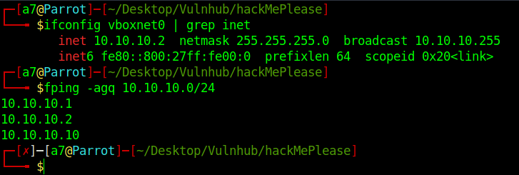
<br />

## Scan Open Ports
Scan the target for open ports and running services.
```
nmap -sV -sC -oN nmap.log 10.10.10.10
```
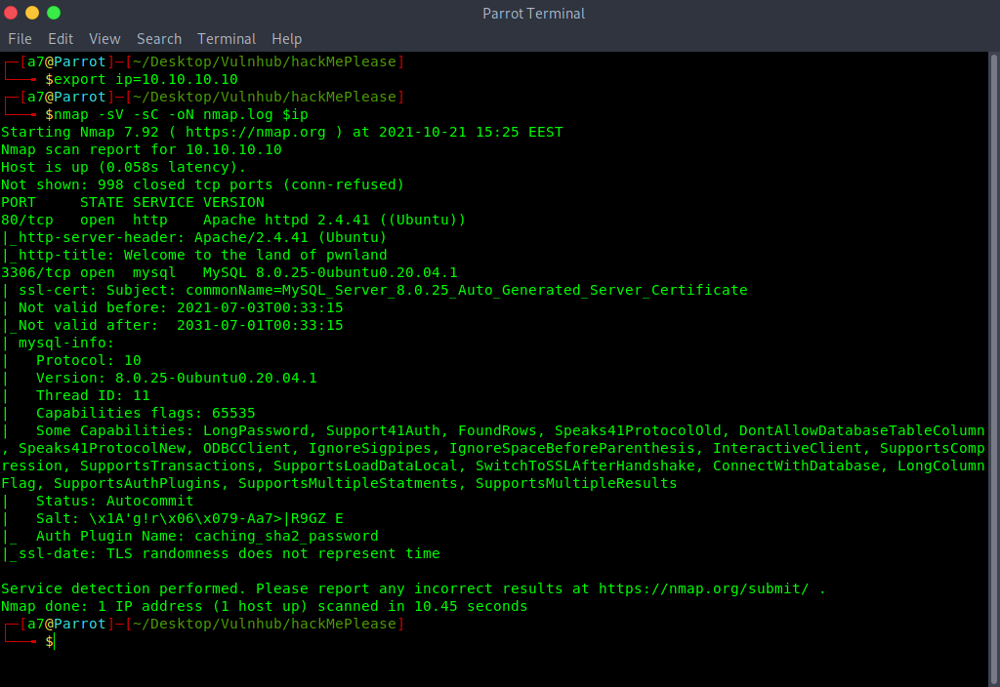
<br />

We have Apache and MySQL.
<br />

## Examine Web Server

We have a default website,  when we inspect the source code, nothing interesting.

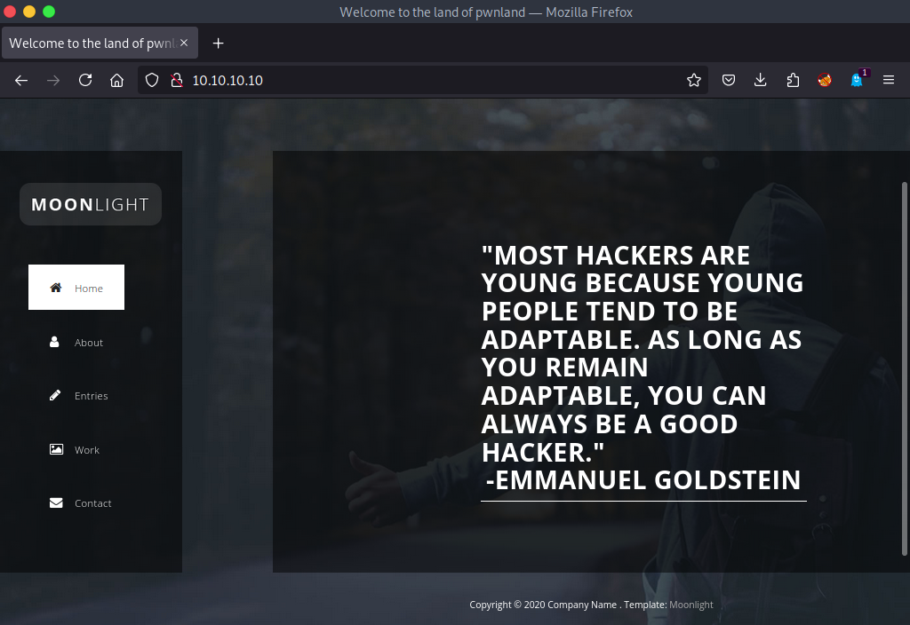
<br />

## Enumerate the directories

Run Gobuster for directories enumeration.

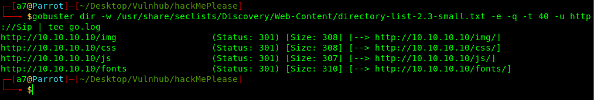
<br />

When we visit any directory,  we got a forbidden message.<br />
After digging around, I checked the website's source code, and there is `js/main.js`.<br />
Opened it and nothing special, but a strange comment.

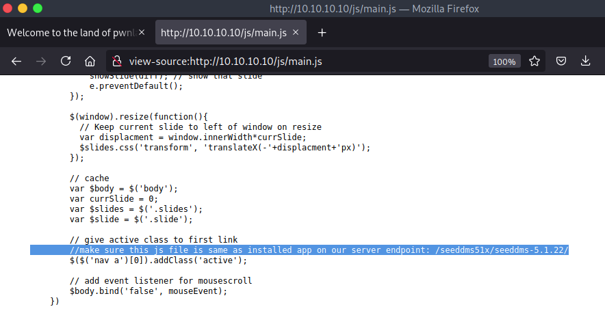
<br />

Searching around,  It's `DMS (Document Management System)`.<br />
> Reference: [https://www.seeddms.org/index.php?id=2](https://www.seeddms.org/index.php?id=2).<br />
> Exploit: [https://www.exploit-db.com/exploits/47022](https://www.exploit-db.com/exploits/47022).<br />
> and a repository: [https://sourceforge.net/p/seeddms/code/ci/5.1.22/tree/](https://sourceforge.net/p/seeddms/code/ci/5.1.22/tree/).<br />

Ok,  checking the path `http://10.10.10.10/seeddms51x/seedms-5.1.22/` and a login panel appears.

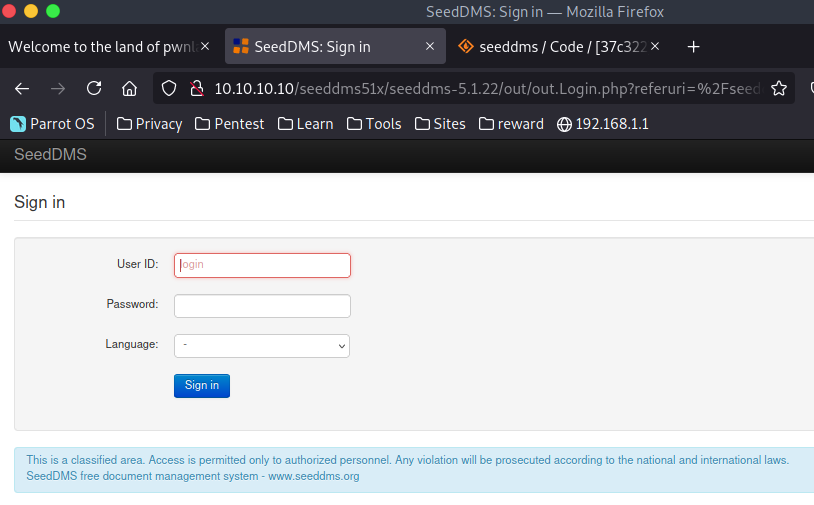
<br />

The description said that brute force is not required. Back to the repository, there is a `/conf` file.

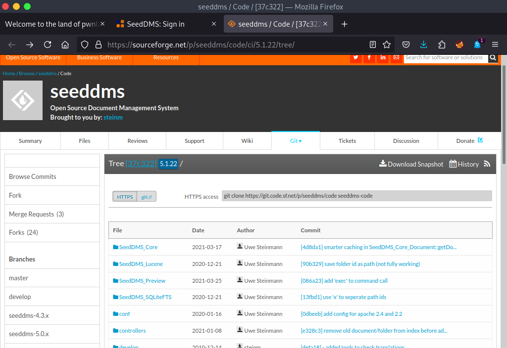
<br />

Navigates to `http://10.10.10.10/seeddms51x/conf/`.

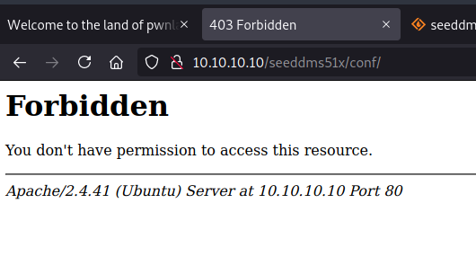
<br />

Forbidden message. There is a `.htaccess` file that restricts directory browsing.

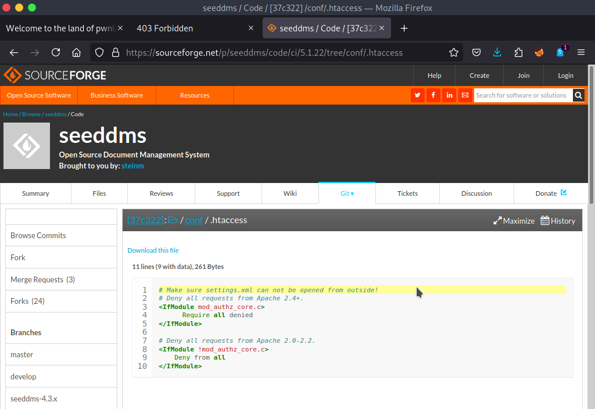
<br />

Let's visit this path `http://10.10.10.10/seeddms51x/conf/settings.xml`,  and finally, database credentials.

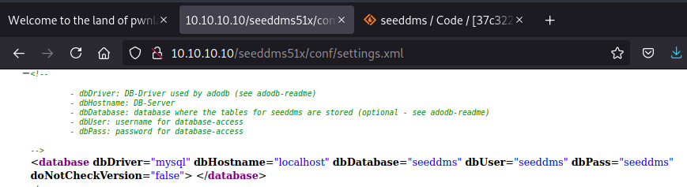
<br />

Connect to the database with mysql tool or mycli.
`mysql -u <username> -p <password> -h <db_ip>`
<br />

There is a database called `seeddms`, let's use it, and look for the tables.

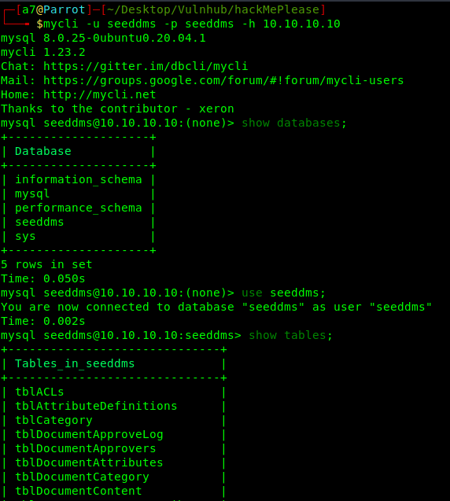
<br />

And we found many tables, there are two interesting tables `users` and `tblUsers`,  let's see their contents.

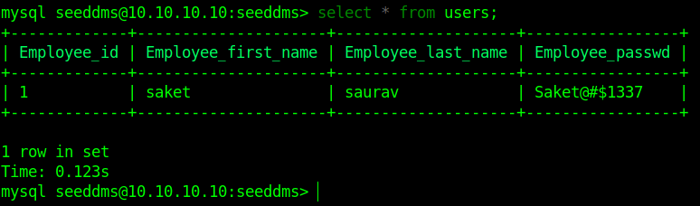
<br />

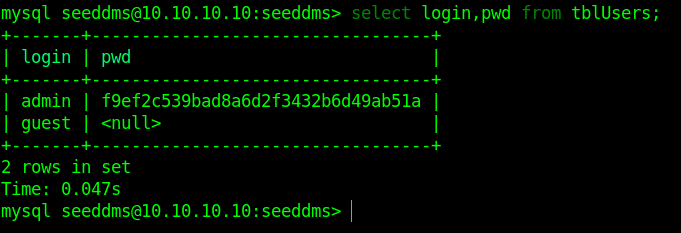
<br />

From the first table, We have a username and password, and in the second one, there is admin and hash, I failed to decrypt it.<br />
So, Why don't we change the admin's hash.

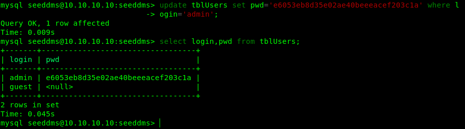
<br />

Back to the login panel, login with the new Password we changed.

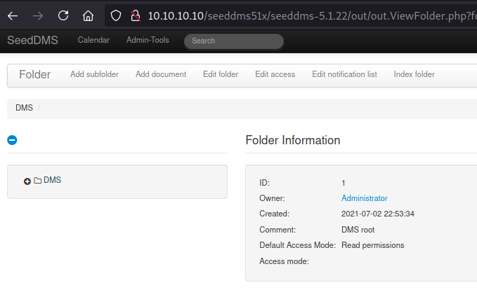
<br />

## Reverse Shell
Now we logged in,  there is an `add document` feature. That means we could upload a file like a reverse shell.

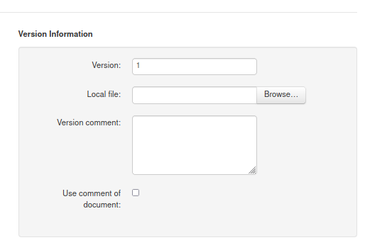
<br />

Let's upload a reverse shell.
<br />

> Find a shell online: [revshells](https://www.revshells.com/) or [pentestmonkey](https://pentestmonkey.net/cheat-sheet/shells/reverse-shell-cheat-sheet)
<br />

In kali, there are some shells by default `/usr/share/webshells/`.

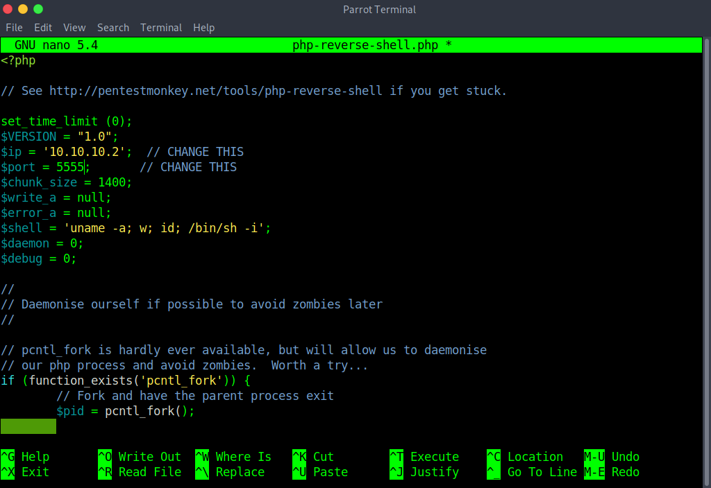
<br />

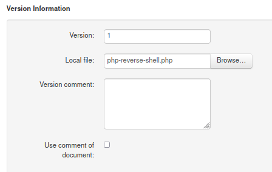
<br />

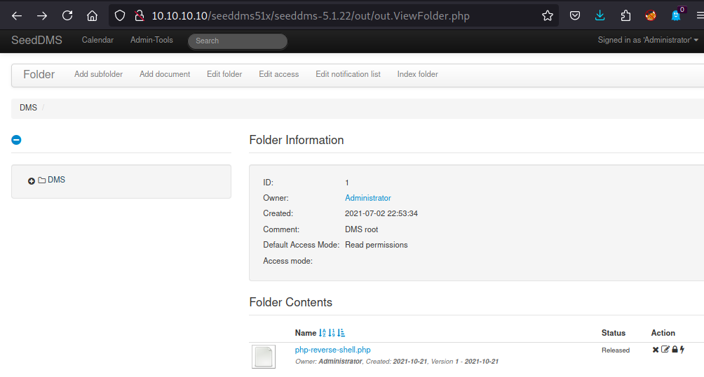
<br />

When We click on the file we see ID.

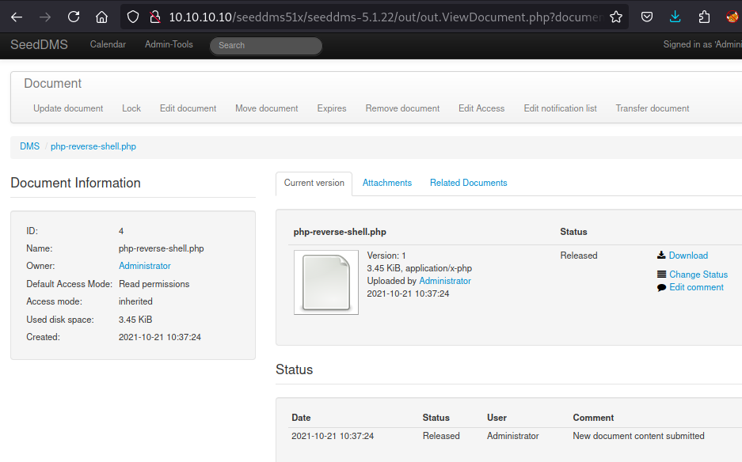
<br />

Back to the Exploit: [exploit-db](https://www.exploit-db.com/exploits/47022)<br />

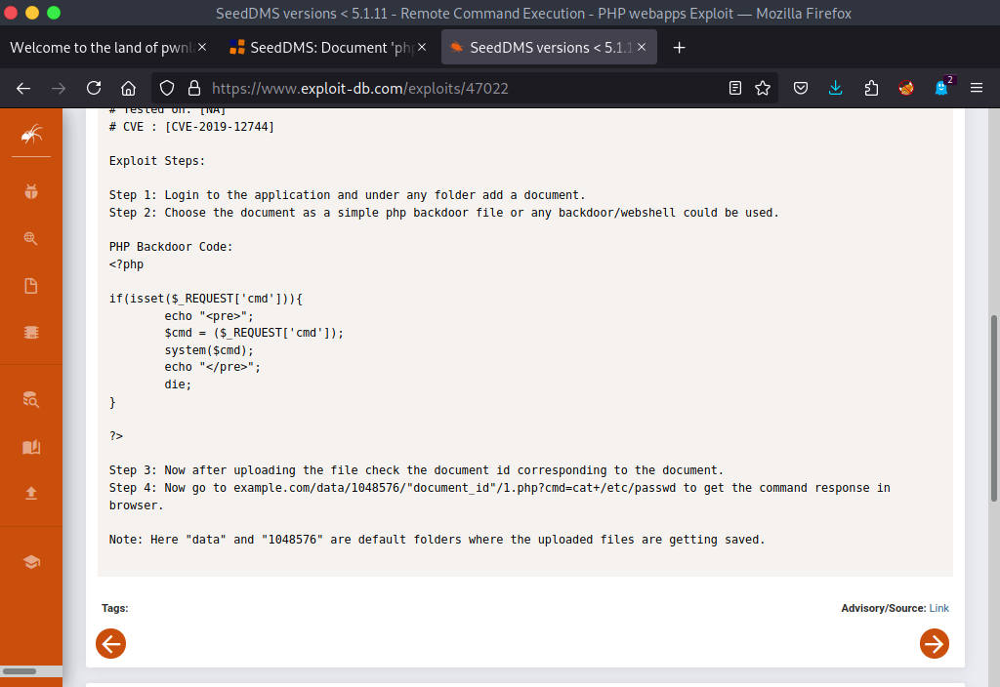
<br />

Our reverse shell is ready, we are listening on port `5555`, we had our reverse shell file ID.<br />
All we need is to visit the link, in my case `http://10.10.10.10/seeddms51x/data/1048576/4/1.php`.
<br />

We got a dummy shell.

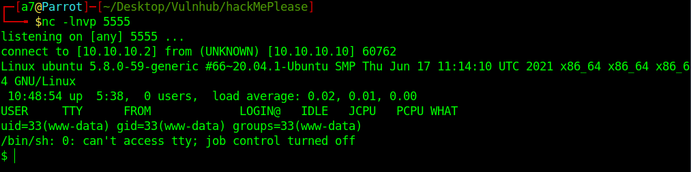
<br />

> Upgrade the shell: [https://infosecwriteups.com/pimp-my-shell-5-ways-to-upgrade-a-netcat-shell-ecd551a180d2](https://infosecwriteups.com/pimp-my-shell-5-ways-to-upgrade-a-netcat-shell-ecd551a180d2).
<br />

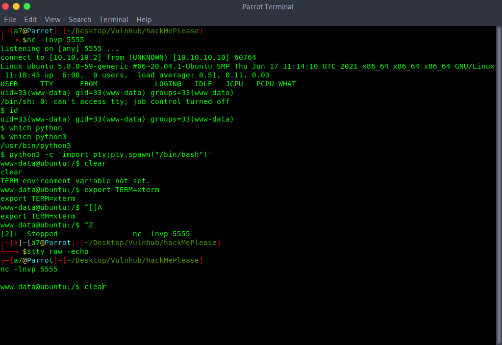
<br />

Now we have an intelligent shell, let's find any user.

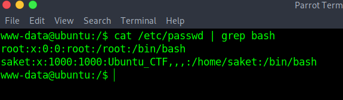
<br />

We already got `saket's password` from the database.

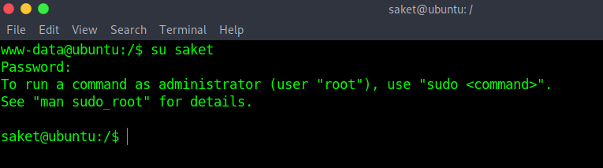
<br />

Now, checked the sudo permissions.

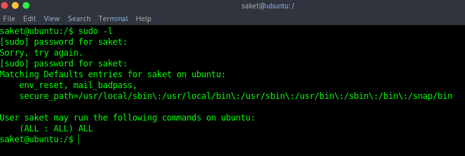
<br />

The user can run any command as sudo. <br />
Switch to root.

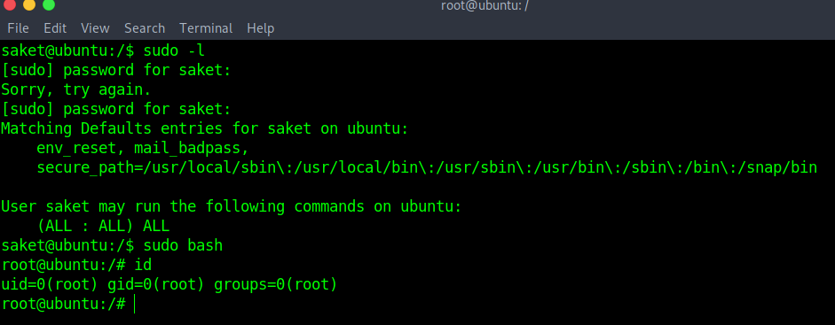
