#  Hackable II - Writeup 

Hackable II is an easy machine from Vulnhub by Elias Sousa.

I have tested this machine on VirtualBox.

Link to the machine: [https://www.vulnhub.com/entry/hackable-ii,711/](https://www.vulnhub.com/entry/hackable-ii,711/)

## Identify the target

First step is to detect the target's IP address.

```
sudo netdiscover -i vboxnet0 -r 192.168.56.0/24

 Currently scanning: Finished!   |   Screen View: Unique Hosts

 2 Captured ARP Req/Rep packets, from 2 hosts.   Total size: 102
_____________________________________________________________________________
   IP            At MAC Address     Count     Len  MAC Vendor / Hostname      
-----------------------------------------------------------------------------
192.168.56.1    08:00:27:00:7d:c5      1      42  PCS Systemtechnik GmbH
192.168.56.8    08:00:27:27:42:3f      1      60  PCS Systemtechnik GmbH
```
<br />

## Scan Open Ports

Port scaning let us know which services is running.

```
export ip=192.168.56.8

sudo nmap -p- -T4 -sV -sC $ip | tee scan

Nmap scan report for 192.168.56.8
Host is up (0.81s latency).
Not shown: 65532 closed tcp ports (reset)
PORT   STATE SERVICE VERSION
21/tcp open  ftp     ProFTPD
| ftp-anon: Anonymous FTP login allowed (FTP code 230)
|_-rw-r--r--   1 0        0             109 Nov 26  2020 CALL.html
22/tcp open  ssh     OpenSSH 7.2p2 Ubuntu 4ubuntu2.10 (Ubuntu Linux; protocol 2.0)
| ssh-hostkey: 
|   2048 2f:c6:2f:c4:6d:a6:f5:5b:c2:1b:f9:17:1f:9a:09:89 (RSA)
|   256 5e:91:1b:6b:f1:d8:81:de:8b:2c:f3:70:61:ea:6f:29 (ECDSA)
|_  256 f1:98:21:91:c8:ee:4d:a2:83:14:64:96:37:5b:44:3d (ED25519)
80/tcp open  http    Apache httpd 2.4.18 ((Ubuntu))
|_http-title: Apache2 Ubuntu Default Page: It works
|_http-server-header: Apache/2.4.18 (Ubuntu)
MAC Address: 08:00:27:27:42:3F (Oracle VirtualBox virtual NIC)
Service Info: OS: Linux; CPE: cpe:/o:linux:linux_kernel

Service detection performed. Please report any incorrect results at https://nmap.org/submit/ .
Nmap done: 1 IP address (1 host up) scanned in 187.83 seconds
```

<br />

As we see above, We have `FTP`, `SSH` and `HTTP`.

There's a file in FTP server, we can access the FTP server anonymously by providing `anonymous` as Username and Password.

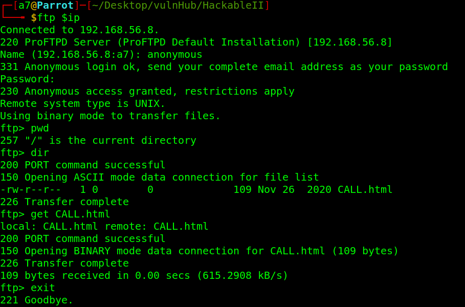

Download the file by Get:  `get CALL.html`.

<br />

Cat the file.

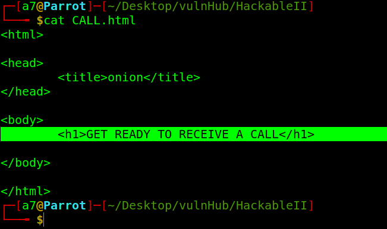

Maybe it's a hint.

## Enumerate Apache Server

Anyway, navigates to the web server we got **apache default page**, run gobuster for directories enumeration.

```
gobuster dir -w /usr/share/seclists/Discovery/Web-Content/directory-list-2.3-medium.txt -u http://$ip -x .php -q -t 50 | tee go.txt
/files                (Status: 301) [Size: 312] [--> http://192.168.56.8/files/]
/server-status        (Status: 403) [Size: 277]
```
<br />

Lets look into `/files`.

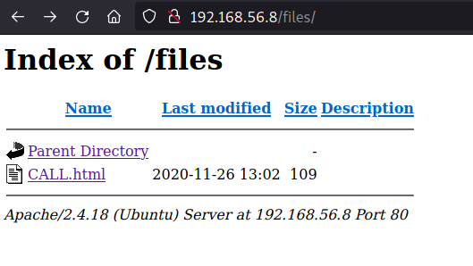

<br />

Open CALL.html.

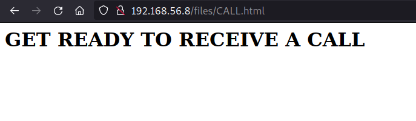

The same file we downloaded earlier. The directory `files` is served on FTP server. 

We could upload a webshell in the FTP server, and execute it using the browser.

We use `put` to upload.

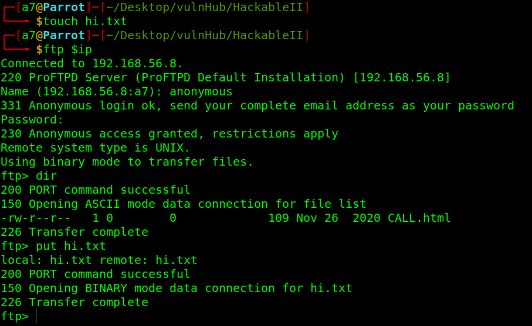

<br />

Reload the page.

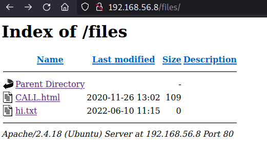

That works. Lets upload a Reverse Shell.

Find shell online in: [revshells](https://www.revshells.com/) or [pentestmonkey](https://pentestmonkey.net/cheat-sheet/shells/reverse-shell-cheat-sheet)

In kali, there's some shells by default `/usr/share/webshells/`.  Just remember to change the IP and Port.

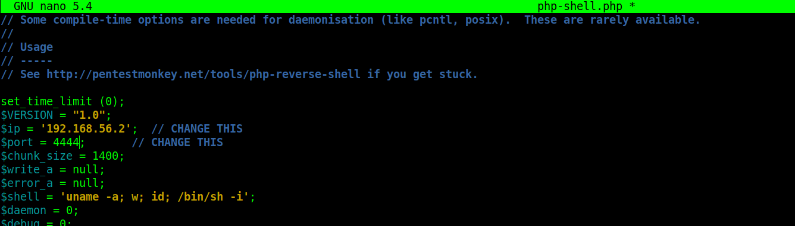

Upload our shell.

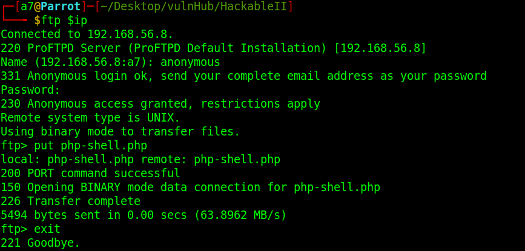

Listened on port `4444`, back to `files` directory, and click on the shell file.

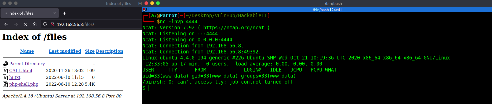

We have a dummy shell.

Upgrade the shell: [https://infosecwriteups.com/pimp-my-shell-5-ways-to-upgrade-a-netcat-shell-ecd551a180d2](https://infosecwriteups.com/pimp-my-shell-5-ways-to-upgrade-a-netcat-shell-ecd551a180d2)

<br />

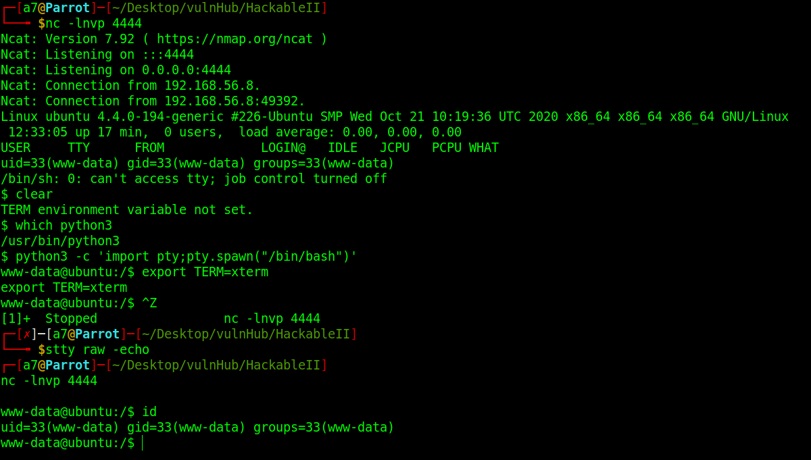 

<br />

## User access

Now we'r in, lets get user priv.

there's a `.runme.sh` script.

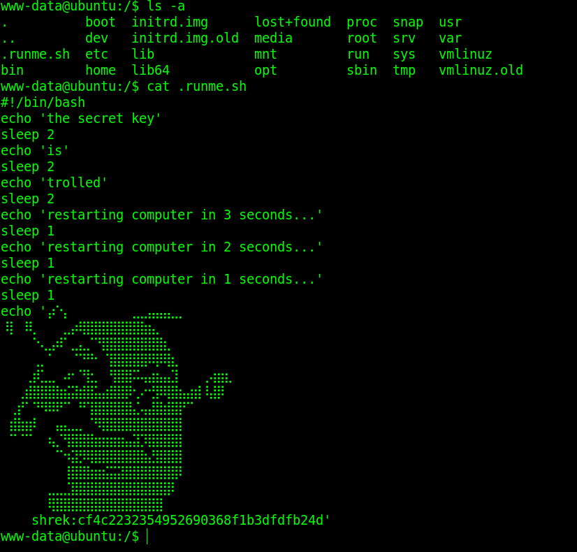

<br />

Md5 hash, crack it in [crackstation](https://crackstation.net/)

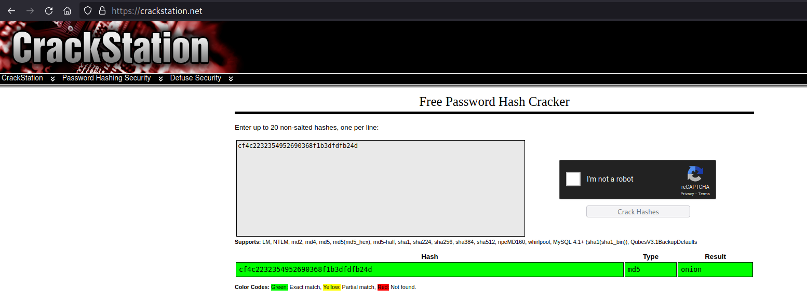

<br />

We have a password, we need a user.

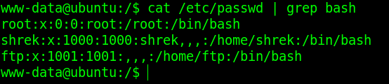

<br />

Switch to the user  `shrek`.

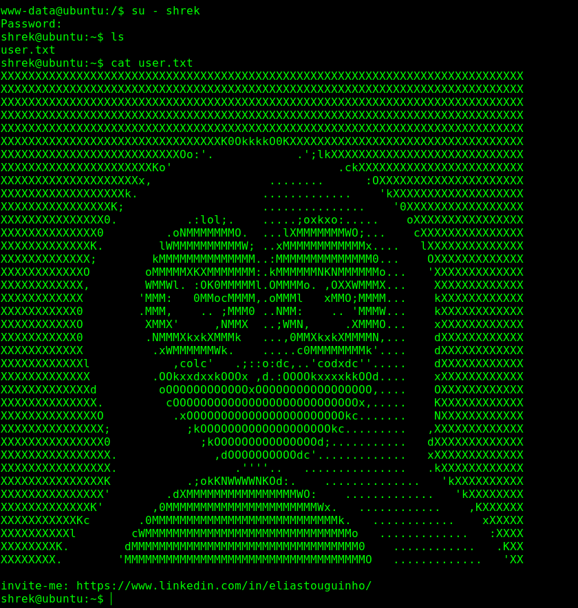

<br />

## Privilege Escalation

Lets get root access.

When i checked the sudo permission, we could run one command as root.

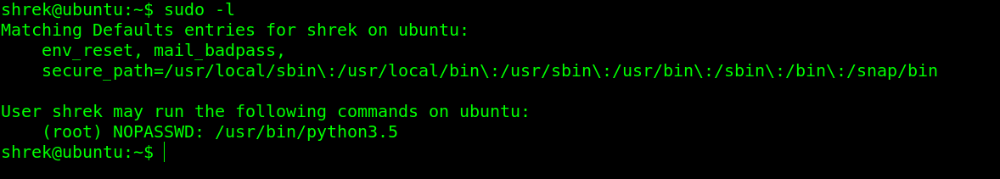

<br />

Searching in gtfobins for exploit: [https://gtfobins.github.io/gtfobins/python/#shell](https://gtfobins.github.io/gtfobins/python/#shell)

We can use this binary to get a root shell.

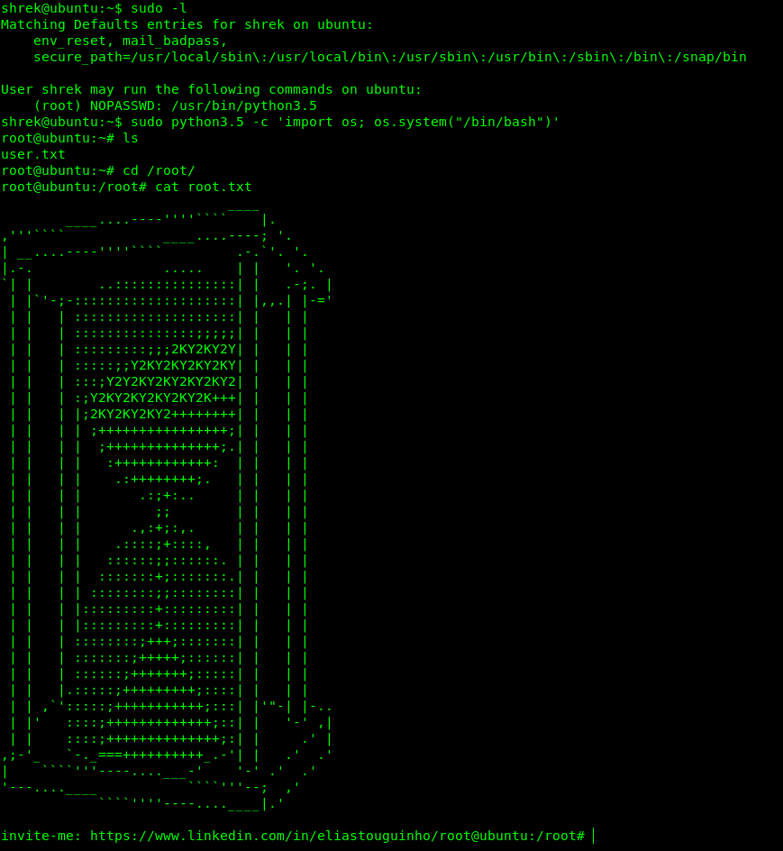