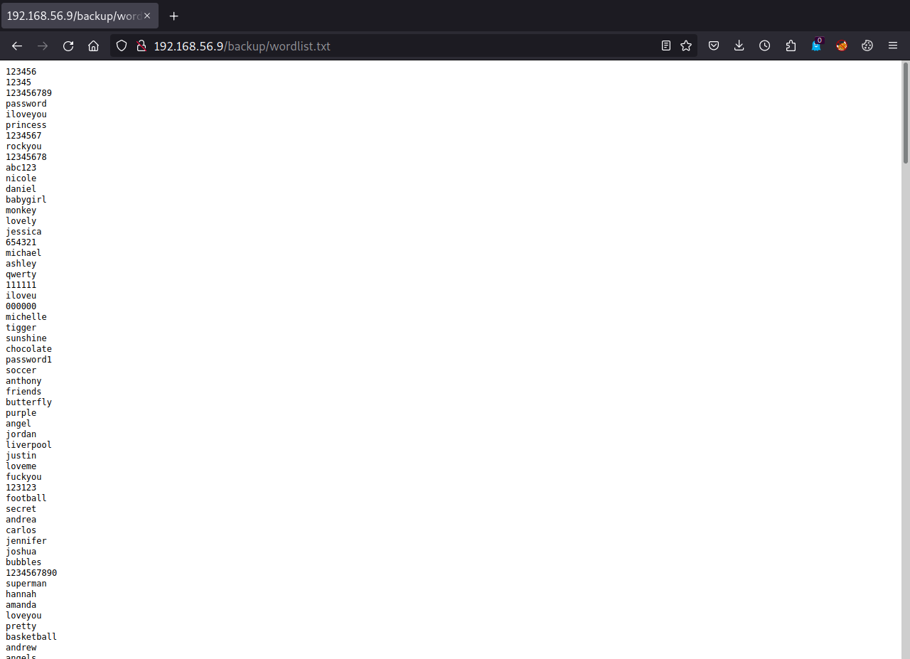

#  Hackable III - Writeup 

Hackable III is a medium level machine from Vulnhub by Elias Sousa.

I have tested this machine on VirtualBox.

Link to the machine: [https://www.vulnhub.com/entry/hackable-iii,720/](https://www.vulnhub.com/entry/hackable-iii,720/)

## Identify the target

Firstly, we need to identify the target's IP address. I use netdiscover for that.

```
sudo netdiscover -i vboxnet0 -r 192.168.56.0/24

Currently scanning: Finished!   |   Screen View: Unique Hosts

2 Captured ARP Req/Rep packets, from 2 hosts.   Total size: 102
_____________________________________________________________________________
   IP            At MAC Address     Count     Len  MAC Vendor / Hostname      
-----------------------------------------------------------------------------
192.168.56.1    08:00:27:8e:8d:25      1      42  PCS Systemtechnik GmbH
192.168.56.9    08:00:27:5d:40:a1      1      60  PCS Systemtechnik GmbH
```
## Port scan

Port scanning let us know which ports or services is running.

We will use nmap.

Nmap (Network Mapper) use many arguments, `-Pn` to skip host discovery, `-p-` to scan all 65535 ports, `-T4` timing template (Aggressive mode, higher is faster), `-sV` for version detection, `-sC` for default scripts.

```
sudo nmap -Pn -p- -T4 -sV -sC $ip | tee scan.log

Nmap scan report for 192.168.56.9
Host is up (0.62s latency).
Not shown: 65533 closed tcp ports (reset)
PORT   STATE    SERVICE VERSION
22/tcp filtered ssh
80/tcp open     http    Apache httpd 2.4.46 ((Ubuntu))
|_http-title: Kryptos - LAN Home
| http-robots.txt: 1 disallowed entry 
|_/config
|_http-server-header: Apache/2.4.46 (Ubuntu)
MAC Address: 08:00:27:5D:40:A1 (Oracle VirtualBox virtual NIC)

Service detection performed. Please report any incorrect results at https://nmap.org/submit/ .
Nmap done: 1 IP address (1 host up) scanned in 180.30 seconds
```
<br />

We can see that two ports is running, `SSH` and `HTTP`.

## Enumerate Web Server

In our scan result, the web server contains `robots.txt` and `/config`, lets examine them while we do directory bruteforcing.


examined the source code and discovered some usefull information.


<br />

We have a link to the login page, username, hint that there is port knocking and something with .jpg.

`Port knocking is a way to secure a server by closing firewall ports—even those you know will be used. Those ports are opened on demand if—and only if—the connection request provides the secret knock.`

> Reference: [https://www.howtogeek.com/442733/how-to-use-port-knocking-on-linux-and-why-you-shouldnt/](https://www.howtogeek.com/442733/how-to-use-port-knocking-on-linux-and-why-you-shouldnt/)

<br />

We need to know the knocking sequence. Lets continue.


<br />


<br />


<br />

Base64, decode it.


<br />

Save that number, and now we have our bruteforce result.

```
gobuster dir -w /usr/share/seclists/Discovery/Web-Content/directory-list-2.3-medium.txt -x .txt -e -q -t 50 -u http://$ip
http://192.168.56.9/css                  (Status: 301) [Size: 310] [--> http://192.168.56.9/css/]
http://192.168.56.9/js                   (Status: 301) [Size: 309] [--> http://192.168.56.9/js/] 
http://192.168.56.9/config               (Status: 301) [Size: 313] [--> http://192.168.56.9/config/]
http://192.168.56.9/backup               (Status: 301) [Size: 313] [--> http://192.168.56.9/backup/]
http://192.168.56.9/robots.txt           (Status: 200) [Size: 33]                                   
http://192.168.56.9/imagens              (Status: 301) [Size: 314] [--> http://192.168.56.9/imagens/]
http://192.168.56.9/login_page           (Status: 301) [Size: 317] [--> http://192.168.56.9/login_page/]
http://192.168.56.9/server-status        (Status: 403) [Size: 277]  
```

<br />

The `backup` directory had a text file called `wordlist.txt`, download it, we gona use it.

<br />



<br />

When we check `css` directory, there is a file `2.txt` containes a text encoded in brainfuck language.

<br />


There's online tools to decode it: [https://www.dcode.fr](https://www.dcode.fr/brainfuck-language).

<br />


<br />

Save that number and lets navigates to `login_page`.

<br />


Tried some usernames and passwords, which redirected to a blank page, check the source code, interesting info!! 

<br />


<br />

It suffers from SQL injection, and location: `3.jpg`. Open it into the browser. 


Nothing unusual, but the file name match the pattern. Lets download it and do some stego.


When it asks for passphrase, just click `Enter`.

<br />

We’re ready to perform port knocking, remember the sequence: `1.txt`, `2.txt` and `3.jpg`.

We just need a tool called `knockd`.


<br />

And our command is:   `knock <Target's IP> 10000 4444 65535`


<br />

Great. Earlier, we found a wordlist in `backup` directory, and we have a username. Lets bruteforce.


<br />

## Get User access

Now let’s use the credentials we obtained to log into ssh.


<br />

Cat **User.txt**


<br />

## Privilege Escalation

In home directory, there's another user, cat `/etc/passwd`.


<br />

Under `/var/www/html`, a file called `.backup_config.php`, and we have user credentials, switch to `hackable_3`.


## Root Access

Now, we need to get root access.

Checking the user id, it's vulnerable to lxd. We can use lxd privilege escalation to gain root access.


<h4>LXC, which is ‘Linux Containers’, is a solution for creating a virtual environment for 
software at the operating system level within the scope of the kernel of Linux.</h4>

<h4>LXD is, in a way, has LXC as its subset, and we can say that it is its extension.</h4>

<br />

> Reference: [https://www.educba.com/lxc-vs-lxd/](https://www.educba.com/lxc-vs-lxd/) 

<br />

> Exploitation-guide: [https://book.hacktricks.xyz/linux-hardening/privilege-escalation/interesting-groups-linux-pe/lxd-privilege-escalation](https://book.hacktricks.xyz/linux-hardening/privilege-escalation/interesting-groups-linux-pe/lxd-privilege-escalation)

<br />


We get an error, we don’t have a storage pool. We have to initialize one: `lxd init`, use default values.


Next, continued from the last failed step `lxc init alpine privesc -c security.privileged=true`.
<br />


<br />

Cat **root.txt**

