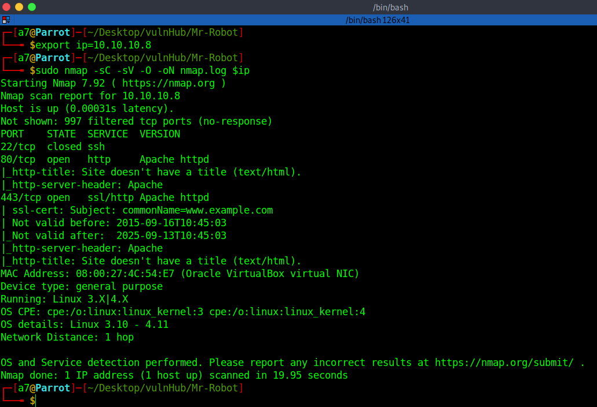
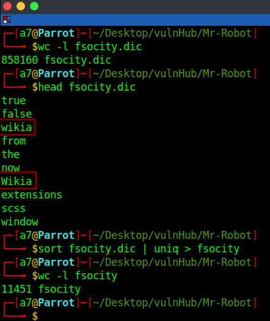

# Mr-Robot - Writeup

Mr-Robot is a beginner-intermediate level machine from Vulnhub by Leon Johnson.<br />
This VM has three keys hidden in different locations. Our goal is to find all three. Each key is progressively difficult to find.<br />
Link to the machine: [https://www.vulnhub.com/entry/mr-robot-1,151/](https://www.vulnhub.com/entry/mr-robot-1,151/) 

<br />

## Target discovery

The first step is identifying our target's IP address.

```
fping -agq 10.10.10.0/24

10.10.10.1
10.10.10.2
10.10.10.8
```
<br />

## Scanning The Target

Let's find any open ports, running services on the target machine.


<br />
<br />

We have `HTTP` and `HTTPs`.

<br />

## Web Enumeration

Let's start by examining the web page.


<br />
<br />

Looks like it's a dynamic web page. Inspecting the source code, and nothing useful.


<br />
<br />

Fired `nikto` "a web server scanner which performs tests against web servers".


<br />
<br />

A lot of information, but the most important are `robot.txt` and `wp-login`.<br />
Let's see what's in `robots.txt`.


<br />
<br />

We got `fsocity.dic`, download it.


<br />
<br />

It's a wordlist, there's `key-1-of-3.txt`, let's navigate to it. 


<br />
<br />

We have the first key. Back to nikto result, let's see what's in `readme` 


<br />
<br />

Ok! let's continue. We have `wp-login` which is a WordPress login page.


<br />
<br />

Previously, we downloaded a wordlist, we could use to bruteforce the username and the password.<br />
To do that, we will use a great tool called `hydra`, but we need to provide a few pieces of info to work:
1) Login or Wordlist for Usernames.
2) Password or Wordlist for Passwords.
3) IP address or Hostname.
4) Protocol, in our case: HTTP Method (POST/GET).
5) Directory or the path to the Login Page. 
6) Request Body for Username/Password.
7) A Way to Identify Failed Attempts.
<br />

Let's log in and intercept the request with `Burp`.


<br />
<br />

As we see above, the request and the response give us all the info we needed. Let's fire hydra 
and start with the username bruteforce.


<br />
<br />

After we found the username `Elliot`, it's easier to find the password.<br />
Before we do that, we need to know the error message when the password is wrong.


<br />
<br />

Let's get the password.


<br />
<br />

Great! Let's log in.


<br />
<br />

## Getting access

Now, let's get a reverse shell.<br />
In `Appearance`, click on `Editor`, then click on `404 Template` to edit.


<br />
<br />

Now, modify this template with php-reverse shell, then, press `Update File`.


<br />
<br />

Open a listener, then vist this URL `http://machin-ip/wp-admin/theme=twentyfifteen&file=404.php`


<br />
<br />

Under `/home`, there's a user `robot`, and in his directory, there're two files, `key-2-of-3.txt`, and `password.raw-md5`.


<br />
<br />

Let's decode the password.


<br />
<br />
<br />

Switch to the user `robot`.


<br />
<br />

Cat `key-2-of-3.txt`.


<br />
<br />

## root access

Now, let's find a way to escalate our privileges by searching for `SUID` binaries.


<br />
<br />

Heading to `GTFObins` website, and searching for `Nmap`, we could abuse Nmap to get a root shell. [https://gtfobins.github.io/gtfobins/nmap/](https://gtfobins.github.io/gtfobins/nmap/).


<br />