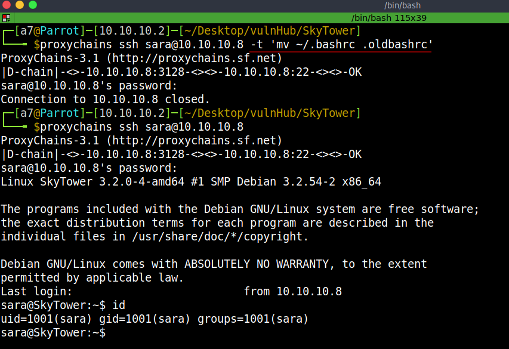

# SkyTower - Writeup 

SkyTower is an intermediate-level machine from Vulnhub by Telspace. 
This CTF was designed by Telspace Systems for the CTF at the ITWeb Security Summit and BSidesCPT (Cape Town). 
Link to the machine: [https://www.vulnhub.com/entry/skytower-1,96/](https://www.vulnhub.com/entry/skytower-1,96/)
 

## Recon

First, let's identify our target.

 
 

## Scanning

Let's find out which services are running.

 
 

We have a filtered SSH, a web server, and a squid proxy server.

## Enumeration

Let's browse the website.

 
 

It's a login page. 
Let's check if it's vulnerable to SQLi by adding `'`.

 
 

After we submit, we got an error in our query. This means it's vulnerable to SQLi. 
Let's try another one.

 
 

Press `Login`.

 
 

As we see above, there's some kind of character filter. 
We could change `or` with `||`, let's try it.

 
 

Submit.

 
 

We got `John`'s ssh creds, but ssh is filtered. 
We have a `squid` proxy server, we could route our ssh through the proxy server. 
First, let's configure our `proxychains.conf` file.

 
 

Now ssh to the machine with proxy.

 
 

The connection is closed, I don't know why but we could use `-t` to force pseudo-terminal.

 
 

When we check `.bashrc` file, the last line force the ssh connection to close, we could remove or change the file name and reconnect to the machine.

 
 

## Privelege Escalation

Checking our sudo perms, and we don't have any.

 
 

We have two more users on this machine.

 
 

After enumerating, we found `login.php` under `/var/www`, this file contains creds for MySQL.

 
 

Let's login.

 
 

There's a database called `SkyTech`, let's dump its contents.

 
 

We got the passwords for the users found earlier, let's login with Sara.

 
 

Ok, rename `.bashrc` and log in again.

 
 

Checking Sara's Perms.

 
 

We could use `cat/ls` as root with no password. 
Let's abuse this perms by path-traversing the directories.

 
 

Finally, let's read flag.txt.

 