# Symfonos:5 - Writeup 

Symfonos:5 is a Beginner real life-based machine from Vulnhub by Zayotic.<br />
This machine is designed to teach people the importance of understanding from the interior.<br />
Link to the machine: [https://www.vulnhub.com/entry/symfonos-52,415/](https://www.vulnhub.com/entry/symfonos-52,415/)
<br />

## Information Gathering

I'll use `netdiscover` to identify our target.

```bash
┌─[a7@Parrot]─[~/Desktop/vulnHub/Symfonos:5]
└──╼ $sudo netdiscover -i vboxnet0 -r 10.10.10.0/24

Currently scanning: Finished!   |   Screen View: Unique Hosts

2 Captured ARP Req/Rep packets, from 2 hosts.   Total size: 102
_____________________________________________________________________________
	IP            At MAC Address     Count     Len  MAC Vendor / Hostname      
-----------------------------------------------------------------------------
10.10.10.1      08:00:27:f5:32:a1      1      42  PCS Systemtechnik GmbH
10.10.10.11     08:00:27:15:c4:a6      1      60  PCS Systemtechnik GmbH
```

<br />

## Scanning the Target

Let's scan our target for open ports, and running services.

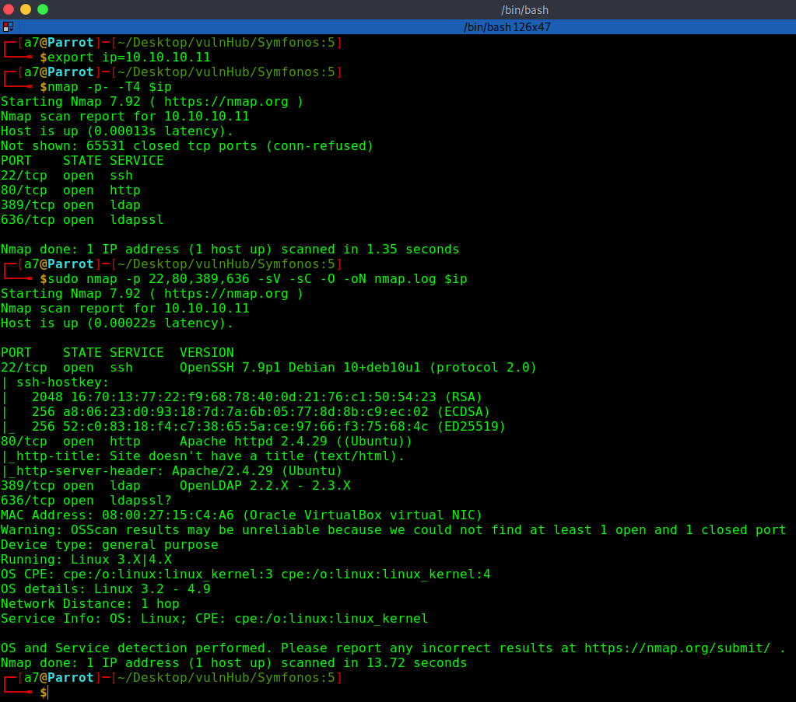
<br />
<br />

## Web Enumeration

Let's visit the website.

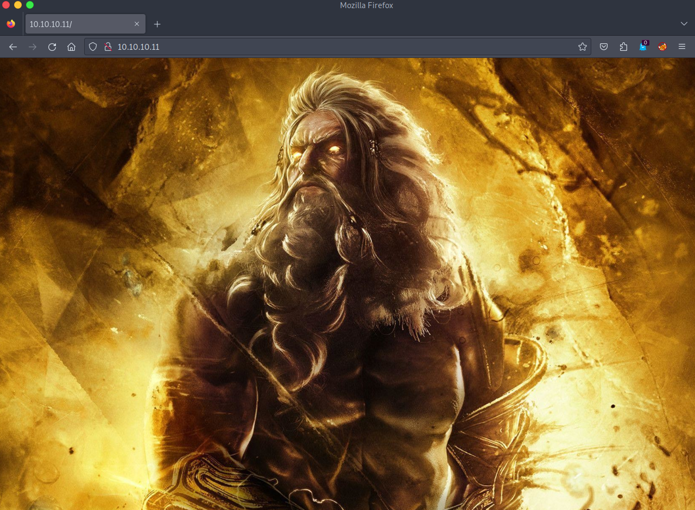
<br />
<br />

Just a picture, inspecting the source code and we got nothing, let's brute-force the directories.

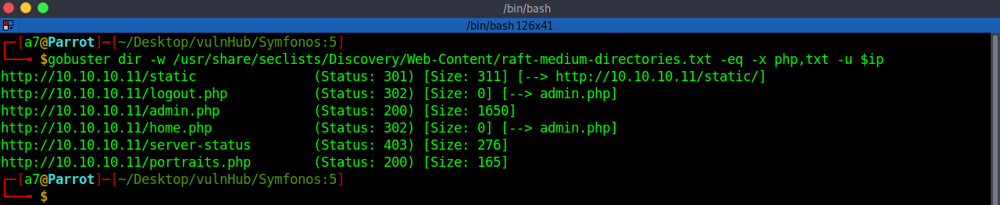
<br />
<br />

Let's visit `/admin.php`.

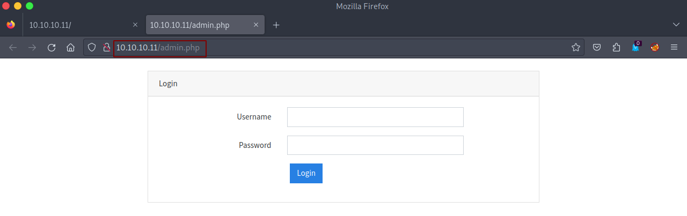
<br />
<br />

We have a Login Form, let's visit `/portraits.php`.

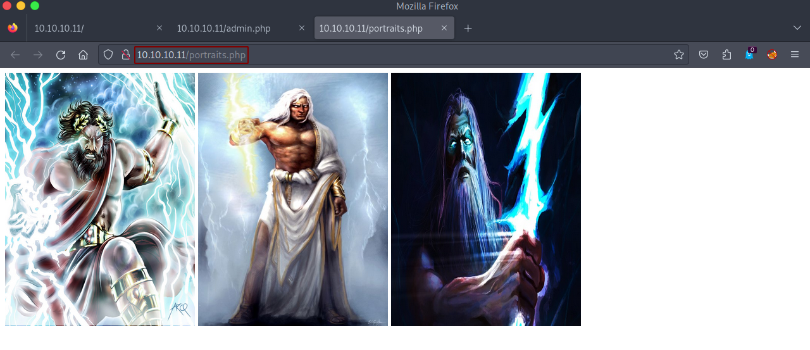
<br />
<br />

Ok, we got three pictures for 'Zeus', back to the Login Form, tried some default credentials but didn't work, tried an *SQLi* queries as `*` in username and password and it works.

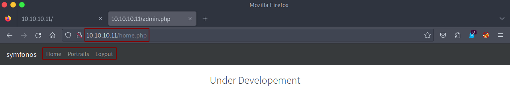
<br />
<br />

We got a panel, let's click on `Portraits`.

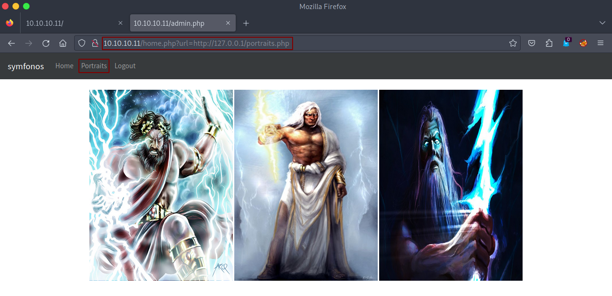
<br />
<br />

It redirects us to `portraits.php`, but as you see above, the **URL** parameter is including `portraits.php` which looks like **LFI**.<br />
Let's test it, open **Burp**, intercept the request, and add `/etc/passwd`.

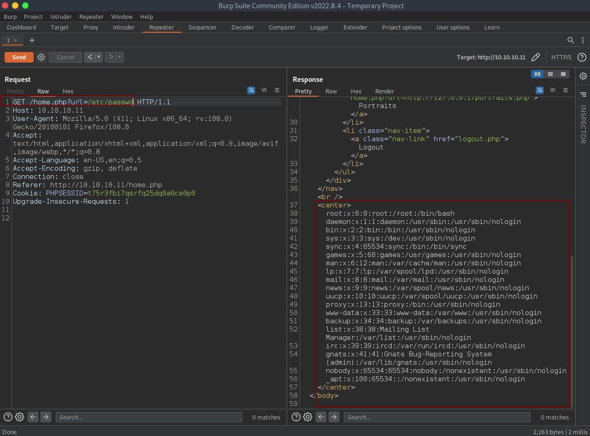
<br />
<br />

We have **LFI** vulnerability, let's include `admin.php`, hopefully, we'll find interesting information.

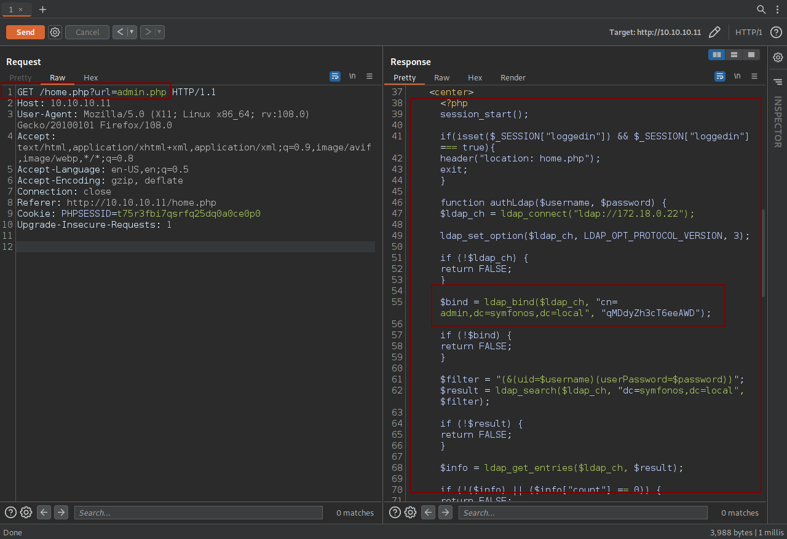
<br />
<br />

We got LDAP credentials, start enumerating.


<br />
<br />

We got the user `Zeus` and his password, let's SSH.

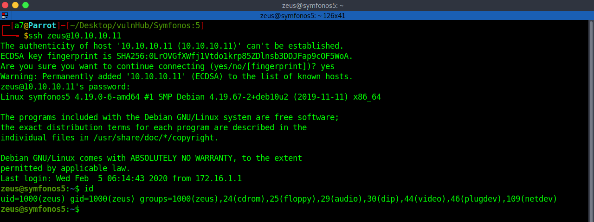
<br />
<br />

## Privilege Escalation

Now, check the Sudo permissions.

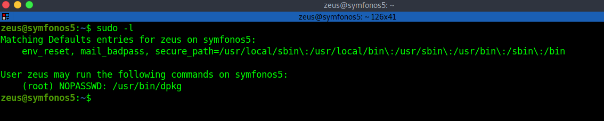
<br />
<br />

We can run `/usr/bin/dpkg` as root without a password, let's search for a way to abuse it in **gtfobins**.


<br />
<br />

As we see, we need to craft a custom payload as a Debian package '.deb' extension with `fpm`, and then upload it on the target machine.<br />
Let's first install fpm: [https://fpm.readthedocs.io/en/latest/installation.html](https://fpm.readthedocs.io/en/latest/installation.html)

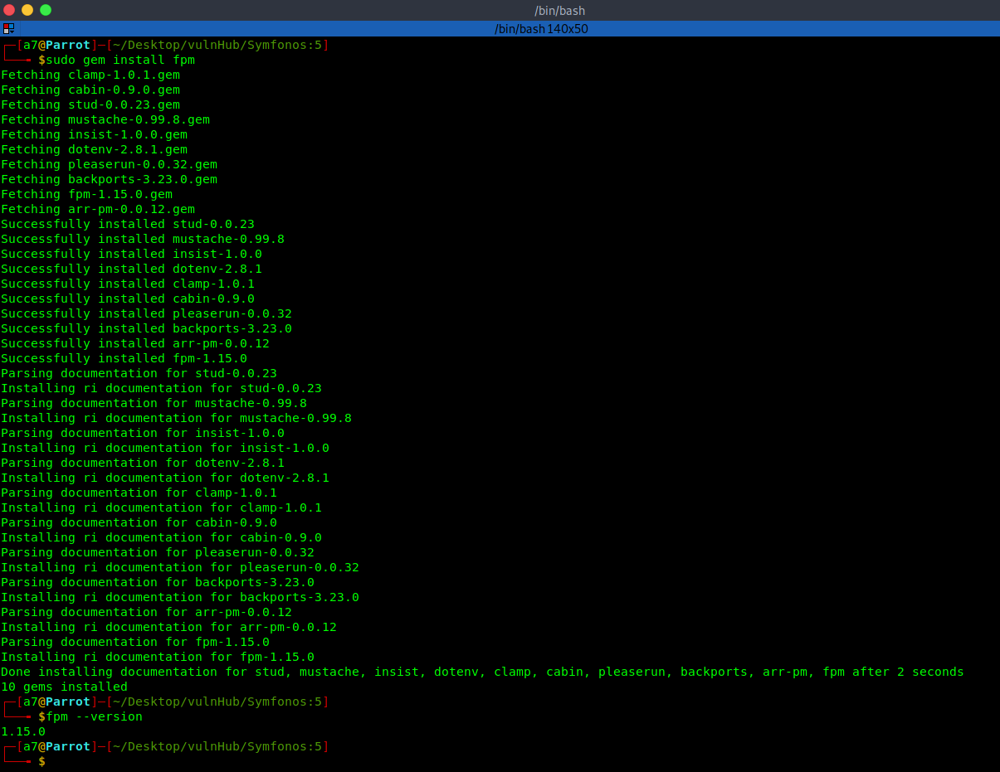
<br />
<br />

Now, let's create our package.

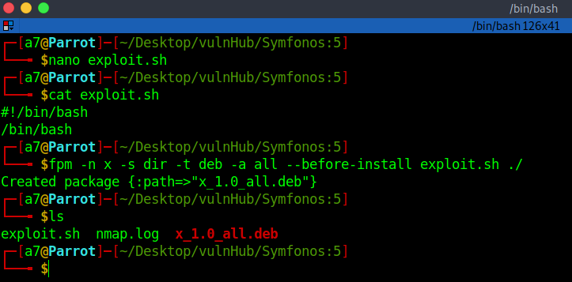
<br />
<br />

Upload it on the target machine.

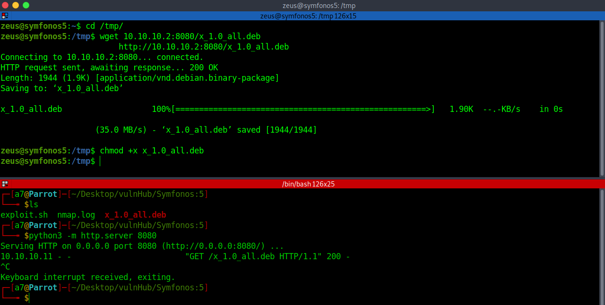
<br />
<br />

Let's install it.

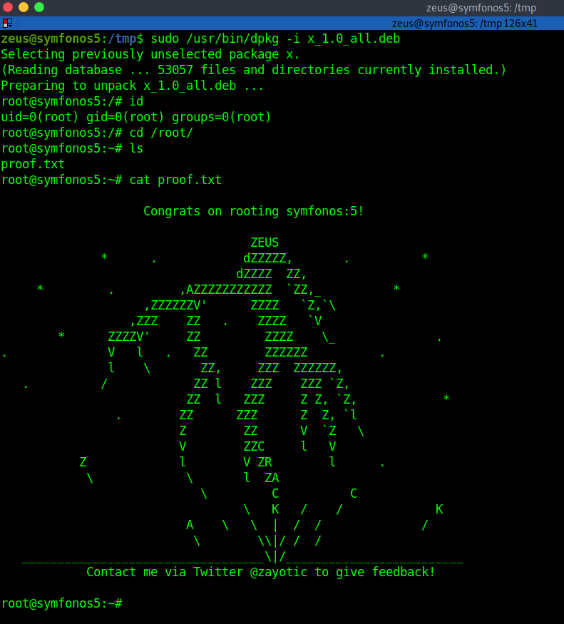
<br />